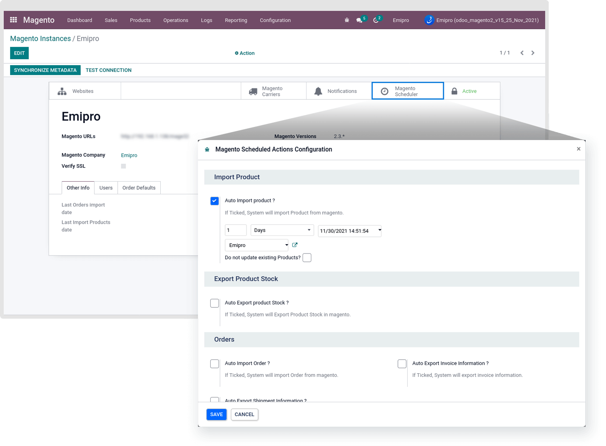
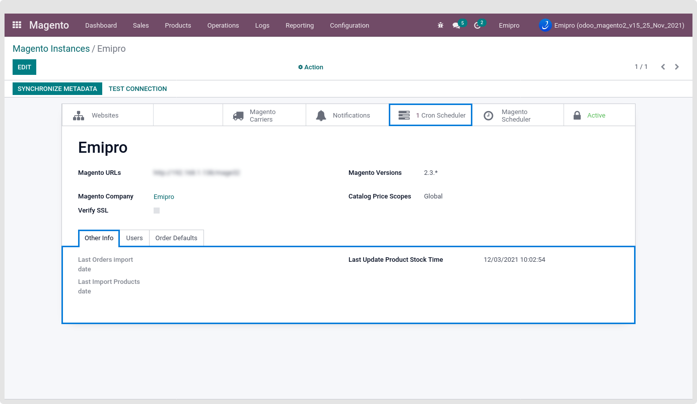
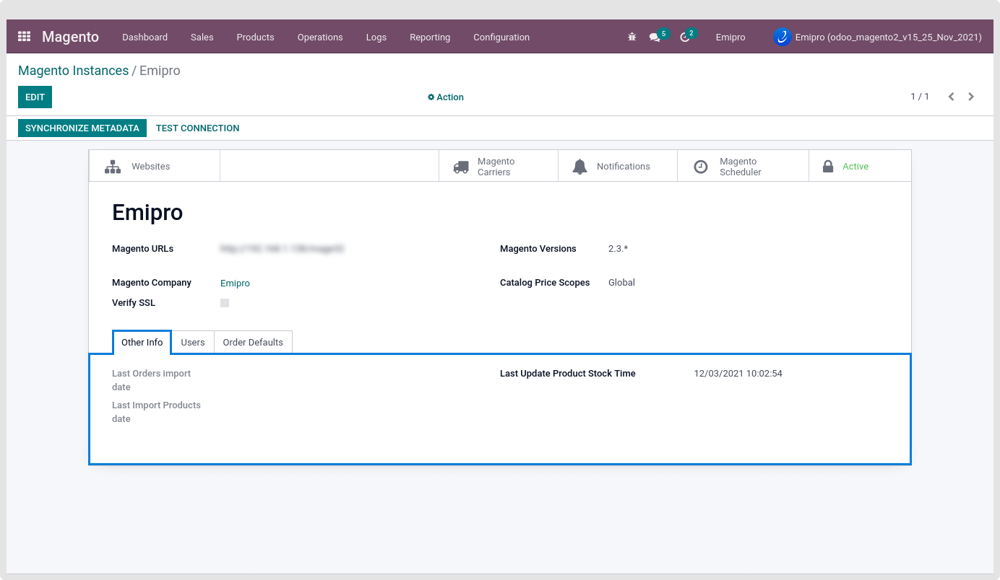

### Automatic Scheduler Configuration

Many important processes can save much of your time when they are automated. However, when configuring the automatic schedulers, one has to take care of many things that can create complexity.

Do not set the same time interval for all the processes, instead keep a time gap between them as it may eat a handsome amount of your system resources. Secondly, certain processes are dependent on each other, so it is advisable to configure such processes accurately, and again keeping a time gap between them will be beneficial to run automatic jobs smoothly.

Now here for Magento, you can configure Import Product, Export Product Stock, Import Order, Export Shipment, and Export Invoice processed for automatic operations at a certain time interval. Refer to the screenshot below for how it is configured.

That will be configured by clicking on the “Magento Scheduler” smart button.

 

Once you successfully and accurately configure the automatic jobs, you can see how many scheduled actions are set by clicking on cron scheduler.

 

You can see the last imported order, product as well as export product stock date from the Other Info Tab in the same window. This will give you an idea of the last actions performed.

 

After running the Import order and product Process Scheduler action the respected queue will be generated. All the queues having 200 queue lines of the records. And you can find those queue records by Magento > Logs > Orders Queue / Products queue.

