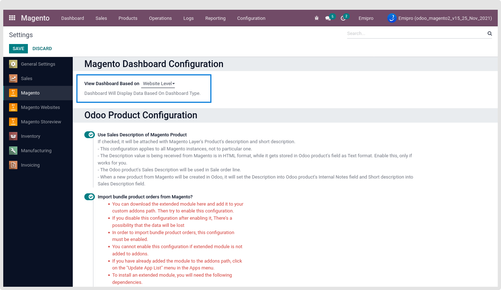
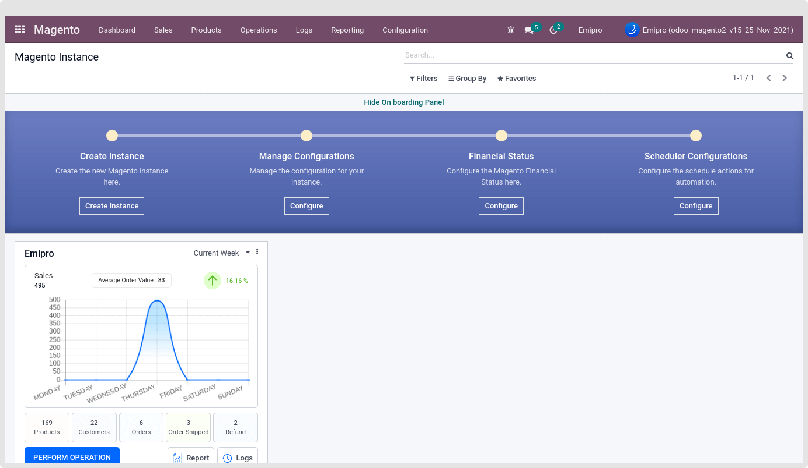
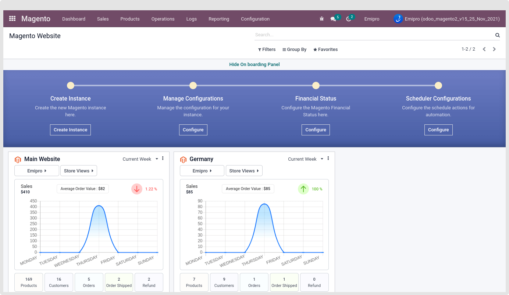
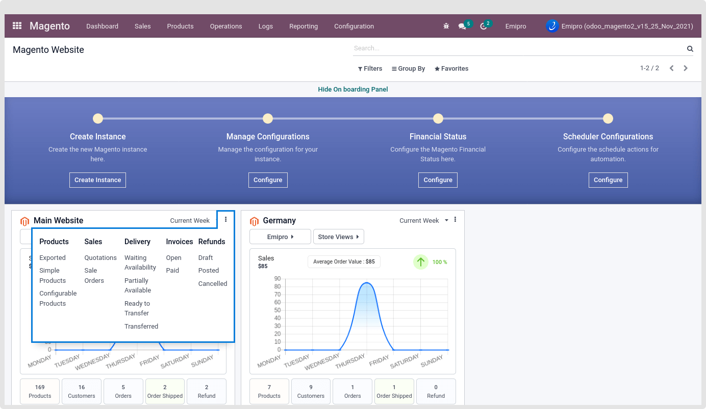

### Dashboard

Dashboards are a data visualization tool that allows all users to understand the analytics that matters to their business, department, or project. Even for non-technical users, dashboards allow them to participate and understand the analytics process by compiling data and visualizing trends and occurrences.

You can easily identify the Product and its count, Customers, Orders, and Shipped Orders, refunds. Load the data from Current Week, Current Month, Current Year, or All. By default, it loads current week data.

You can load the Dashboard data by below Two Options.

 

1. #### Instance Level

Set the “View Dashboard Based on” as the Instance Level.

 

2. #### Website Level

Set the “View Dashboard Based on” as the Website Level.

 

Now go to the Dashboard. All the loaded data and its count will be based on your configuration.

Below is the Smart Button in the kanban view.

1. **Products**

Load those Magento Layer Product Templates in which the selected website or Instance is set and also Sync with Magento set as True.

In the above screenshot, the Emipro website has 6 Products, and the Demo website has 5 Products. It does not mean the total Imported products for the current instance is 11. Because some of the products may be common in both the websites for the current Instance.

2. **Customers**

Load and display the Customer count based on the selected instance’s website. Customer having the Magento website. So based on that users easily identify the website-wise customer and the total number of selected customers.

3. **Orders**

Load and display the Order count based on the selected instance’s website or selected instance. Display total count of sale orders. 

4. **Order Shipped**

Load and display those order counts which delivery is in the Done state. Here consider the delivery which stock\_location is “Customer”.

5. **Refund**

Shows refunds (credit notes) for magento orders.

By clicking on the above smart buttons, you will directly jump to the respected action’s view.

Easily get the Sale Order Reports

Easily identify the log. 

Easily Perform any operation by clicking on the “Perform Operation”

Clicking on the Instance name, Jump to the respected Instance

Clicking on the Store Views, Jump to the respected website’s all store view list.

Log will not display the website wise.

 

By clicking on the vertical three dots, you will find the best option to analyze your store website wise or Instance wise.

