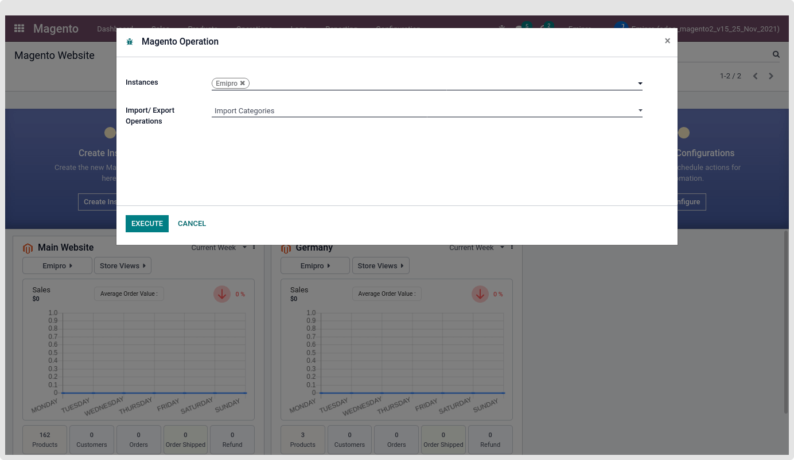
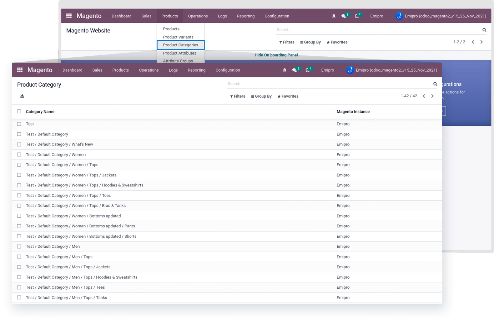

### Import Categories

This Operation imports all your Magento Instance’s categories and creates the Magento Categories record in the Magento Layer. You can check all those categories recorded under the Magento > Products > Product Categories.

 

* After import Category from Magento to odoo in Case, some of the category Data will be deleted from the Magento and then again perform the same operation, The deleted record will not affect in odoo. This means that deleted records will not be deleted in odoo and if some of the category data will be updated from the Magento and then again perform the same operation, The updated record will affect in odoo. This means that the updated record will be updated in odoo.

* Product categories records are not visible in odoo product category.

