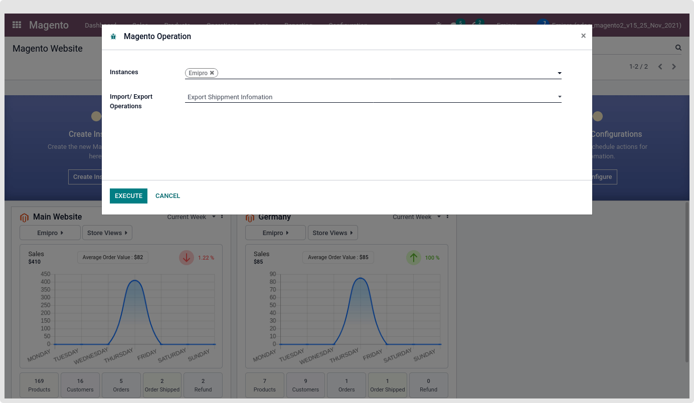

### Export Shipment via Operation wizard

After clicking on the execute button, the connector collects all the pickings which fulfill the below conditions:

1. Delivery orders are for the Magento orders
2. Order shipment is not exported
3. Order's Delivery order is created and Validated
4. Customer location is set as a destination location in the Delivery orders

