### Export Shipment manually by clicking on button from form view

1. **Export shipment When MSI Is Not Enabled**

There is an “Export Shipment In Magento” button in the Delivery Order. This button is only visible while the Delivery Order is for Magento order, Done state, and Destination Location is Customer.

 

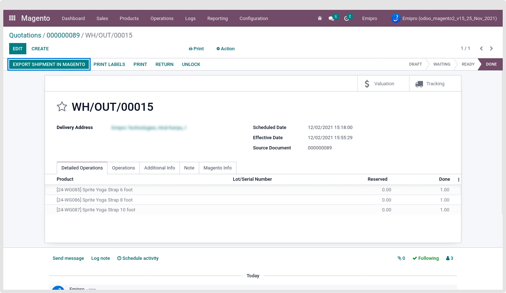

After completing any of the above options for Export Shipment operation, Magento shipment ID was set in the respected Delivery Order record.

Tracking Details will be seen into additional info tab of delivery order.

 

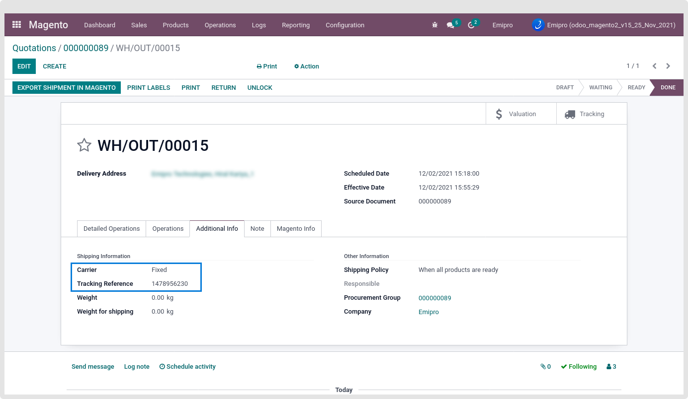

Magento’s Shipment ID set in the Magento Info tab.

 

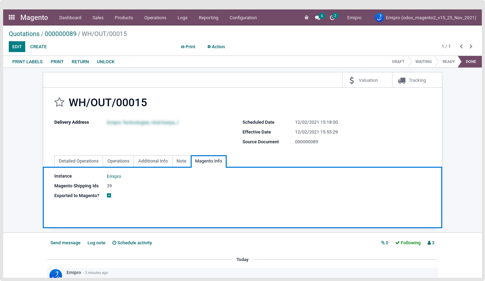

Created Shipment record in Magento Panel for the respected Order.

 

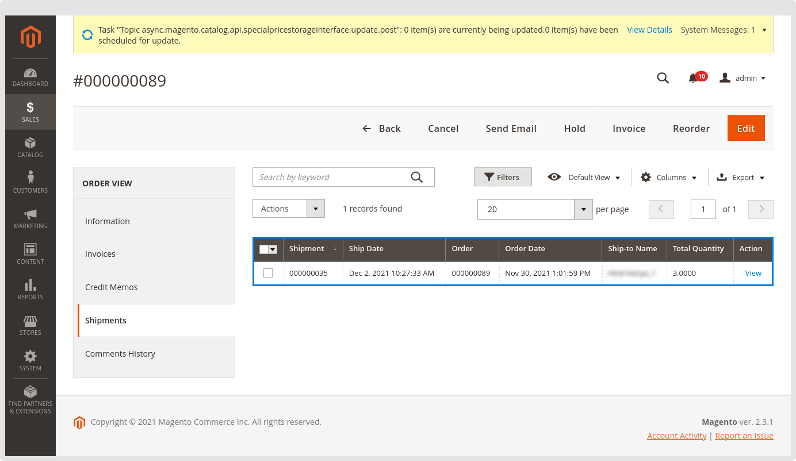

During the Export Shipment Operation process if any of the Delivery Order is not exported, Then the error log is created and attached in the Delivery Method. Also, the shipment record was not created in the respected Magento order.

 

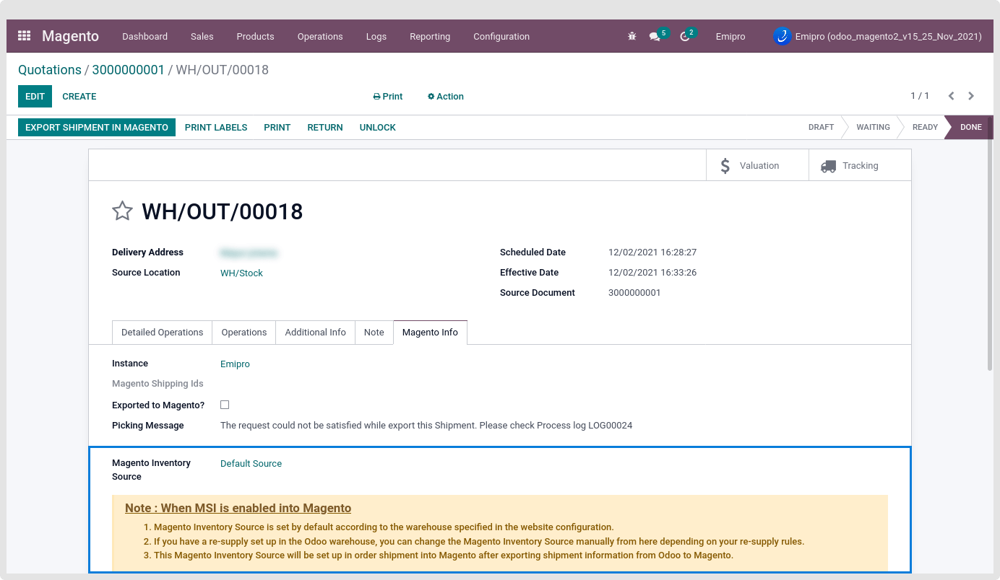

That log is navigating to Magento > Logs > Log Book.

 

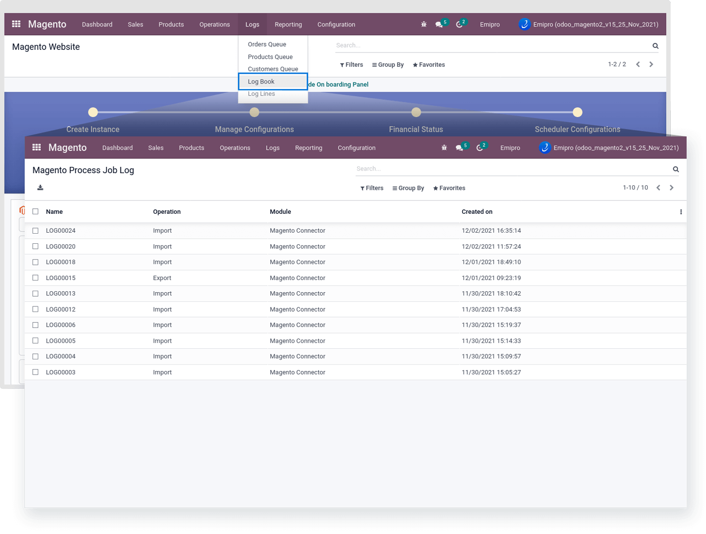

 

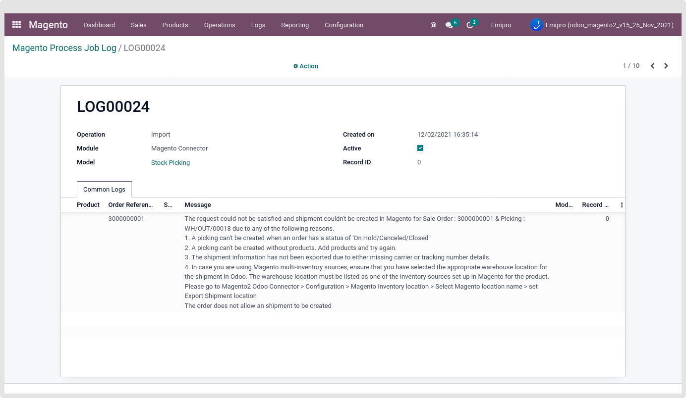

The system only allows three-time attempts to Export this kind of Shipment record. If the system does not get the proper response from the Magento side every time, Then the system will skip that record.

In case you are managing the package in odoo. Then your Tracking details export be linked below. 

 

As shown in the above screenshot, If you are managing the Packages. And those Packages having the “Addition Reference”, then while exporting the shipment information that package “Addition Reference” will export into Magento instead of the “Tracking Reference”.

 

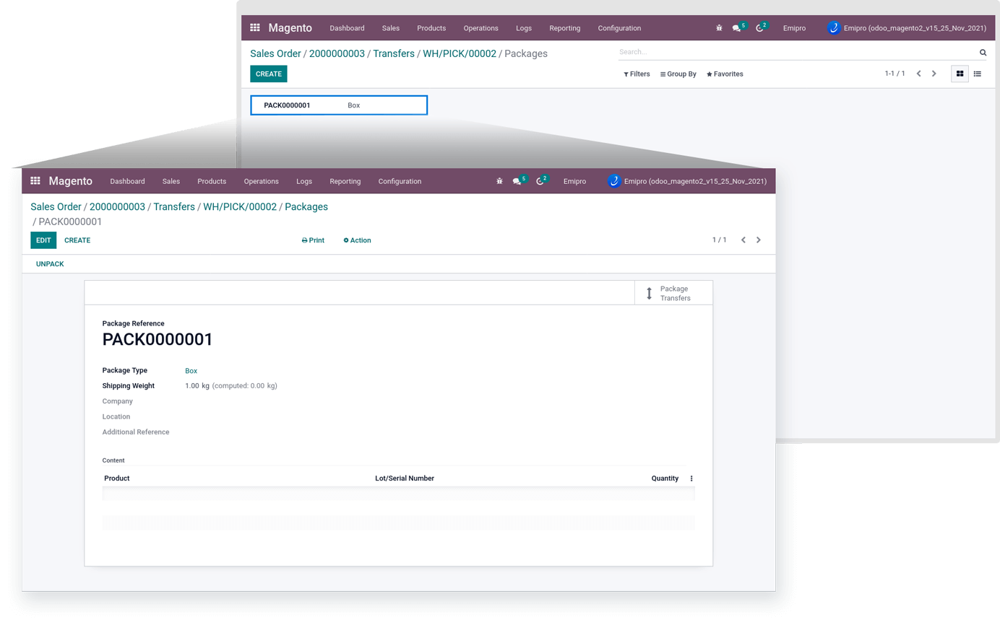

If one Delivery has more than one package and all packages have “Addition Reference” then the package-wise line will be created into the Magento Shipment record.

As per the above screenshot, there are two different packages for the single picking record. And all having the “Addition Reference”.

The picking also “Tracking Reference” as shown in the below screenshot.

 

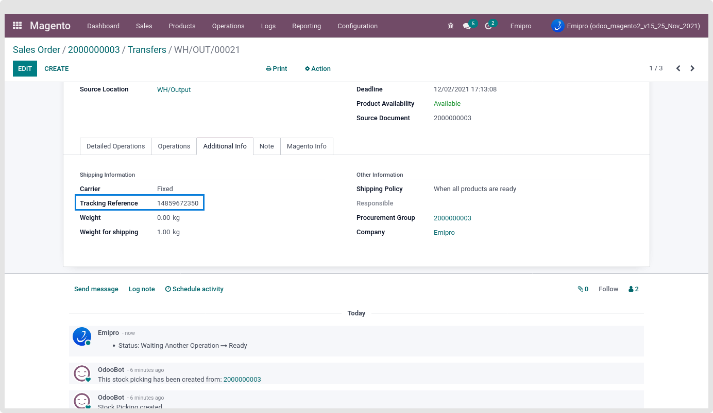

But now while Exporting this Shipment information from odoo to Magento. The tracking details display like the below screenshot.

 

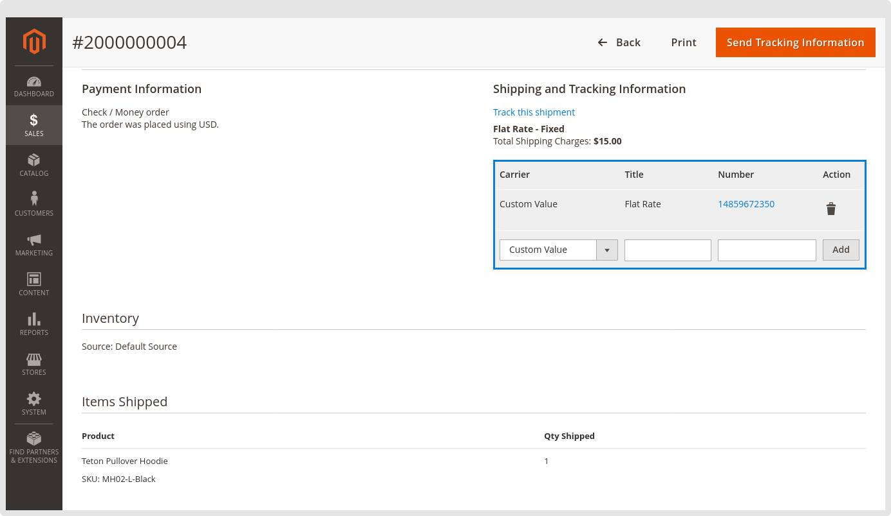

2. **Export shipment Using MSI**

the magento2 odoo connector allow to export shipment operation with MSI(multi source inventory) so if you need to export shipment from multiple sources then configure export shipment location in magento inventory location and set the location as per below image.

 

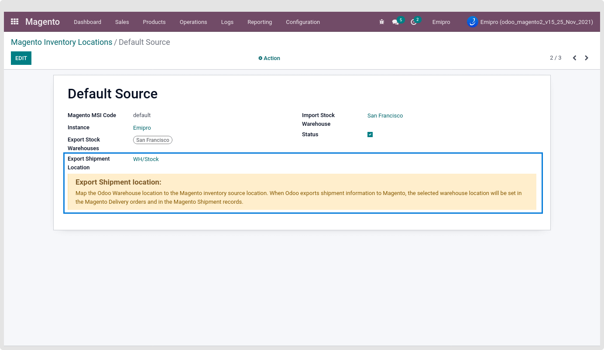

After that import the order and go to the delivery order and go to the magento info tab. Here, you will see location of the selected warehouse from magento website configuration will be set by default in magento inventory sources.

 

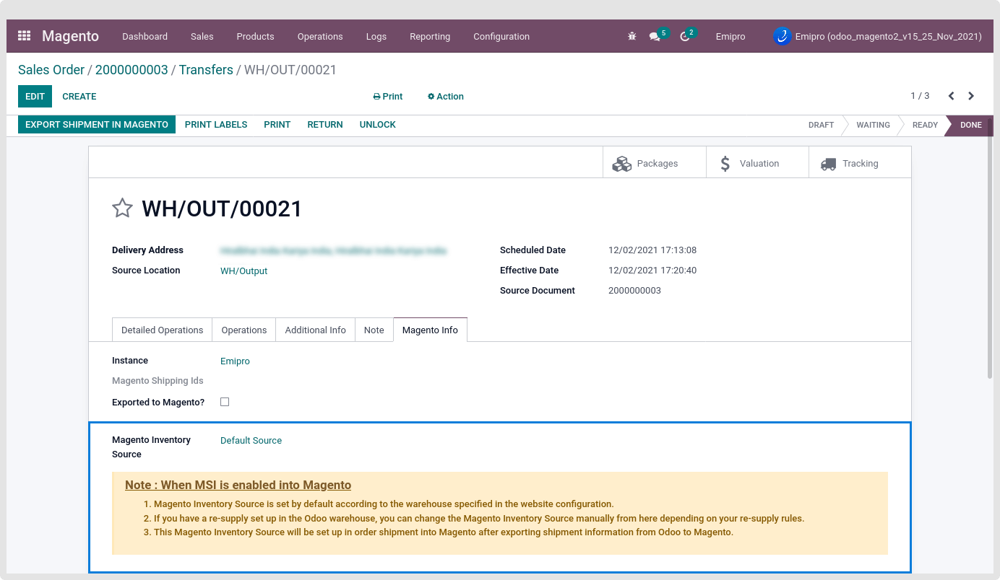

After that export shipment into Magento and check once shipment is exported successfully by navigating to the magento > sales > orders > shipments. Here, you can check inventory source is set which we defined into delivery order into Odoo.

 

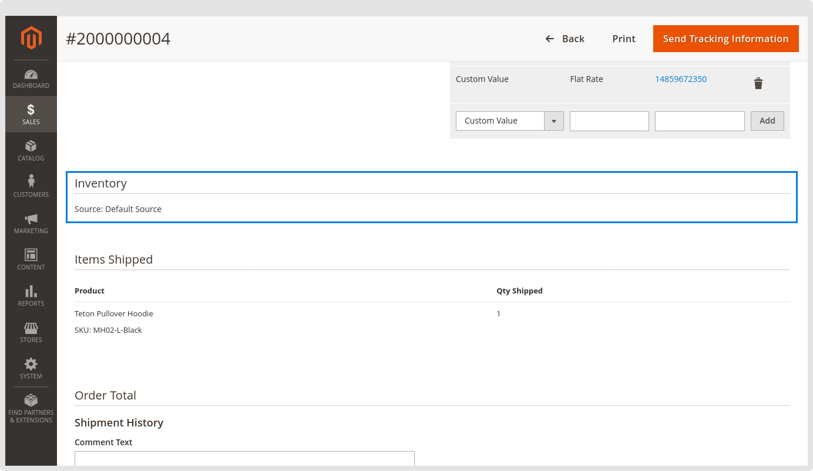

