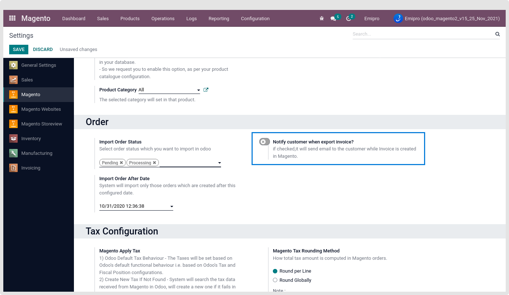
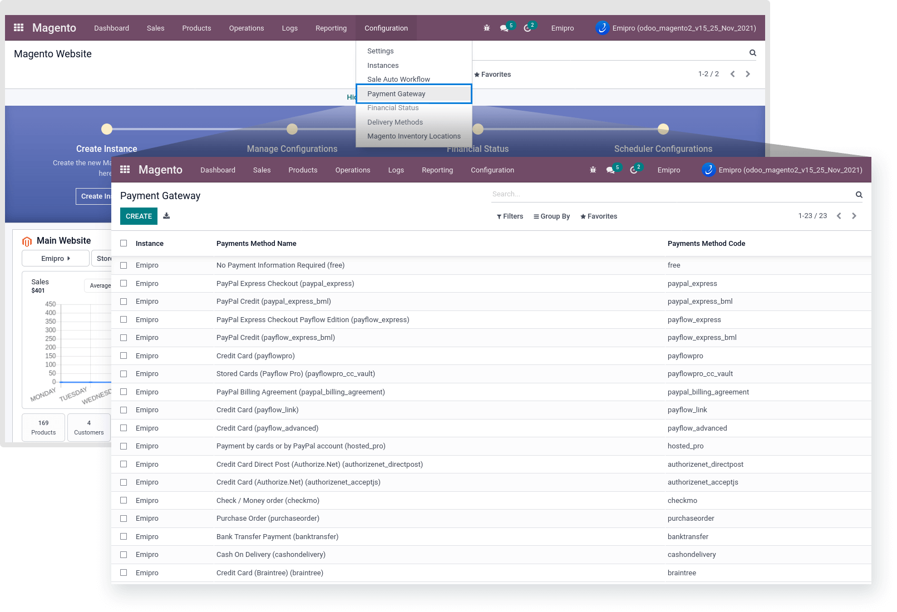
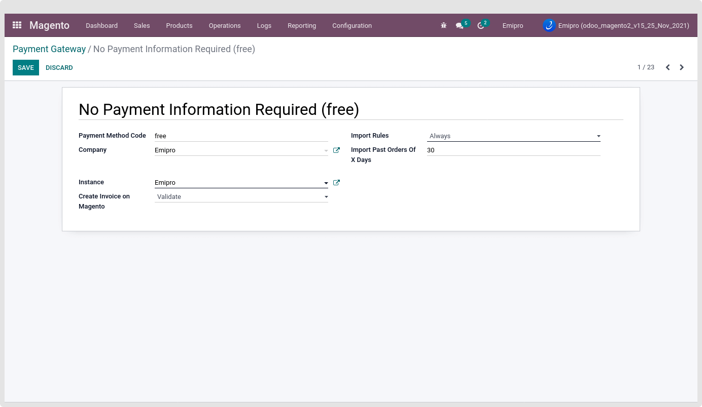
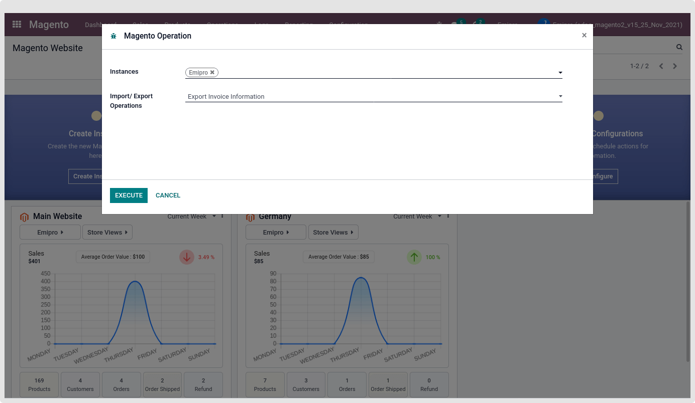
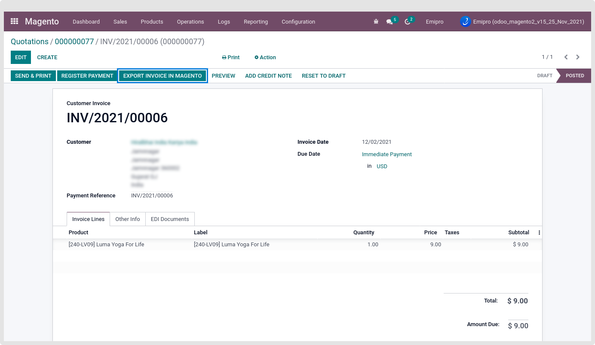
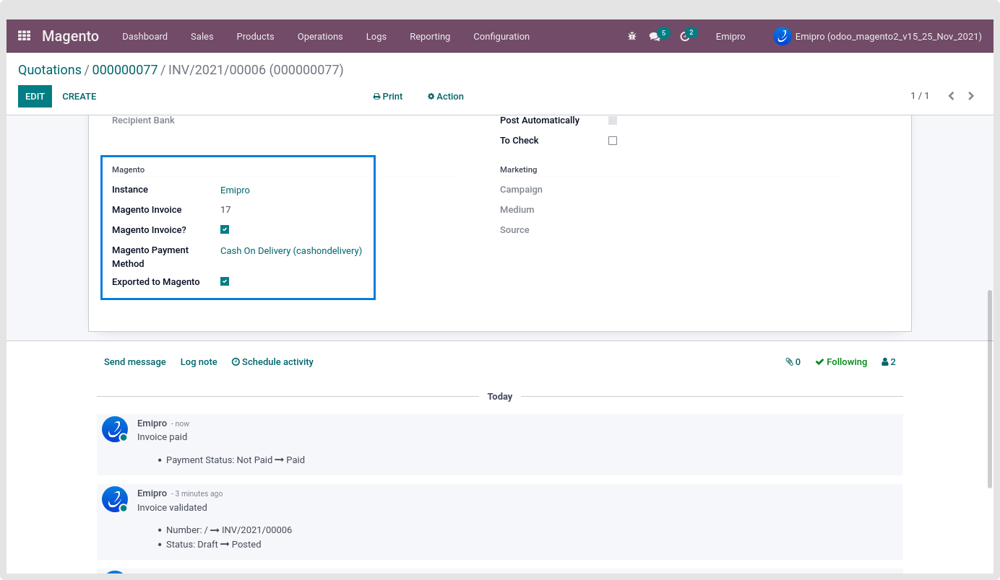
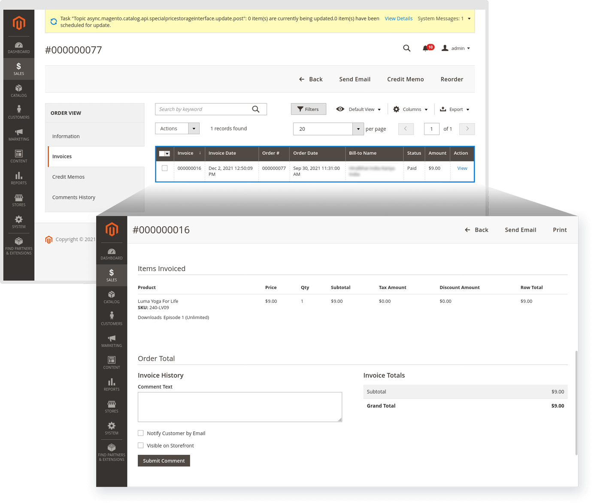
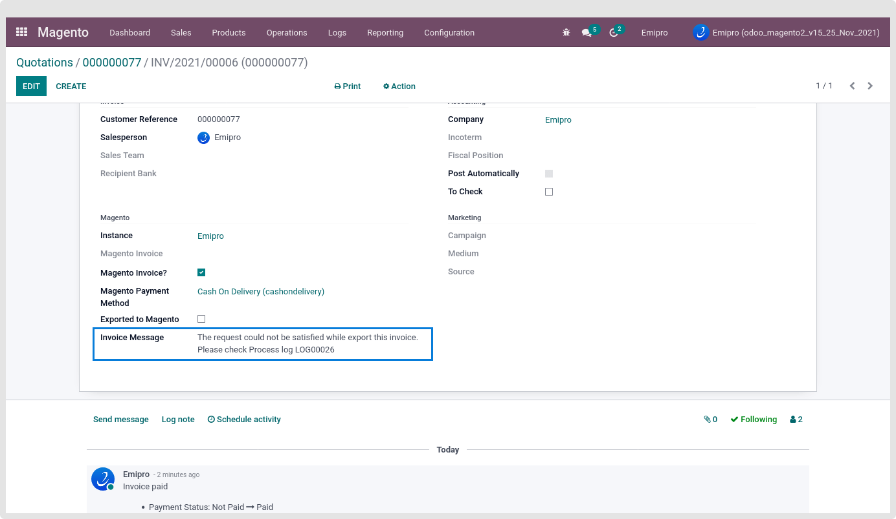
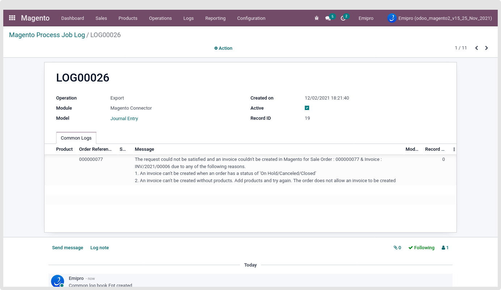

### Export Invoice Information

Once the Invoice is created in Odoo for the Magneto orders imported, we can perform export invoice operations via operation wizard or manually from particular invoice. Then the connector will create an Invoice record in the Magento for the respective Magento orders and export all the invoice details to the Magento.

This Operation also allows the Export of Partially Invoice Information.

While exporting the Invoice from odoo to Magento, There is one configuration for Notifying the Ordered Customer or not?

This setting will be enabled by navigating to the Magento > Configuration > Settings > Select Instance > Notify customer when export invoice?

 

 

If the above configuration is checked, it will add invoice comments in order invoice while the Invoice is created in Magento.

Based on the Invoice state the Invoice will be Exported or the Button will be visible in the Invoice. That configuration is under the Payment Method. To set above configuration by navigating to the Magento > Configuration > Payment Gateway.

 

**Create Invoice on Magento**: If this option is selected either validated or In payment/ paid, then invoice will be exported for this payment method. By default it is set to ‘Blank’, then the invoice will not be exported in the Magento for this payment method.

* **Validate**: Export those invoice payment state is "Posted"
* **In-Payment/Paid**: Export those invoice payment state is "In payment" or "paid"

Based on your requirement, you need to configure this setting in all payment methods.

 

There will be two different ways to Export the Invoice Information

1. Export Invoice Operation

Go to Magento > Operations > Select Instance and “Export Invoice Information” from operations.

 

After clicking on the Execute button, the connector will export invoices that fulfill the following conditions:

1. Invoice of the Magneto Order
2. The order invoice is not yet exported
3. Invoice payment state is either in "Posted" or "In Payment/Paid" state

 

2. **Single Invoice Export operation**

There is an “Export Invoice In Magento" button in the Invoice. This button is only visible while the Invoice is for Magento order and invoice payment state is Posted or Paid.

 

After completing any of the above options for Export Invoice operation, Magento Invoice ID was set in the respected Invoice record.

Magento’s Invoice ID set in the Magento Info tab.

 

Created Invoice record in Magento Panel for the respected Order.

 

During the Export Invoice Operation process if any of the Invoice is not exported due to not getting a proper response from the Magento Panel, Then the error log is created and attached in the Invoice record. Also, the Invoice record was not created in the respected Magento order. We can check logs by navigating to Magento > Logs > Log Book.

 

 

The system only allows three-time attempts to export this kind of Invoice record. If the system does not get the proper response from the Magento side every time, Then the system will skip that record.

