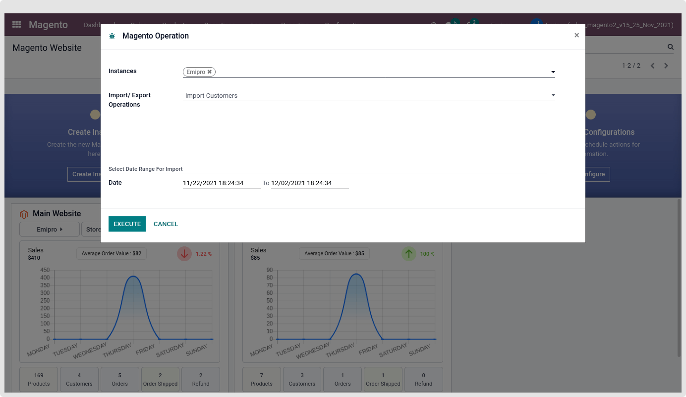
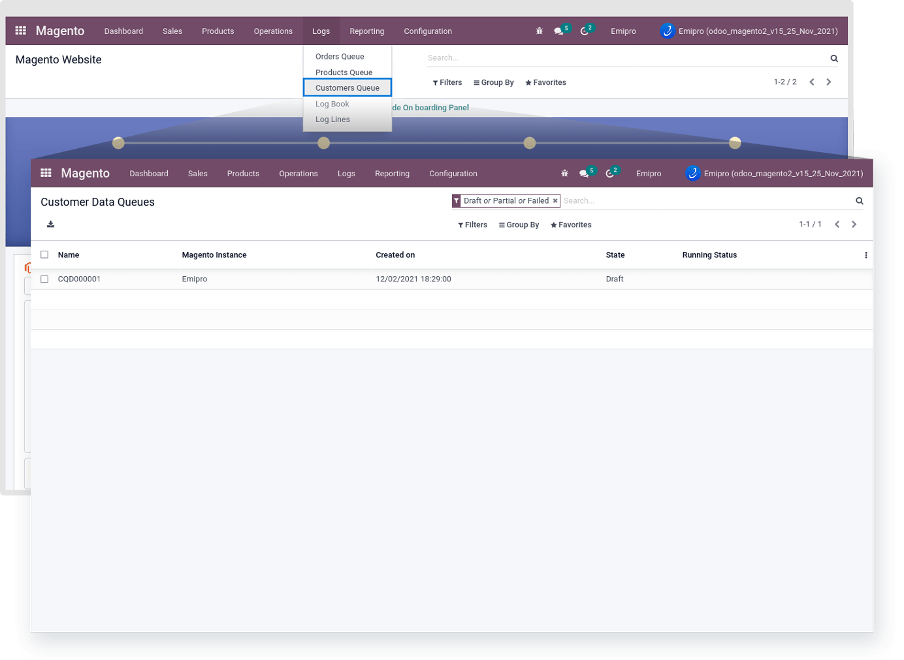
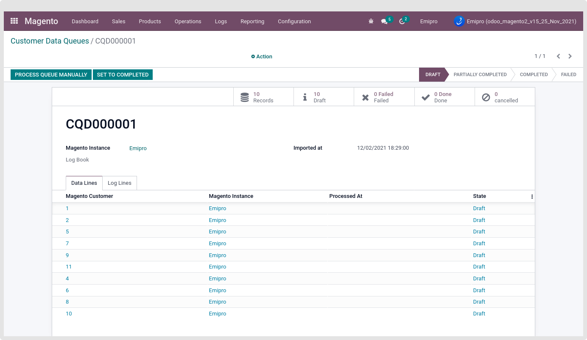
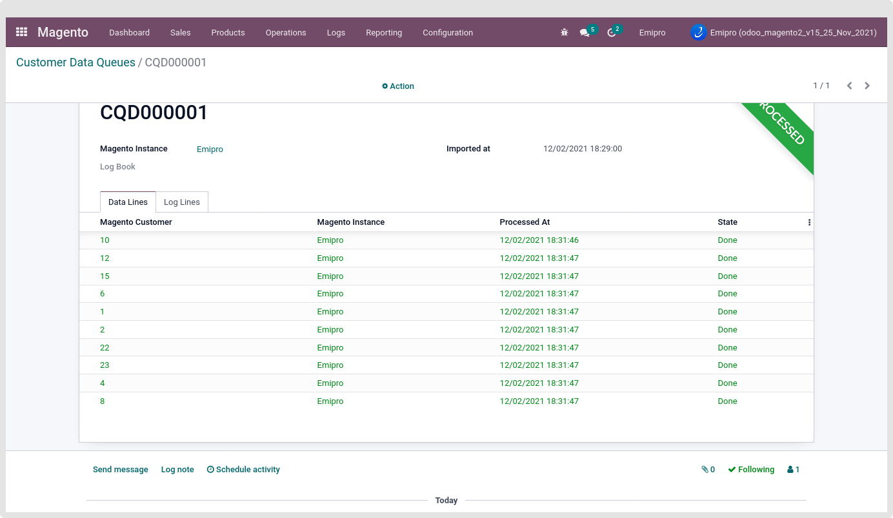
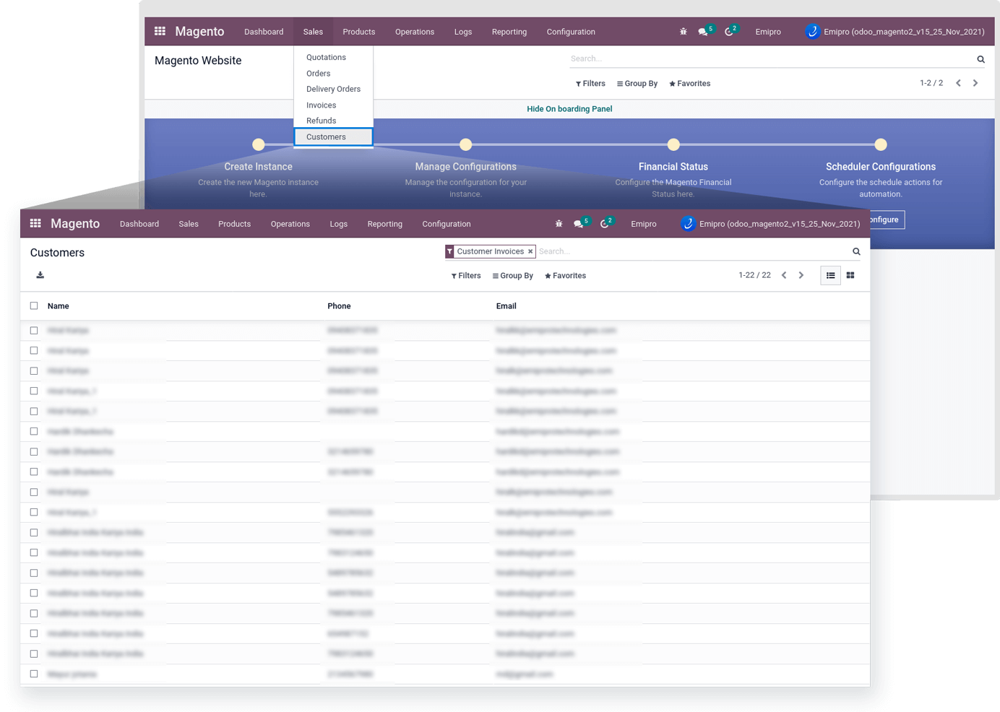
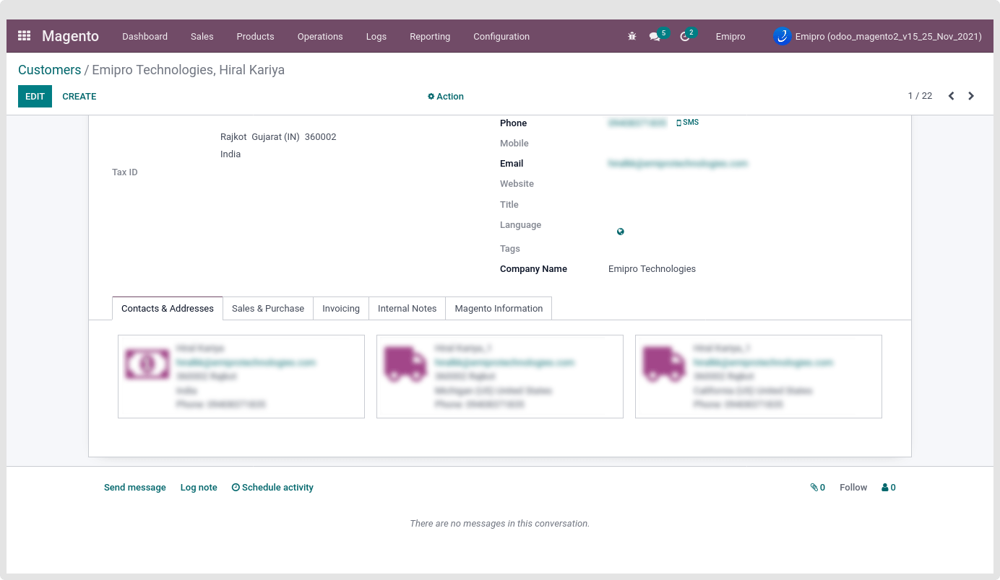
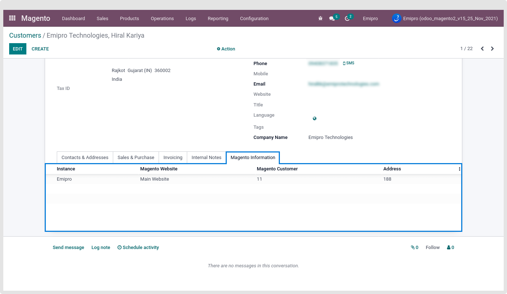

### Import Customers

Import registered customers by navigating to Magento -> Operations -> Import Customers. By default, it will set the last 10 days as the From date and the current date as the To date.

 

If you perform the import customer operation then a customer queue is created and after that you can process the customer queue to import customers.

 

 

As described earlier in the import product queue, the queue will be process automatically or by clicking on the “Process Queue Manually” button.

 

We can see customers by navigating to Magento > Sales > customers.

 

 

Magento details like Magento customer Id, Magento website, Magento Instance, Magento address Id will be visible in the “Magento Information” tab.

 

