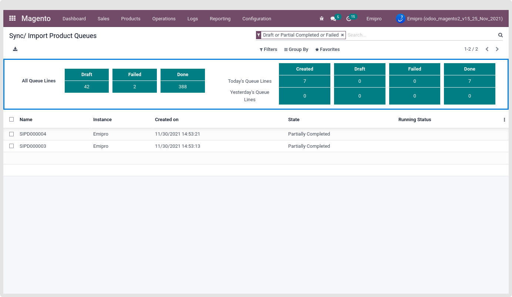
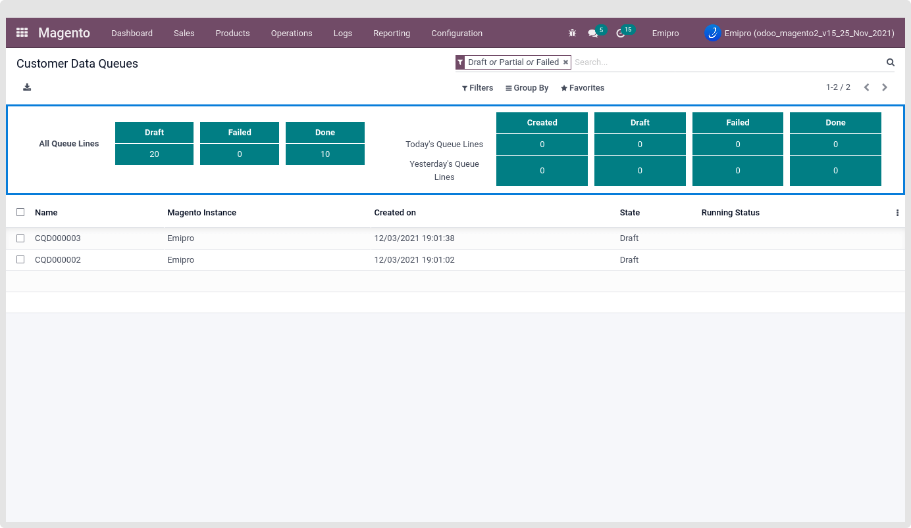

### Queue Line Dashboard

Introduce a whole new feature of queue line dashboard which allows users to visualise their draft, failed and done queue lines as well as statistics of today’s and yesterday’s created, draft, failed and done queue lines of product, order and customers.

1. Order Queue Line Dashboard

To see the order queue line dashboard, navigate to Magento > Logs > Orders Queue.

 

2. Product Queue Line Dashboard

To see the order queue line dashboard, navigate to Magento > Logs > Products Queue.

 

3. Customer Queue Line Dashboard

To see the order queue line dashboard, navigate to Magento > Logs > Customers Queue.

 

