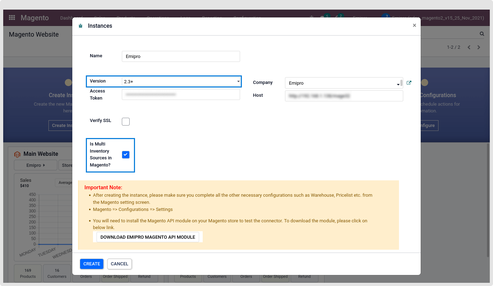
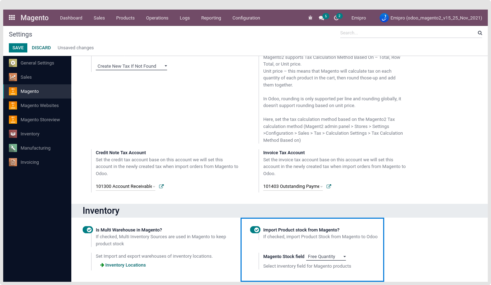
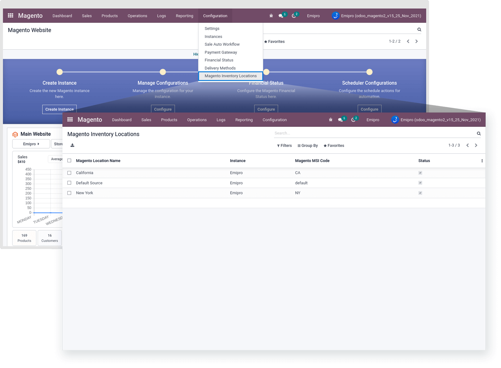
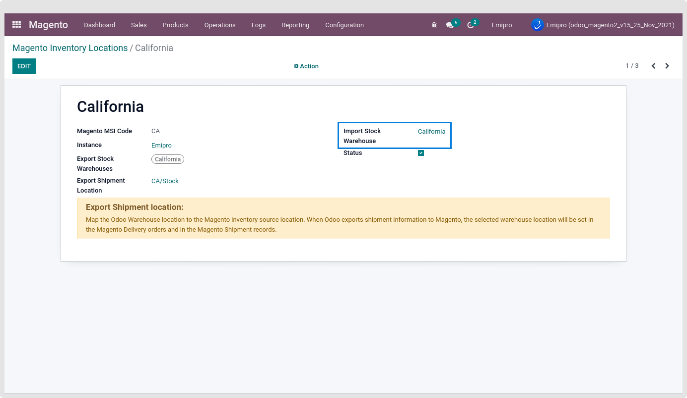
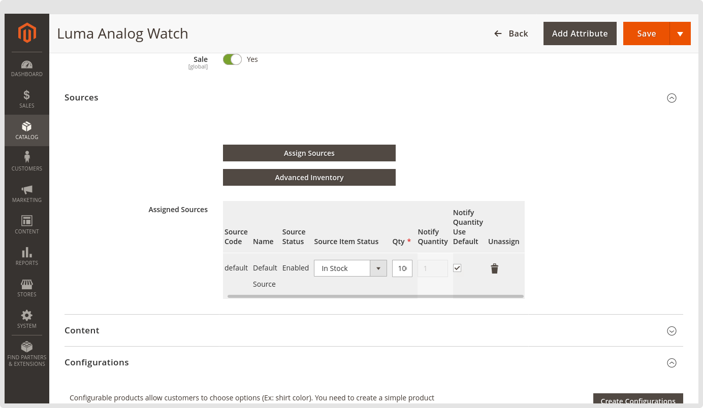
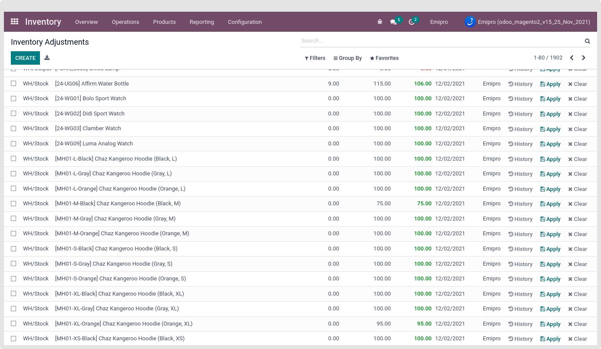
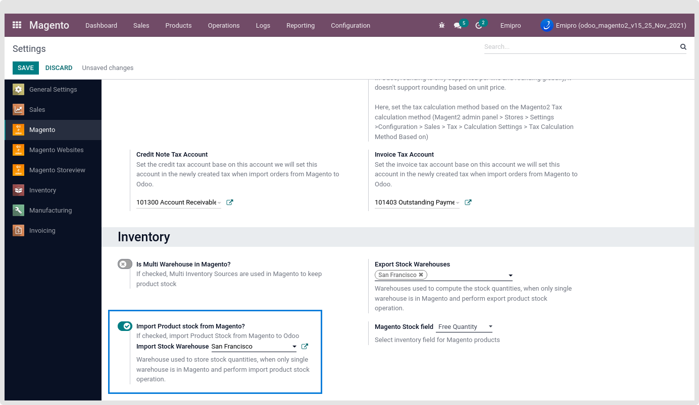

### Import Product Stock

The connector supports importing product stock from the Magento with MSI (Multi-SourceInventory) and without MSI.

**What is MSI?:** Magento2 Multi-Source Inventory (MSI) is newly introduced in Magento 2.3 version which is used to manage inventory by source (location). With the support of Magento 2 MSI, it is easier for the store merchants to control their single or multi-channel inventories and sales channels. MSI is designed to assist merchant stores in managing their multi-sources of inventory and sales channels from the Magento 2 admin panel.

So Based on your Magento version, you need to configure whether the MSI is in your Magento store or not.

1. #### **Magento version 2.3+ and Using MSI**

There are two ways to allow the MSI for the Magento Instance. If your Magento version is 2.3+.

1. While creating the Magento instance, you can configure it from the Instance wizard during the Instance creating time.

 

2. Navigate to the Magento > Configuration > Settings > Inventory Configuration. Under this, you can configure "Is Multi Warehouse in Magento?"

 

If the MSI is configured during the Instance creation time, it will automatically create your stock location in odoo. But in case you will configure the MSI from the Magento Configuration after Instance creation. Then we recommended applying “Synchronize Metadata” from the Instance.

All your Magento Location is located under the Magento > Configuration > Magento Inventory Locations.

 

Before Perform the import stock operation, Configure the odoo warehouse to import the Magento product inventory stock.

 

Import product stock is work if import product stock configuration is enabled. Otherwise import stock operation will not work.

Enable this configuration by navigating to the Magento > Configuration > Settings > Inventory > Import product stock from magento.

 

Now all the configuration is completed related to Import stock with MSI. So now you can perform the Import stock Operation by navigating to the Magento > Operations > Select “Import Stock” Operation.

 

* **Auto Validate Inventory? :** If it is checked then import product stock automatically validate in odoo, Otherwise its stay in draft state, Customer need to validate manually.

 

 

2. #### **Magento version is 2.1/2.2 or Magento Version 2.3 but not using MSI**

While not using the 2.3 or MSI, It means your inventory stock is managed using a single source location in Magento. So import that location stock into odoo’s one warehouse location. For that configure the odoo warehouse in Magento > Configuration > Settings > Import Stock Warehouse.

 

