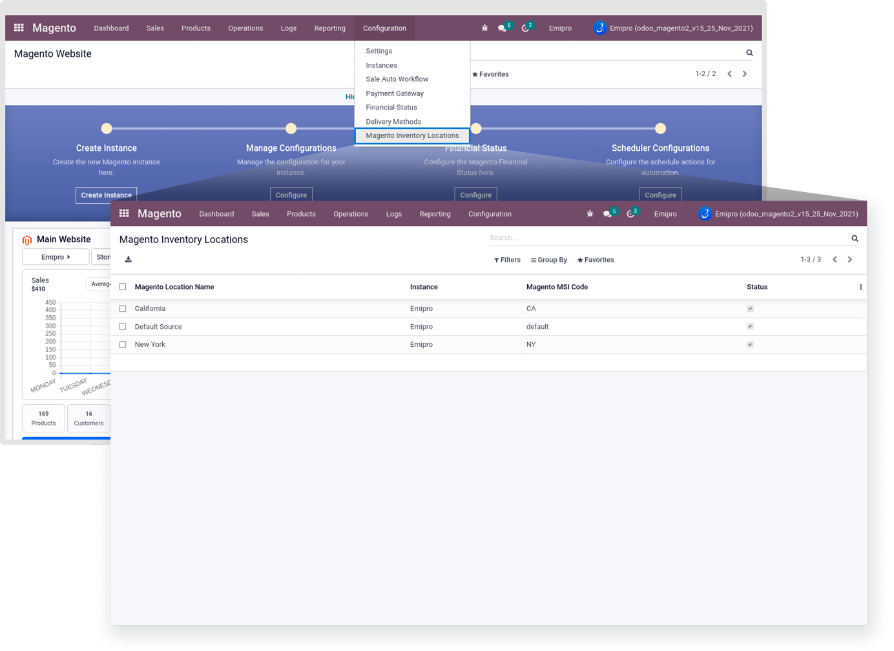
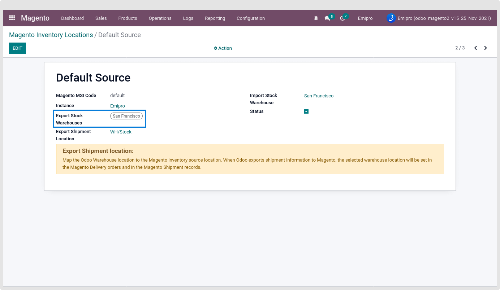
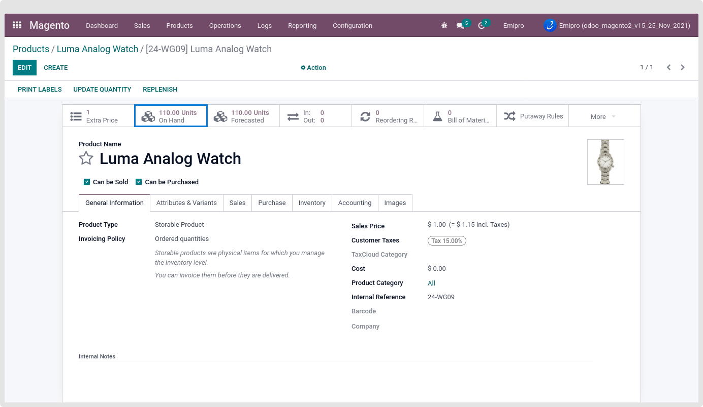
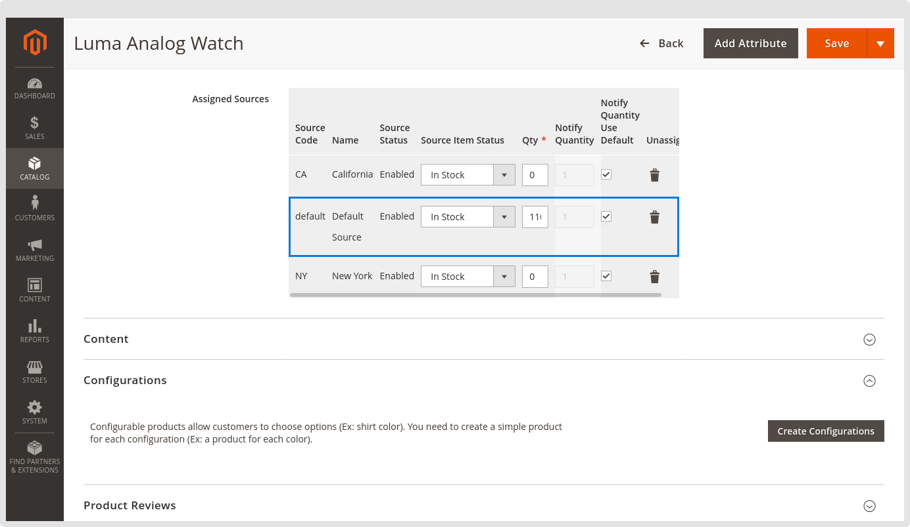

### Magento version 2.3+ and Using MSI

All your Magento Location will be listed at Magento > Configuration > Magento inventory Locations

While performing the Export Stock then based on the Configured export stock Warehouses under the Magento Inventory locations, Product stock will be exported and set in the configured Magento warehouse into Magento.

 

 

As per the above configuration, The product’s stock from the export stock warehouse “San Francisco” will be set in default source for the products into Magento Store.

 

 

