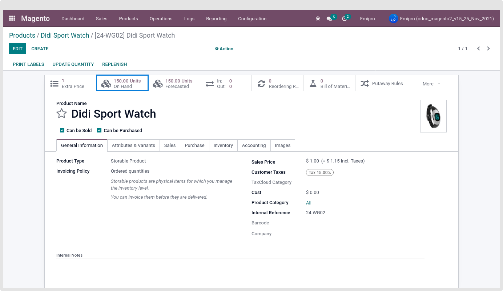
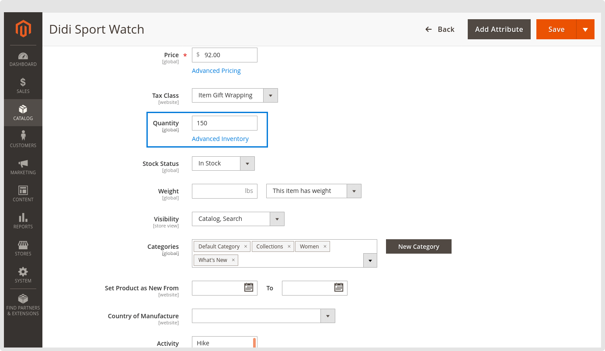

### Magento version is 2.1/2.2 or Magento Version 2.3 but not using MSI

Here your MSI setting is disabled, So all the product stock will be counted and exported from the warehouse which you configured from Magento > Configuration > Settings > Select Instance > Select “Export Stock Warehouses” in your configured Magento store.

 

As discussed above, the product’s stock from the export stock warehouses “San Francisco” will be set for the products into Magento Store.

 

 

 

