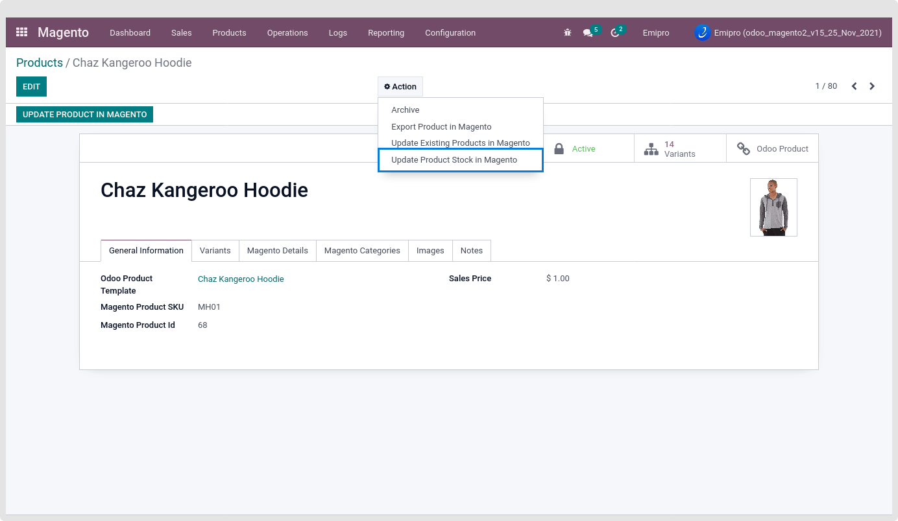

### Update Product Stock in Magento

Based on the above configuration, users can update the product stock for a single product or multiple products.

* Update Stock for Products from tree view.

For updating product stocks, select those products from tree view of the Magento Product Template and click on “Update Product Stock” button from header or click on action and select “Update Product Stock In Magento”

At a time users can only update 80 product’s stock.

By choosing the action update Product stock In Magento or by clicking on Update Product Stock button, below wizard will show.

 

* Update Stock from form view

To update the single product stock, Open specific product from the Magento Layer product template. Then go to Action and select the “Update Product Stock In Magento”.

From there, users can Export product stock for the particular product as well.

 

