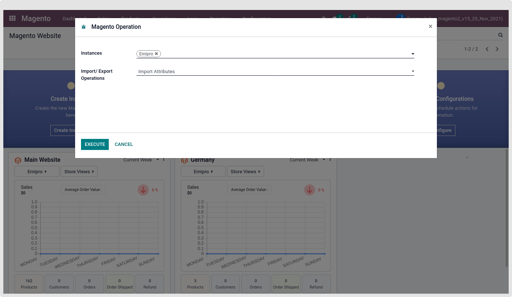
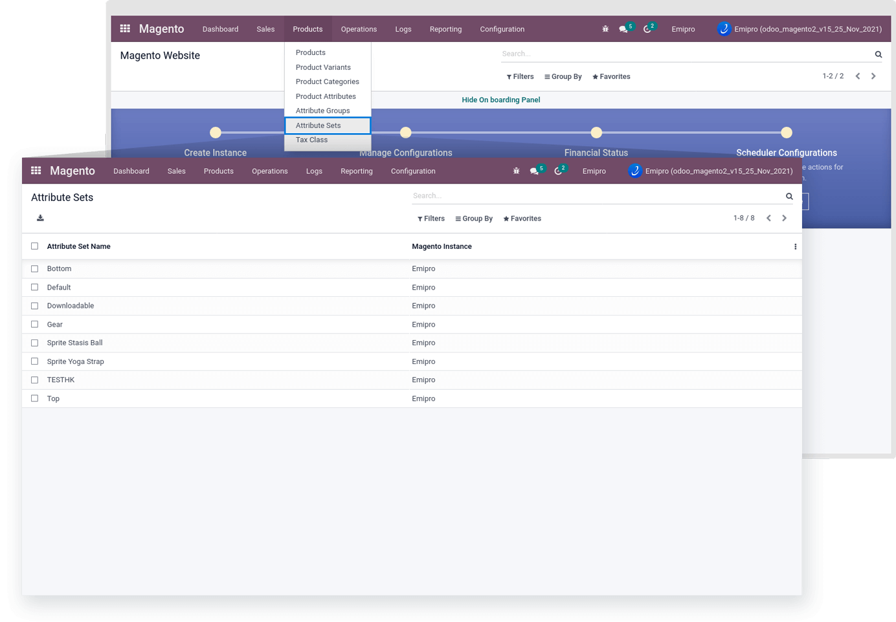
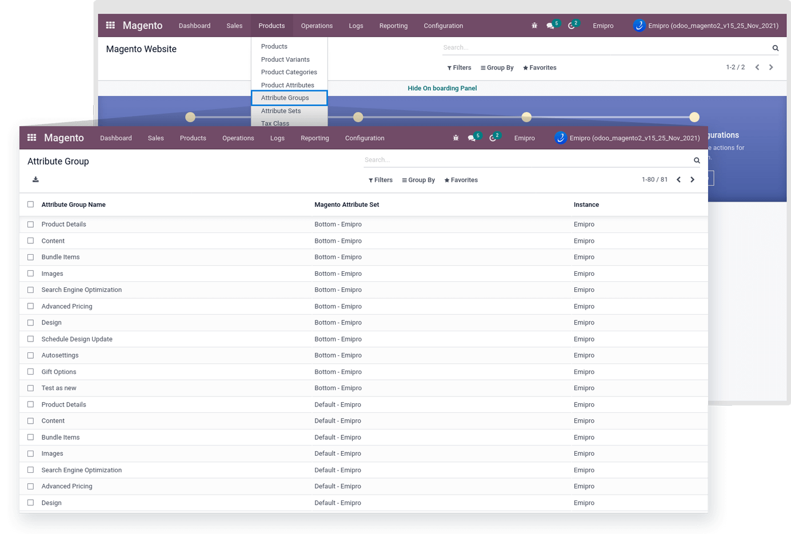
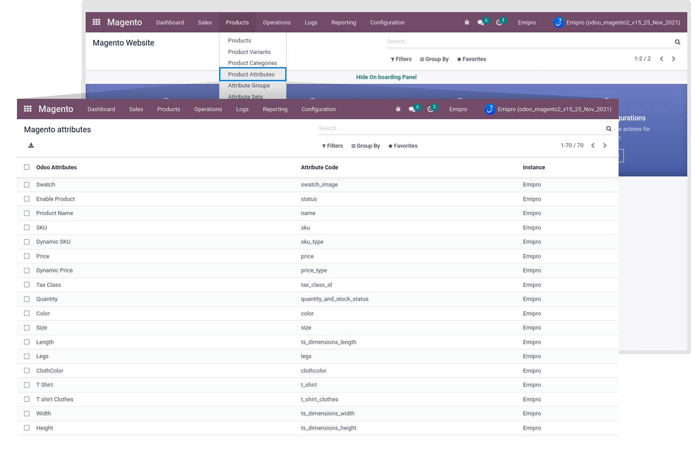
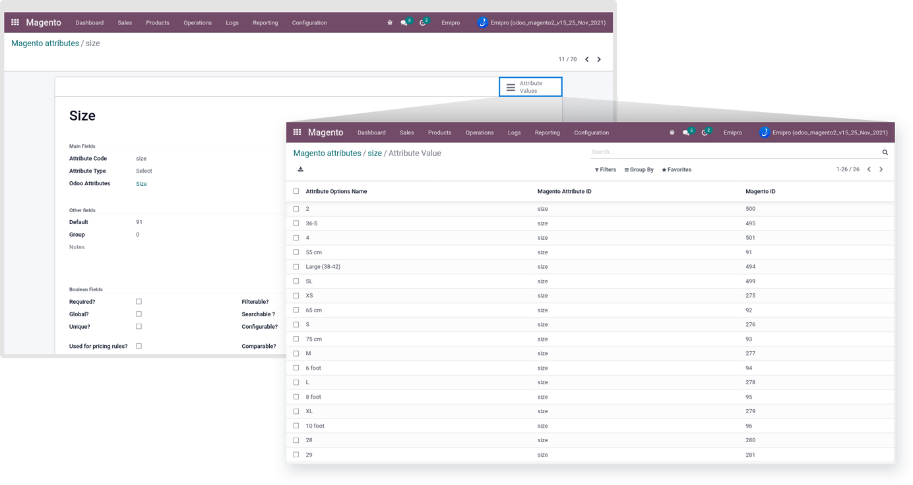

### Import Attributes

Import Attribute group, Attribute Set and Attribute options and values By performing this operation.

 

#### **Attribute set**

All Attribute Set data will list under the Magento > Products > Attribute Sets.

 

#### **Attribute Group**

All Attribute Group data will list under the Magento > Products > Attribute Groups.

 

#### **Attribute options and values**

All Attribute options and Attribute option values data will list under the Magento > Products > Product Attributes.

 

Attribute Value listed under the respective Attributes.

 

