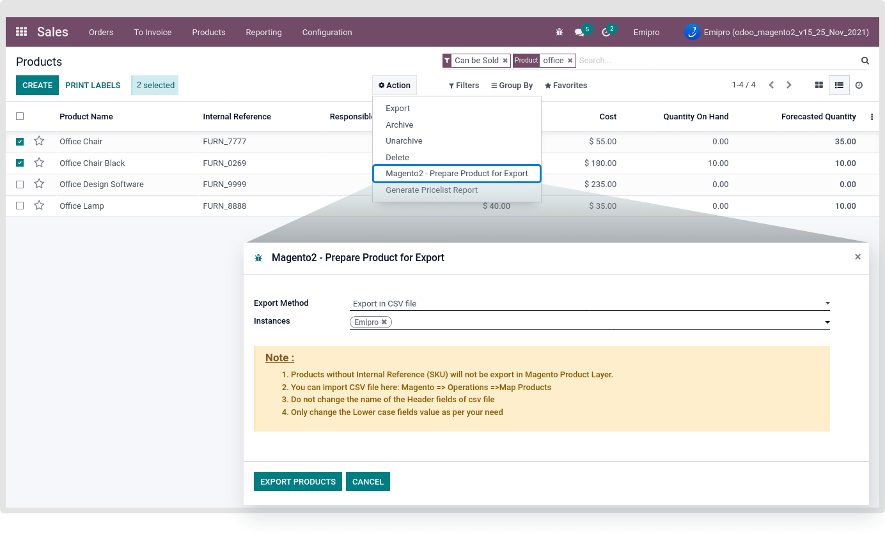
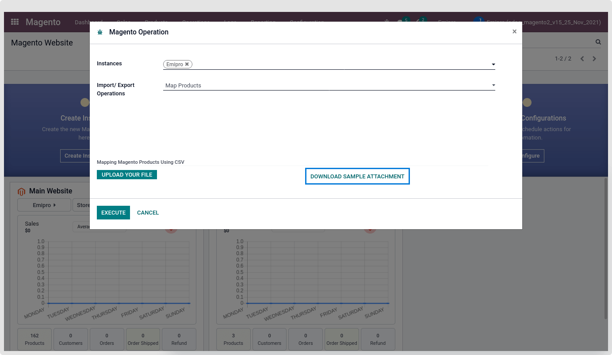
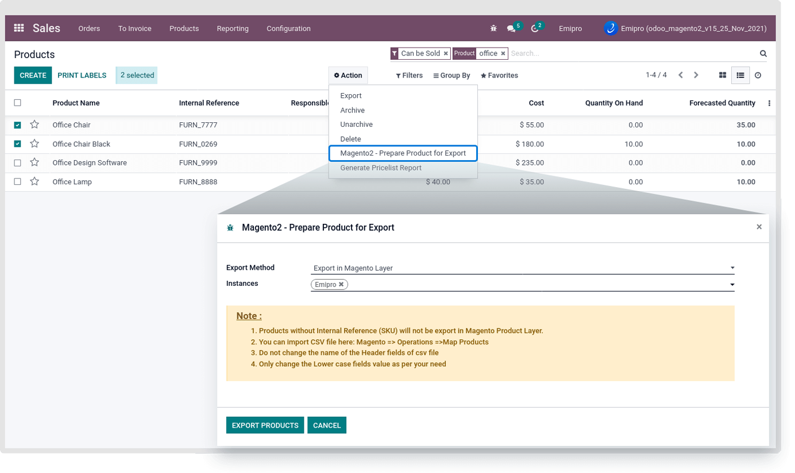
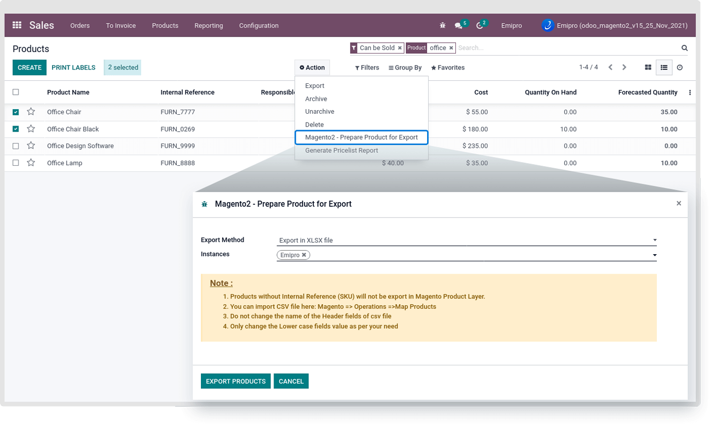
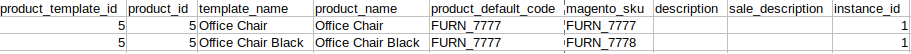

### Map Products

The connector doesn't directly sync products between Magento & Odoo, instead, it creates a layer above Odoo products called Magento Products. While performing this process it will sync Magento products with existing Odoo products. To make it happen you need to navigate to Sales / Products and select the products.

There were three different ways to Map products with Odoo to Magento Layer.

1. Export In CSV file
2. Export In Magento Layer
3. Export In XLSX file

1. **Export In CSV file**

Go to Sales / Products and select the products. Click on the Action button and choose Magento2 - Prepare Product for Export and choose Export in CSV File.

 

After clicking on the Export Products button, It will create a CSV file with the following columns.

* product\_template\_id
* Product\_id
* template\_name
* product\_name
* product\_default\_code
* magento\_sku
* description
* sale\_description
* Instance\_id

Under the magento\_sku enter the SKU of Magento Product and save the file. Use that CSV file for importing products in the Magento layer by navigating to Magento > Operations / Map Products and upload the CSV file. Please select the respective instance and click on the Execute button.

After performing this operation products are created in Magento Layer and it will be located at Magento > Catalog > Products & Product Variants.

The system will set data like the Odoo Product Template, Magento Product SKU, Variants details, Instance, Product Type, and Name of the Product. Some of the product data is still not set in the Magento product layer, like Magento Product ID, Website, Sync with Magento, etc.

That will be set after performing the Import Product Operation.

Sample file of the map product will download on clicking on “Download Sample Attachment” from the wizard.

 

2. **Export in Magento Layer**

Select this option while you are managing the products with the same SKU on the Magento side and odoo sides.

So using this option, Direct products are mapped from odoo with Magento layer.

 

#### **3. Export In XLSX file**

Go to Sales / Products and select the products. Click on the Action button and choose Magento2 - Prepare Product for Export and choose Export in XLSX File.

 

After clicking on the Export Products button, It will create an XLSX file with the following columns.

* product\_template\_id
* Product\_id
* template\_name
* product\_name
* product\_default\_code
* magento\_sku
* description
* sale\_description
* Instance\_id

Under the magento\_sku enter the SKU of Magento Product and save the file. Use that XLSX file for importing products in the Magento layer by navigating to Magento > Operations / Map Products and upload the XLSX file. Please select the respective instance and click on the Execute button.

After performing this operation products are created in Magento Layer and it will be located at Magento > Catalog > Products & Product Variants.

The system will set data like the Odoo Product Template, Magento Product SKU, Variants details, Instance, Product Type, and Name of the Product. Some of the product data is still not set in the Magento product layer, like Magento Product ID, Website, Sync with Magento, etc.

#### **Magento Offer Selling Product Mapping**

**What is Offer Selling in Magento?** 

In such cases, customers may manage two different product SKUs for a single product by representing two different products in the store. Such scenarios also can be managed in the product mapping. Two different Magento Products indicate the single product in odoo. Our app allows us to manage the Magento offer selling product.

 

