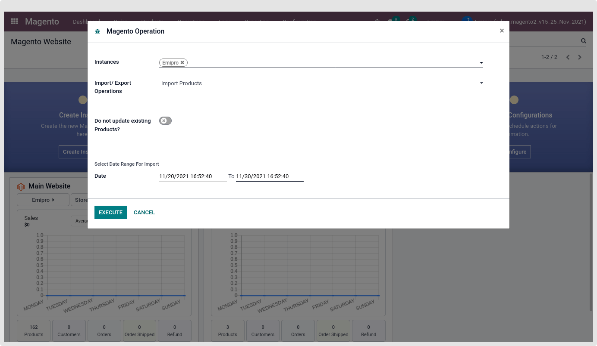
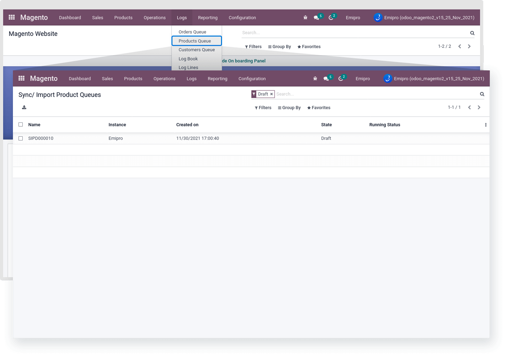
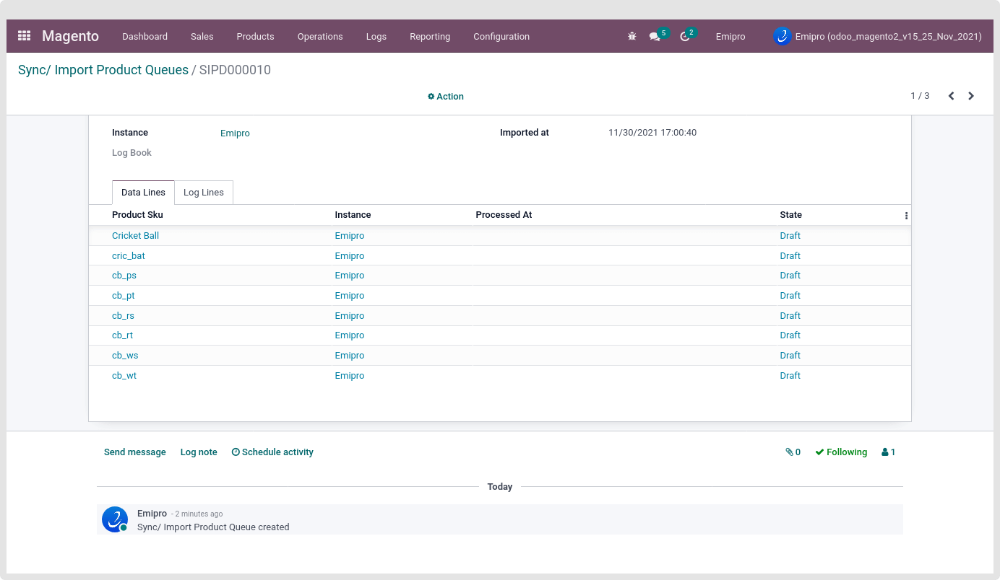
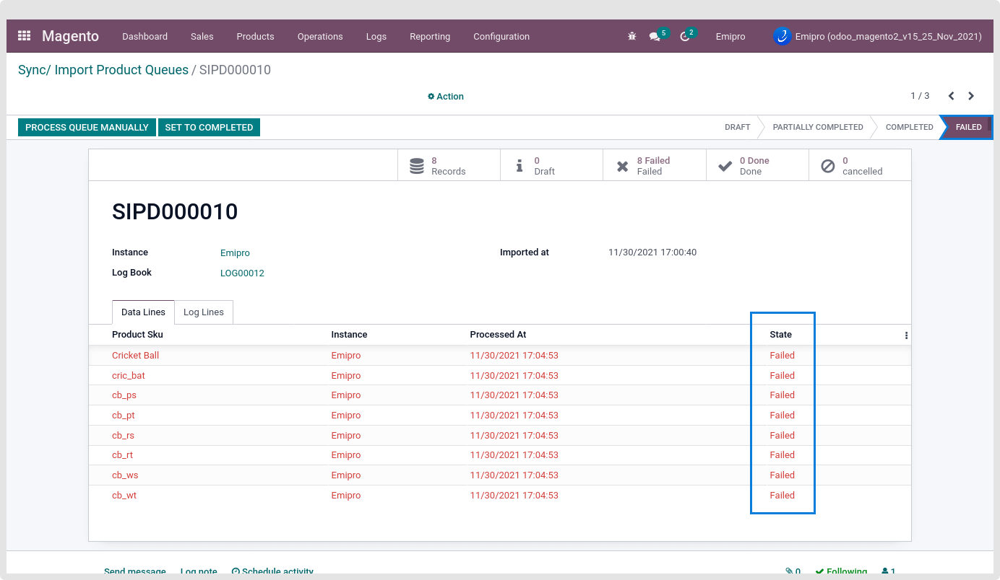
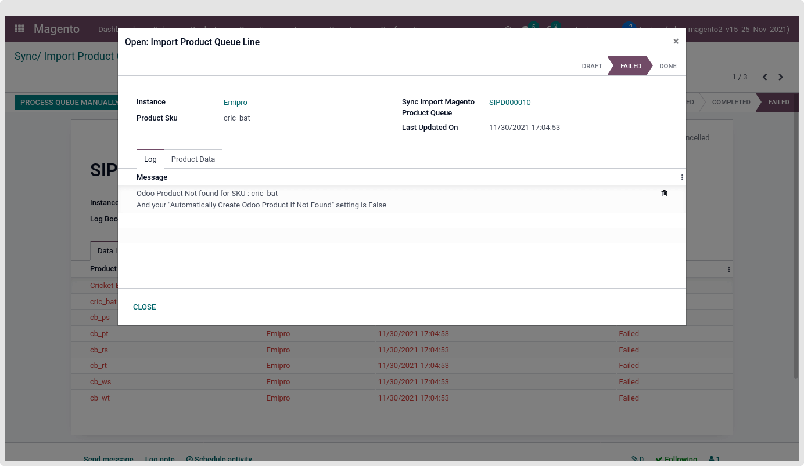
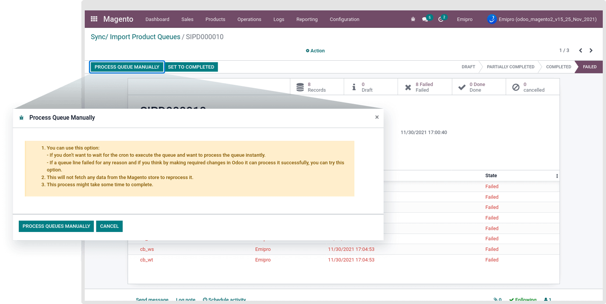
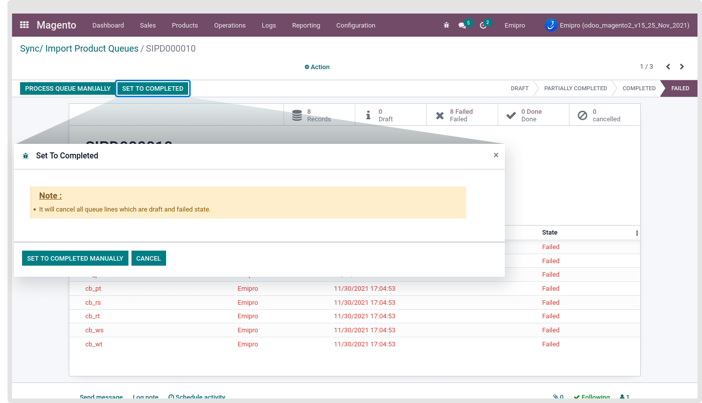
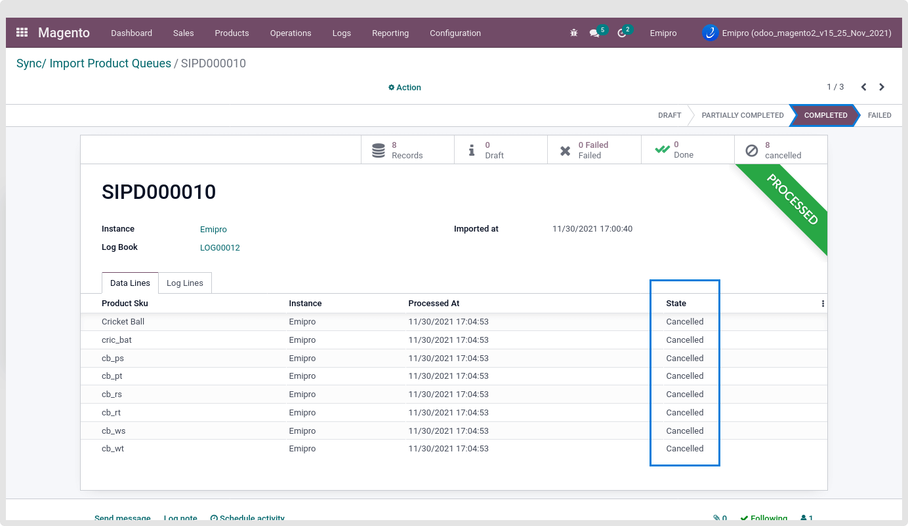

### Import Products

When Importing the products from Magento to Odoo for the first time, you will need to import them manually.

For the First time, Import all the Products by Navigating to Perform Operation. For import, all the Products are Only set To Date in the Operation Wizard And Make the From Date as Blank. So it will import all of the Magento store Products in Odoo. By default, it is set 10 days before To Date.

 

While you insert the From Date and To Date, it will only Import those products which were updated at that time duration.

As per the previous explanation regarding the "Automatically Create Odoo Product If Not Found?" setting.

If you are selling on multiple sales channels and having different Product SKU / Internal Reference / Default Product Code on each sales channel, this setting should be disabled. So, in this case, your Magento store products are still not in Magento Layer, So First Map all those products by Performing the Map Product Operation. And then Perform the Import Product Operation.

But if you made the "Automatically Create Odoo Product If Not Found?" setting as Enable, you can directly perform the Import Product operation without performing the Map Product operation.

Once you click on execute, it will create a Product queue(s).

Our App only allows the Import Configurable and Simple Type Products while performing the Import Product operation.

#### **Introducing Queue**

The whole new way to import thousands of Products, Orders & Customers in a disciplined way and process it in Odoo in batch. With the Queue, you are processing the data in a batch where the load on system resources will be less compared to processing the data in a single shot. Import and process of data are the same but when it is configured for auto-process, it will follow this system.

All the product data which is fetched from Magento will be stored in the Magento -> Logs -> Products Queue.

 

 

You can see all the product queues here as shown in the screenshots below.

 

By default, all those queue states are set as in the Draft state. There is one Schedule Action (cron) run in the backend every 5 minutes. It will take a one-by-one product queue, which was in Draft state.

After that, create the Product in odoo. If the Product is already Mapped with Magento Layer, then only set the few data in the created Magento Layer Product. Like Magento Product ID, Sync with Magento, Magento website, etc.

If any constraint fails, then sets mismatch during the Queue Process, the Product will not create and place the logline. Also, make that product queue line as Fail state and queue status failed too.

 

There are 4 main types of queue states.

* Draft: Queue is still not processed and all the relevant queue lines are in Draft state.
* Partially Completed: Queue is in process or Some of the relevant queue lines are in Draft state, some are in Completed state and some goes to Fail state
* Completed: Relevant all the queue lines are processed successfully and it’s in the done state.
* Failed: All the relevant queue lines are in the Failed state.

 

By clicking on that fail queue, You will find the Fail queue line log. For which reason that queue line goes to fail, that reason describes there.

 

There is another way to run this queue manually. By clicking on the “Process Queue Manually”. Using this option, forcefully run the product queue.

 

By clicking on the “Set To Completed” button, It will cancel all queue lines which are draft and failed states. Set the queue as “Completed” state and all the queue line goes to “Cancelled” state without creating or performing any operation.

 

If you Force Done the queue, the data in it will not be processed in Odoo further anymore.

 

