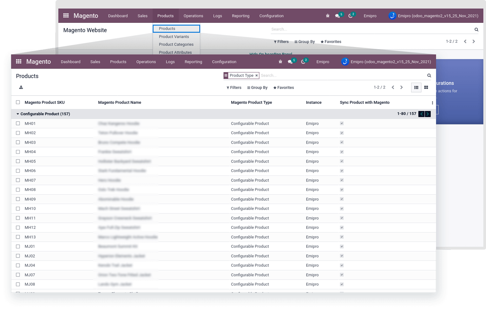
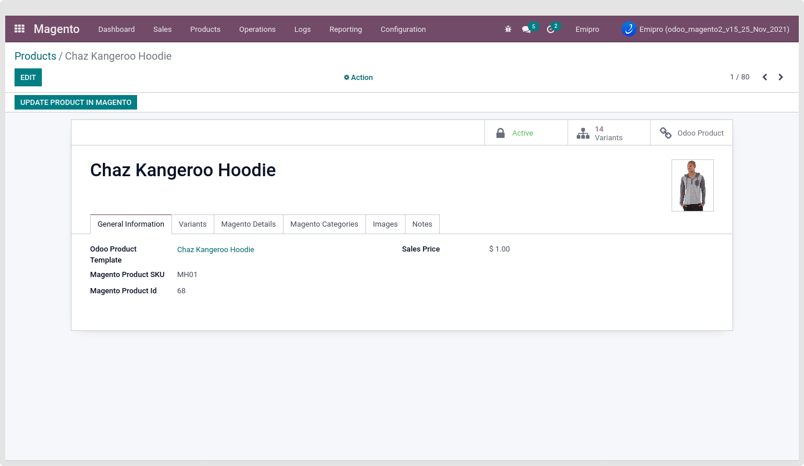

### Configurable Product Import

All the configurable products from Magento will be imported to Odoo as shown below. Easy to identify by “Product Type” under the Magento > Products > Products.

 

Also, find configurable product’s all child products or variants under the Magento > Products > Product Variants.

To show the Particular product-wise its relevant variants, Directly clicking on the Variants smart button inside the Magento Layer Product Template. Also, you can see the total number of the attached variant count.

 

Under the configurable product’s template, you can find the Magento Product ID, Magento Product Image, website, Mapped with odoo product template, Description, Short Description, Magento Instance.

