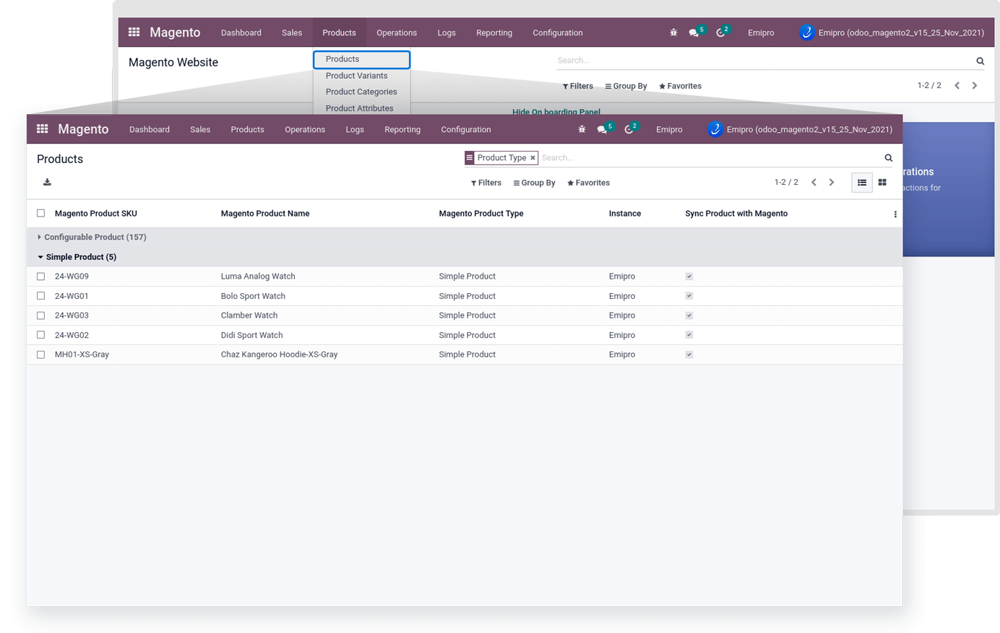
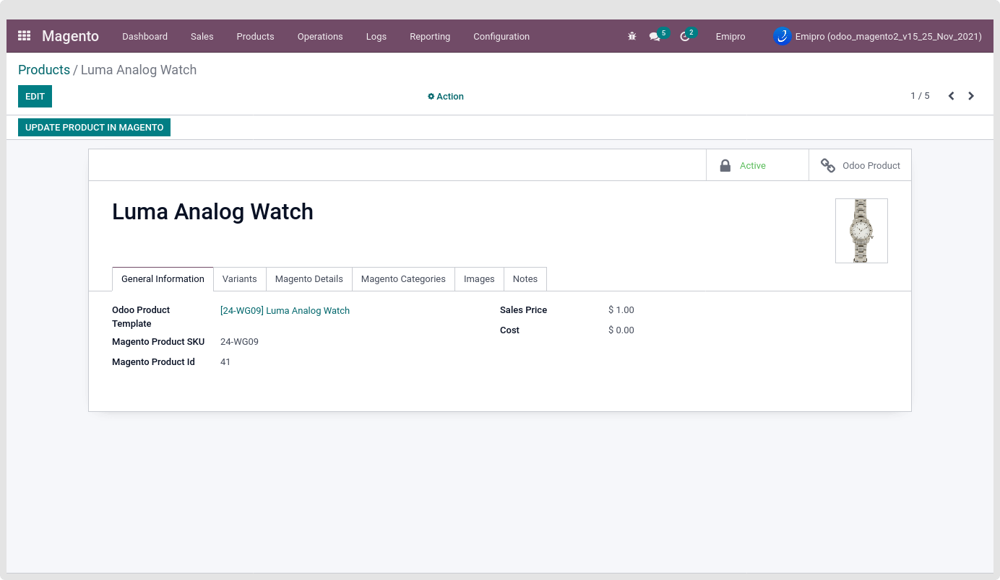
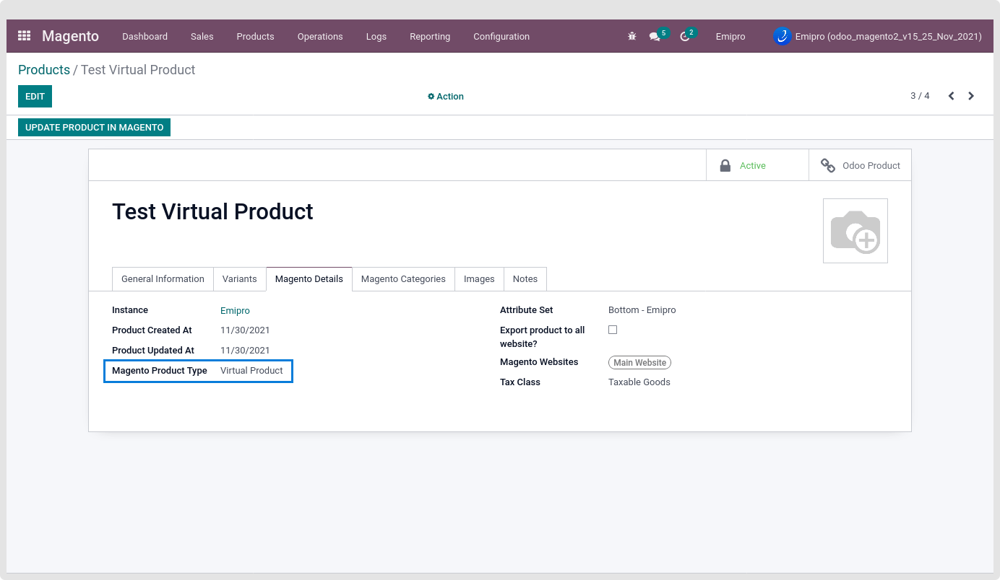
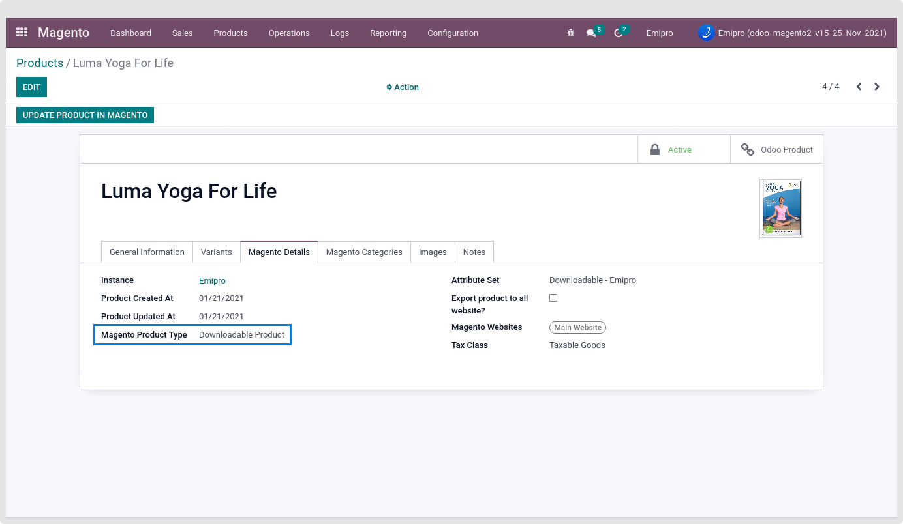
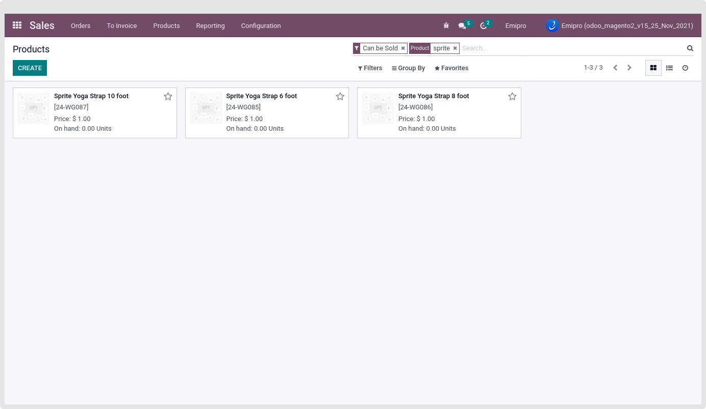
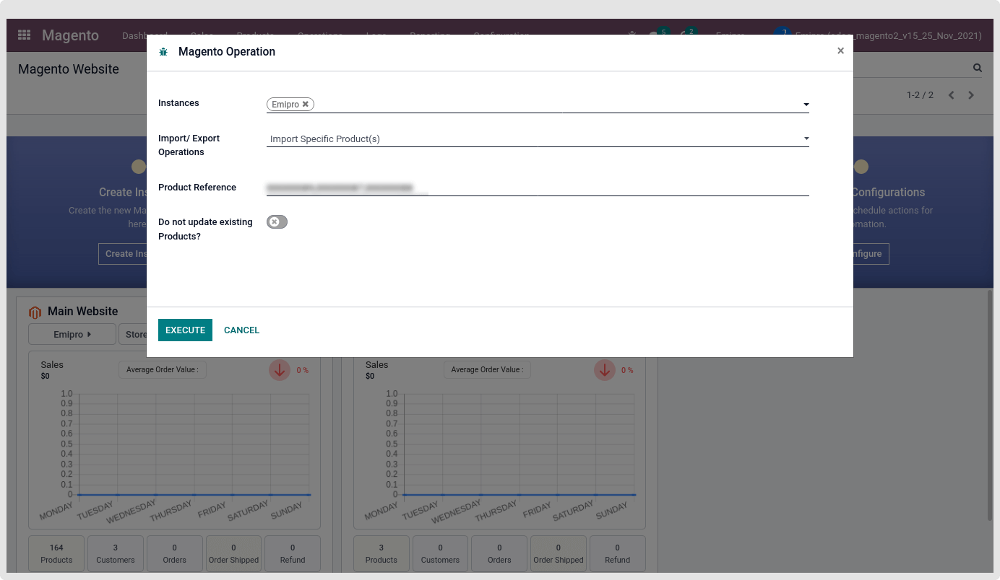

### Simple Product Import

While importing the simple product and after the process, that queue has a simple product type in the queue line. The new product will be created in the Magento > Products > Products as the simple product template and Magento > Products > Product Variants as the Simple product. Here also all the simple product data is saved in the Product template and Product layer.

 

 

In your Magento store if you are managing Product SKU having slash (‘/’). Then it’s required to enable “AllowEncodedSlashes On” in your default Apache configurations. The workaround is to add the AllowEncodedSlashes setting inside a <VirtualHost> container (/etc/apache2/sites-available/default in Ubuntu).

### **Import products during import orders**

The magento2 odoo connector allows unshipped,shipped and specific order and also allow to import virtual, downloadable and grouped product order.

**Virtual product order:** Search product in Odoo first, then check that product within layer; if not found, create product within layer and add that product to sale order; if product is not found in Odoo, then place a log.

You can see virtual product at Magento > Products > Products.

 

**Downloadable product order:** Search product in Odoo first, then check that product within layer; if not found, create product within layer and add that product to sale order; if product is not found in Odoo, then place a log.

You can see downloadable products at Magento > Products > Products.

 

**Grouped product order:** if you are importing the grouped product order then doesn't it matter your **Automatically Create Odoo Product If Not Found?** is true or false but you need to create child products of the main grouped product in odoo and create a grouped product’s order in magento and import that order.

 

#### **Product Price List**

If In your magento store, your catalog price scope is global then only 1 price list will be automatically created with your base currency.

If In your Magento store, your catalog price scope is a website then price lists will be created based on your website currency and automatically will be set into related websites while creating the Magento instance in Odoo.

While importing the product, add the product price in the appropriate price list based on catalog price scope configuration from Magento > Configurations > Settings.

#### **Do not update existing products?**

This Option is visible in the Operation wizard while performing the Import Product or Import Specific Product operation as well as Magento Schedulers from Instance.

By checking this option, If the product is already imported or created in the Magento Layer. Then during the current process, the same Product price will not be updated.

#### **Import Specific Products**

This feature allows importing specific products by Product SKU. Also, allow importing single or multiple Product SKUs with comma-separated.

 

