### Export Product Operations

##### **Simple Product Type**

1. ###### *Create New Simple Product*

While export simple product, user can set some informations which will be used when create a product in Magento

Below are the fields in which the user can set the value.

* Attribute Set

* Tax Class
* Website
* Category
* Images
* Description
* Short Description

**Attribute Set :** Attribute sets must be set when exporting a product into Magento.

 Magento will not allow to create Products without Attribute Set.

So we can configure attribute set values either from product form view or from “Export product in Magento” wizard.

* From Magento Product Template

 

 

* From the “Export Product In Magento” Wizard

 

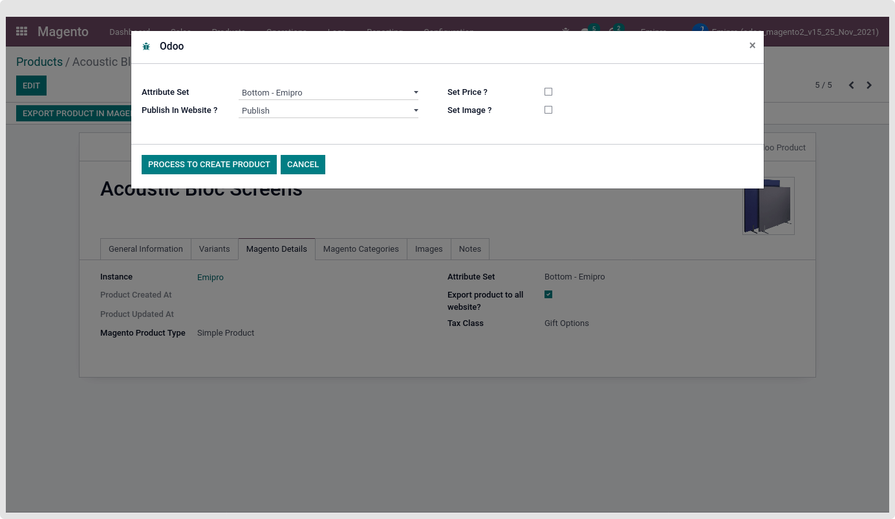

Here, In case the Attribute set value is configured in the Product and also set from the Create new Product wizard then the first priority will give to the wizard Attribute Set.

If attribute set is not set into wizard then attribute set will be taken from the Magento product template form view.

In the exception case, If attribute set value is not set under the product or wizard then the product will not be created in Magento and placed in the log.

 

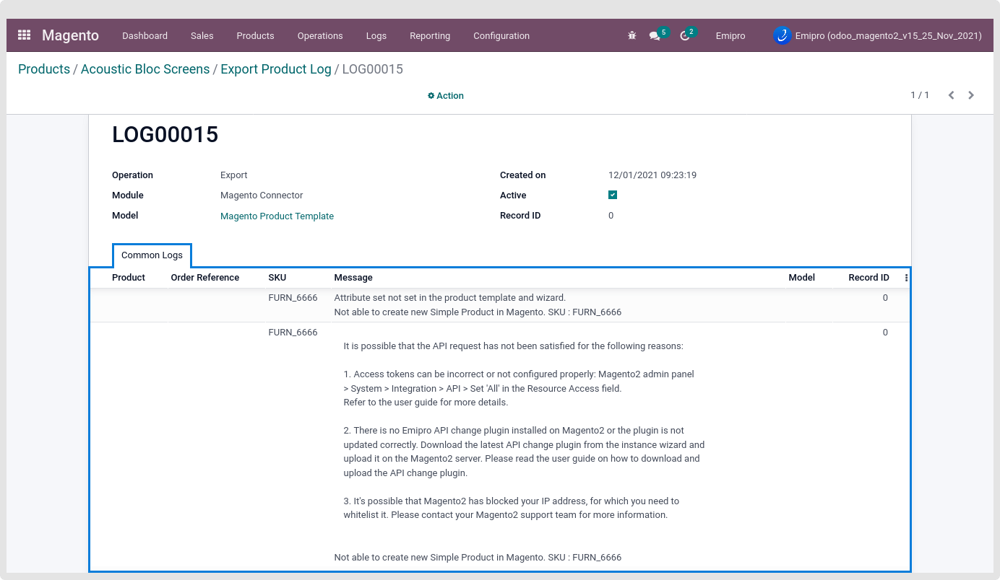

**Tax Class :** To configure tax class, please go to Magento > Products > Products > open any product > Magento Details > Tax class > select Tax class.

 

This Field is not required to configure. In Case this field is not configured during the Export Product, Then the product will be created with the configured “Default Tax Class for Product” from the Magento Store Admin Panel Configuration.

You can check or change that configuration from the Magento Admin Panel. That configuration is located under the Magento admin > Stores > Configuration > Sales > Tax > Tax Classes > Default Tax Class for Product.

 

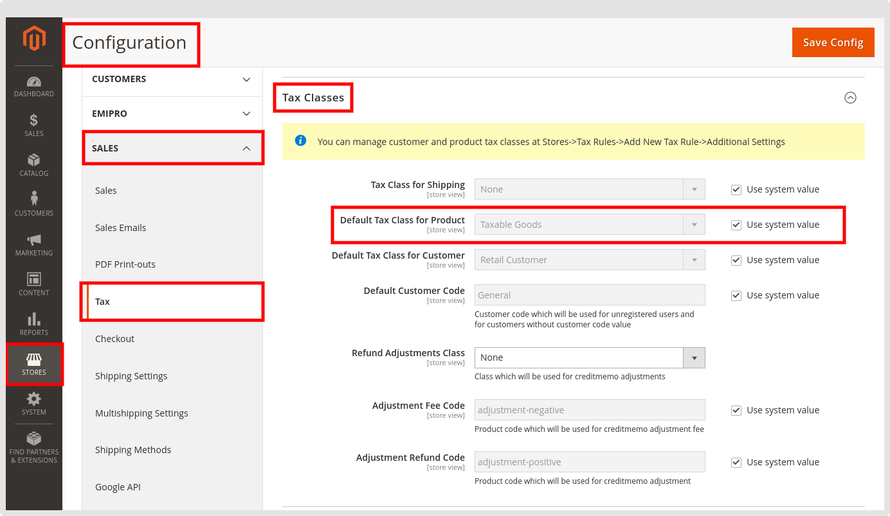

**Website :** Magento Website can be configured 2 ways into Magento Product template.

1. **Export products to all websites?**

 

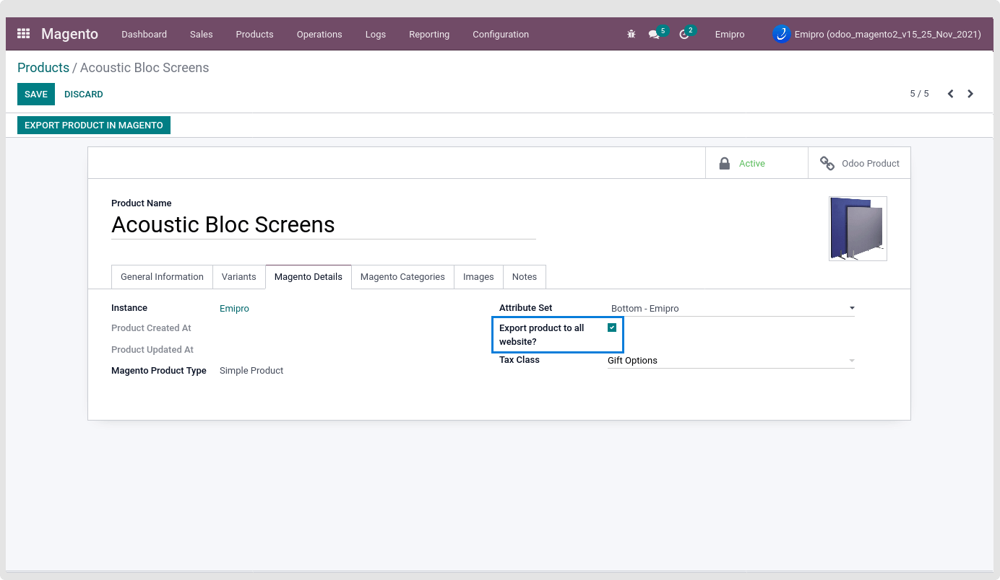

This option can be configured under Magento > Products > Products > open product > click on Magento Details > Export Product to all websites?

By Default this configuration is enabled.

If you are managing multiple websites and want to publish that product in all the websites then “Export product to all websites?” set mark as True.

So a product will be created in all Websites for the configured Instance in the Product.

2. **Select specific websites**

 

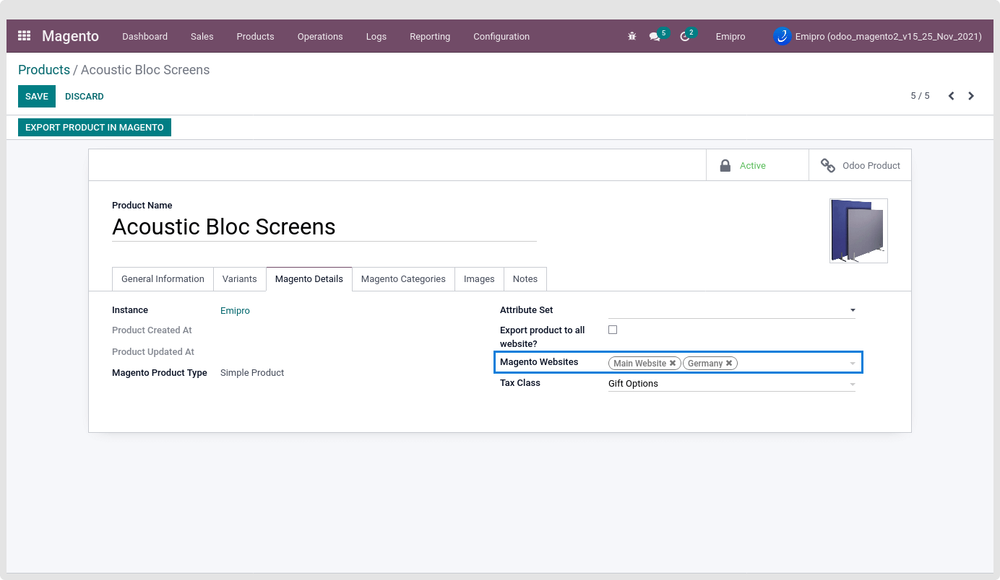

But in case users want to allow this product to specific websites among the all, Then need to configured those selected website in “Magento Websites”

Magento Websites only visible if the Export product to all websites is marked as False.

**Category :** Product category is not required when exporting product into Magento. In this case, the Magento product is not assigned to any category. It is recommended to assign categories to the product.

While creating a new product, if the category is configured, then all those categories will appear in the product in Magento.

The category will be configured under Magento > Products > Products > Magento Categories.

 

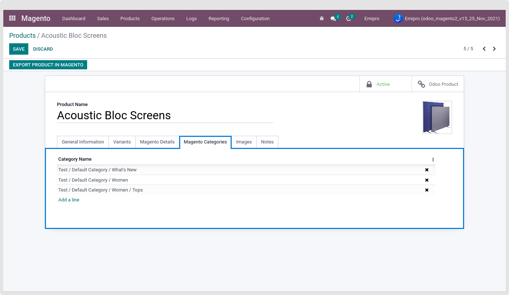

In Case selected category already deleted from the Magento before creating the Product, That category will not assign to Magento Product.

This connector will not create a category if the selected category does not exist in Magento.

**Images :** While Map Product form Odoo Layer to Magento Layer, If in the odoo layer the product Images are set then all those Images will be set in the Magento Layer.

Now if you want to add more images for Magento Product only then you can add those images from the Magento Layer directly.

 

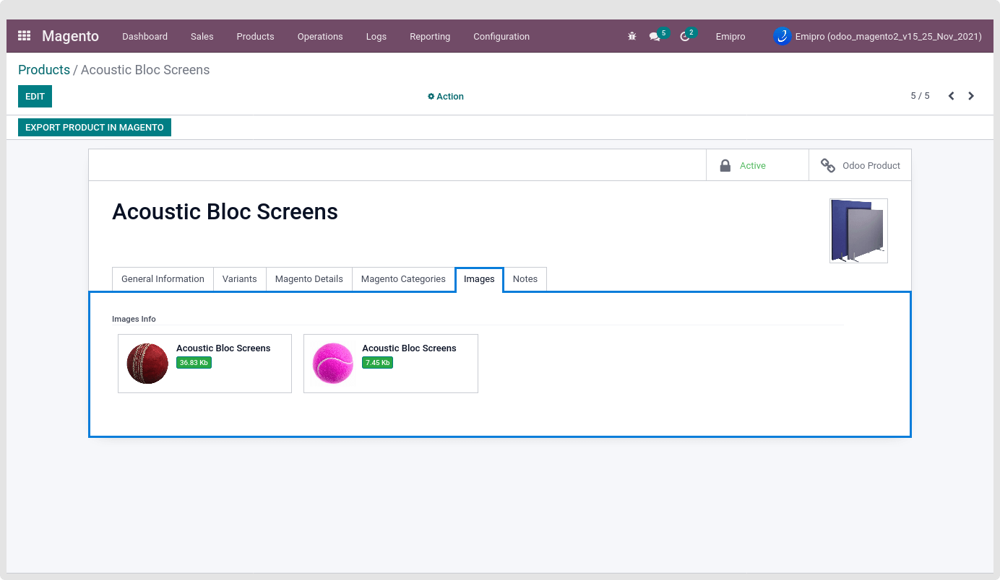

Magento product template main image will be set as Main image into Magento while export product in Magento.

**Description & Short Description :** As explained above for the Global Configuration for the Description and Short Description, this point is determined by that configuration.

If that configuration is enable and you Map your Product from odoo to Magento Layer then only the “Internal Notes” and “Sales Description” will be set under the “Description” and “Short Description”, Otherwise that data will not been set in Magento Layer Product.

 

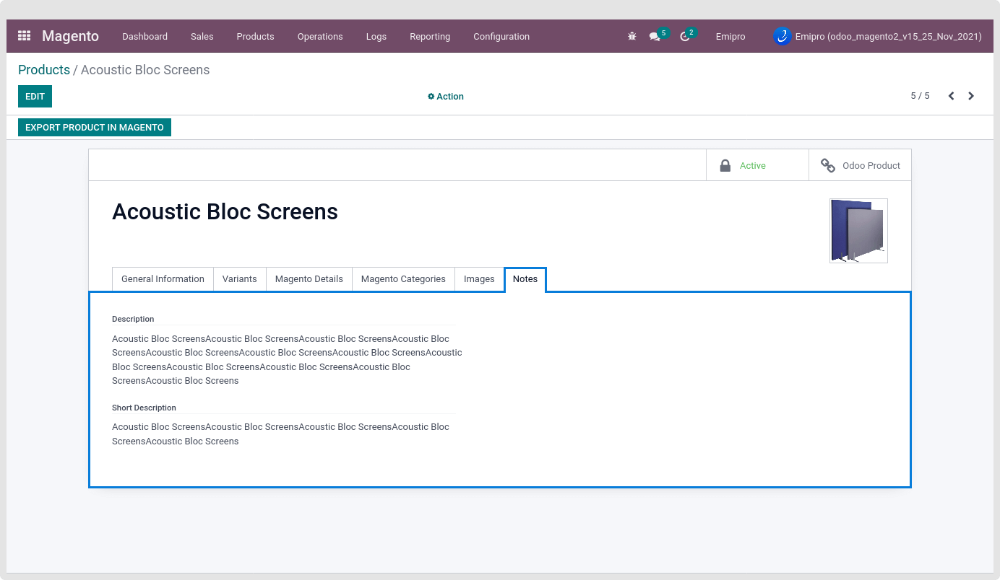

Now that Global configuration is enabled then only the Product Description and Short Description will be sent from odoo to Magento Product and set those details in Magento Product.

Our connector supports this Description and Short Description in Multi Language. In case your Magento store has a different store view and all have different language, Then based on that store language the Product name, Description and Short Description will be set. Before Export Product if you want to create a product with Description and Short Description with multi Language then translate those data in Layer first.

 

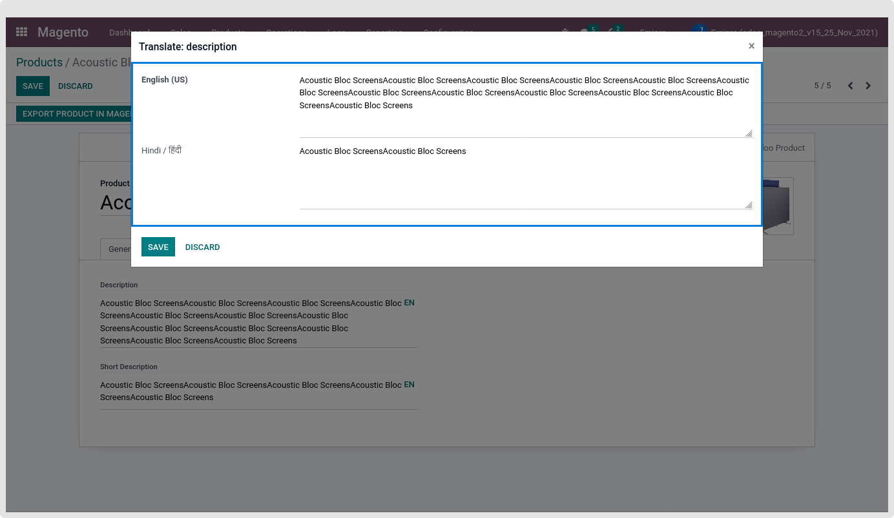

**Price :** While creating a new simple product then Price will be set as per the configured price list in the instance and based on catalog price scope, But if the price is not set in the price list then that price will be taken from the Layer Product Sales Price.

There will be 2 types of catalog price scope available into Magento and based on that price list will be set/taken at the time of import/ export product in/from Magento. Let’s explain catalog price scope in detail.

1. **Global**

If catalog price scope is global then when exporting a product from Odoo then first find the price list which is set under Magento > Configuration > Select Instance > Set Price List into product section.

 

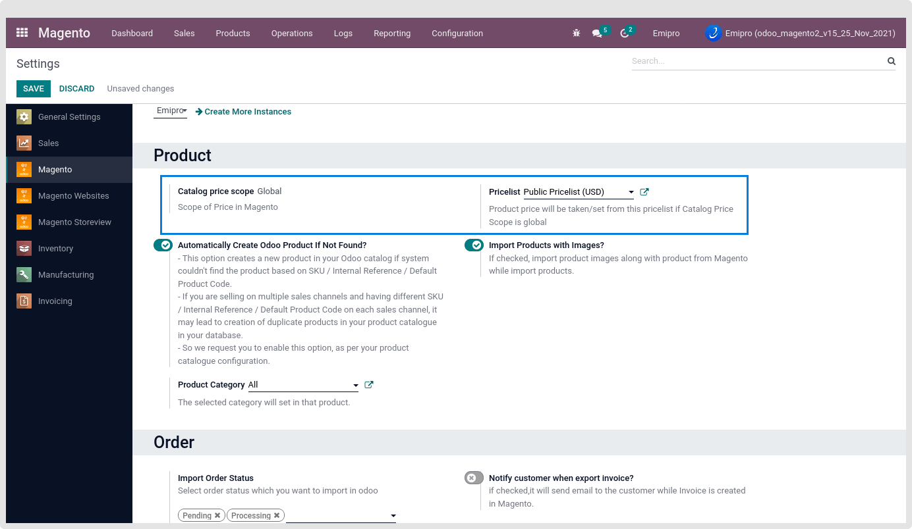

If this price list price is set into product then this price will be taken otherwise product sales price will be taken at the time of export product into Magento.

 

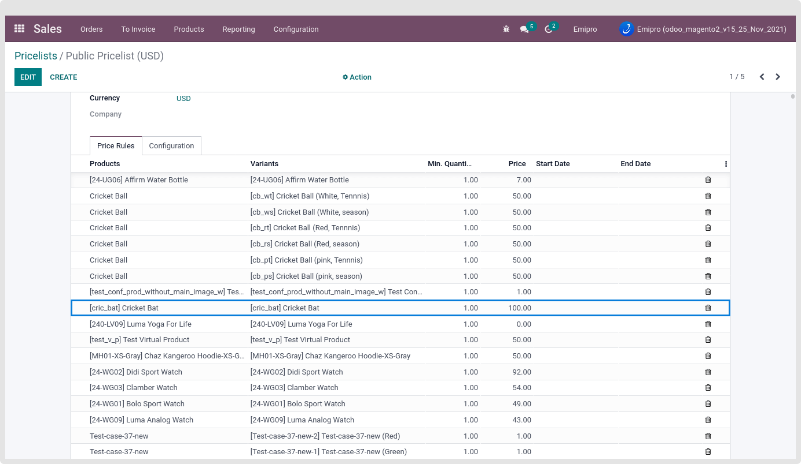

 

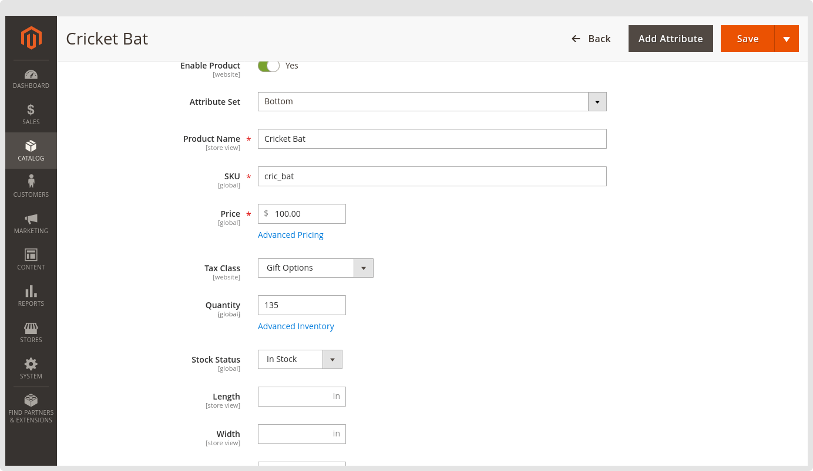

2. **Website**

If the catalog price scope is a website then when exporting a product from Odoo then first find the price list which is set under Magento > Configuration > Select Instance > Select Website> Set Price Lists.

 

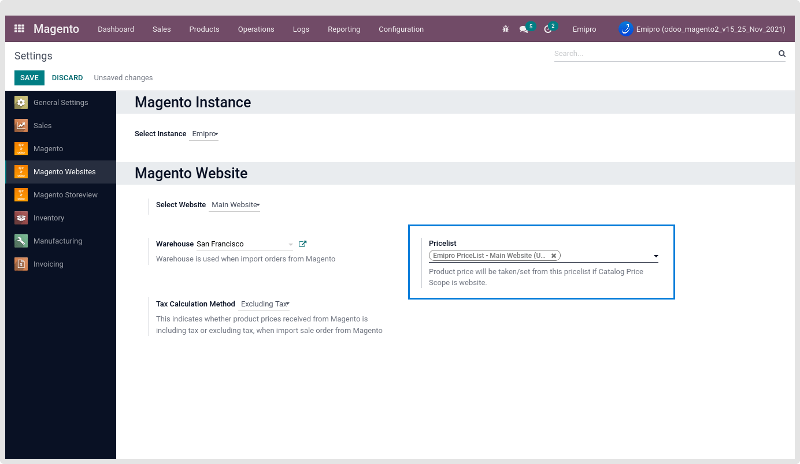

If this price list price is set into product then this price will be taken otherwise product sales price will be taken at the time of export product into Magento.

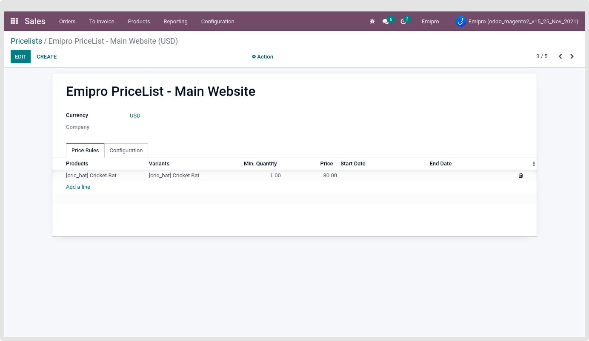

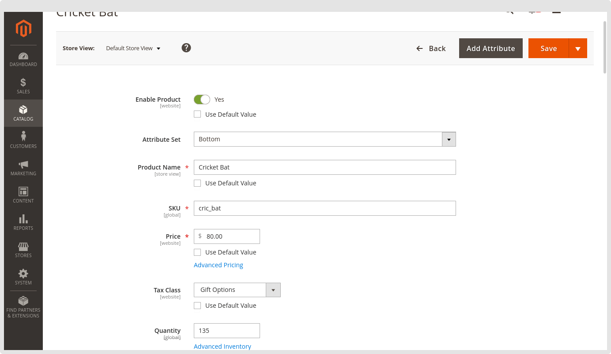

As per the explanation the above details will be set in the products while the New product will be exported from odoo to Magento.

Now, While clicking on the “Export Product in Magento” or Form/Tree view action Create new Product Wizard will be open and users can choose the option as per their requirement.

 

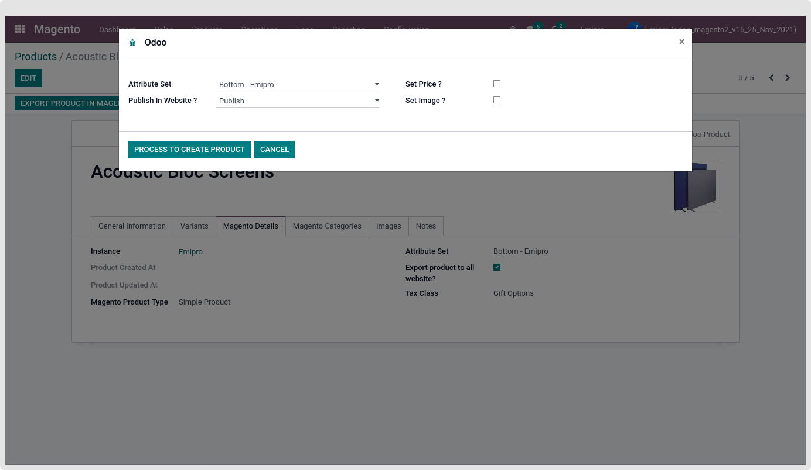

* Attribute Set
* Publish In Website
* Set Price?
* Set Image?

Above are the configuration and based on those values the product created in Magento.

**Attribute Set :** As explained [above](#_q7cotzevitua) is the same.

**Publish in Website:** If you select Publish, then the product will be created with Enable state into Magento. Otherwise, it will be created with Disable state in Magento.

**Set Price? :** If this is checked, the price will be taken from the price list first. If the price is not configured in the price list, then the price will be taken as the sale price.

In the price list also the price Apply on set as the product variant and Compute Price set as the Fixed price.

**Set Image?:** If this option is checked, product images will also be exported into Magento. Otherwise, images will not be exported. 

After clicking on the “Process To Create Product” button from the wizard, It will create a new product in Magento instance. If Magento set Image configuration is checked from the wizard then it will take some time to create a new product.

 

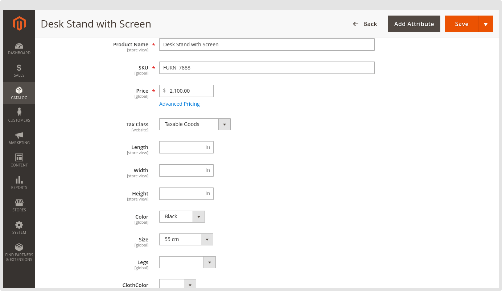

During the product creation process if any kind of problem occurred or not getting 200 as response code then we create the log for the reference.

All those logs will be listed under Magento > Logs > Log Book.

If a new product is created at the Magento side then that Magento Product ID set in the Magento product and template, Also sync with Magento option set as true.

 

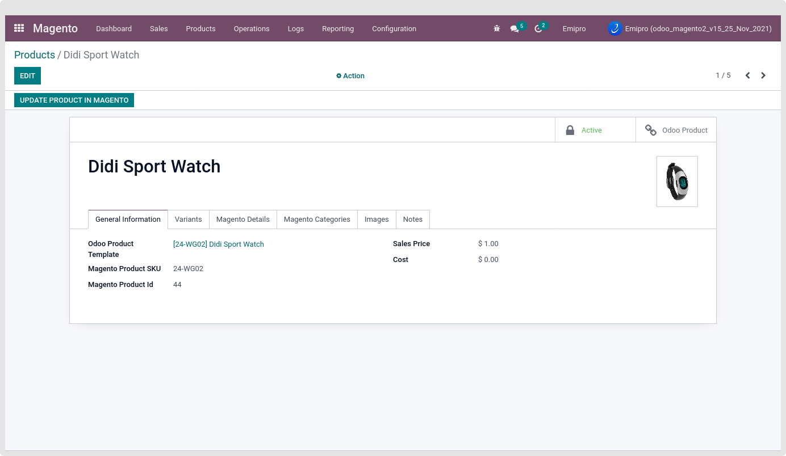

In the Magento Product template if the Magento Product ID is set, It means that product is already created in the Magento Instance. So now not allow us to create duplicate products and for that “Create New Product” This button is not visible in this case.

Users only allow to Update that product if the Magento Product Id is set in the Magento layer product template. So in this case the “Update Product In Magento” button is visible.

2. ###### Update Simple Product

While the Magento product Template has Magento Product ID and That product is already sync with the Magento as True then the “Update Product in Magento” button visible in the Magento product template.

Update product allow to update below fields value

* Product Price
* Product Image
* Update Basic Details
* Update Product Description and Short Description

 

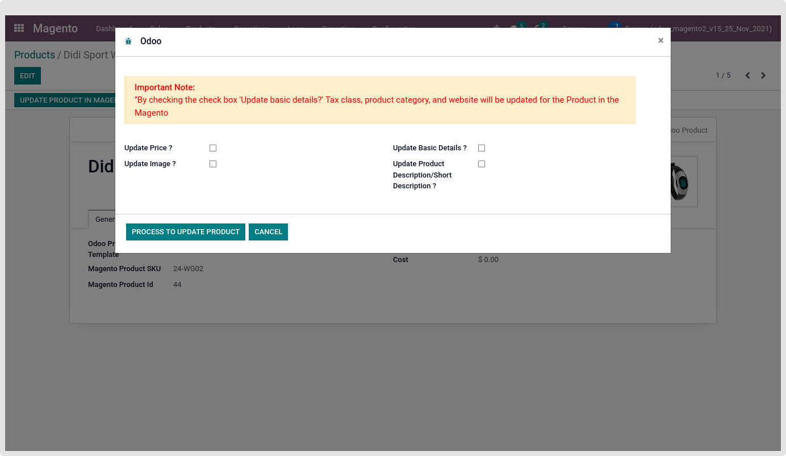

If your Global configuration for the Description and Short Description is disabled then in the Update Product wizard “Update Product Description/Short Description ?” field not visible.

**Update Price? :** If this is checked then take the price from the price list which was configured for the particular website. Also check the website's currency and configured pricelist currency.

Price will update based on the Magento Price Scope Configuration.

* The price will be updated website-wise if Magento's scope is set to "Website".

The price will be taken from the configured price list under website configuration

* If scope is set to "Global", then price will be set globally for the product.

The price will be taken from the configured price list under the main instance configuration.

**Update Images? :** If this is checked, then images will also be updated as per set roles into the main image and other child images into Magento products.

 

 

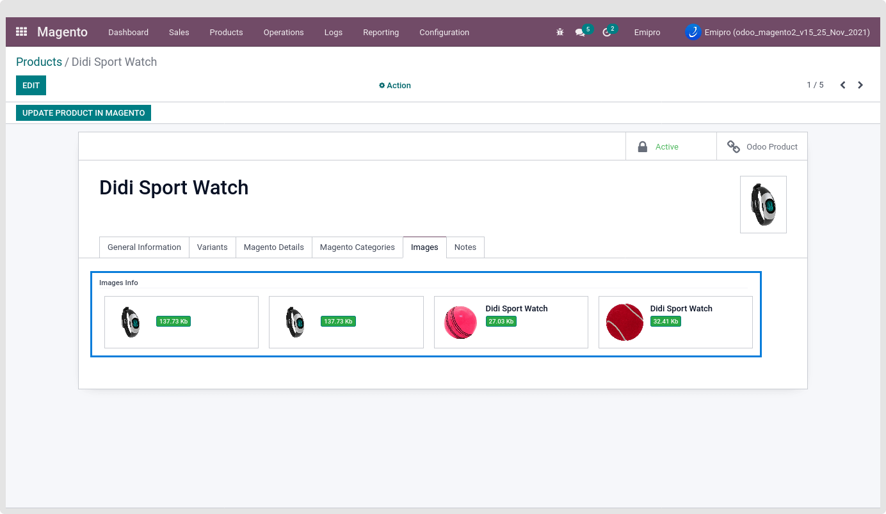

After the update, the Images will be added in the Magento product.

 

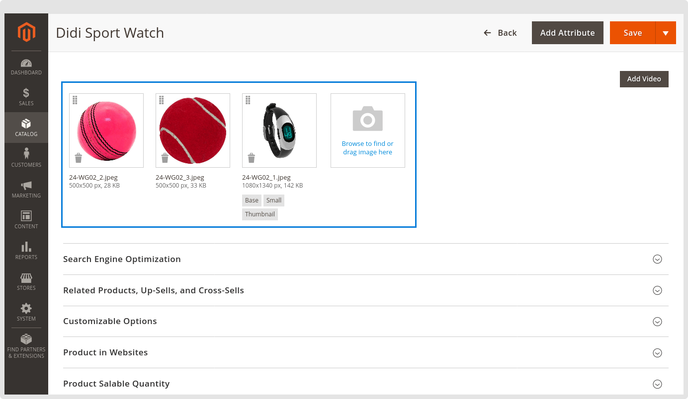

**Update Basic Details :** If this is checked then update product category, websites and Tax Class as configured in the magento product template. Let’s explain in brief for update basic details

1. **Update Tax Class :** Product created with “Taxable Goods” Tax Class, At the time of update product set “Item Gift Wrapping” tax class then this tax class will be set into Magento product.
2. **Update Category :** Product created with below category.

* Default Category
* Collections
* What's New

At the time of the update product, we added a new category “Woman” then this category will be added into Magento Product.

During the Update product time, App only allows adding new categories in the product. Can’t delete existing category or update in Magento Product.

C**. Update Website:** Product created in “test” and “emipro” websites, At the time of update product, if select “EXport Product to all websites?” then the product will be visible to all websites in Magento. Or if add/ delete more websites into the existing selection of websites then that will be affected into the Magento product.

**Update Product Description and Short Description :** If this option is checked then only update the product Description and Short Description otherwise not update.

This field is only visible if the global configuration for the “Use Sales Description of Magento Product” is enabled. 

### **Configurable Product Type**

1. ###### *Create New Configurable Product*

While export configurable product, use can set below details into Magento product template. So products will be created into Magento with all those configured values and variants.

Below are the fields in which the user can set the value.

* Attribute Set
* Tax Class
* Website
* Category

* Images
* Description
* Short Description

Attribute Set, Tax Class, Website, Category, Description & Short Description all those fields are working the same as the Simple product creation.

Users can set variant wise multiple Images and then Export those as the new Configurable and it’s child product. All those images will be set in respected variants and main configurable products.

All the variants having SKU is the pre-requirement. Without the SKU, you can't create the product in Magento.

While creating a new product at that time the main configurable product and its child product don’t have the Magento product Id and all those are not sync with Magento as true.

While creating the configurable product, All the values are set in the main configurable product. Like attribute set, category, Tax Class, and website. and that will be the same for the child product. So no need to set the same value in the child product at the odoo side.

If Publish In website? Is checked then all configurable products and its child will be visible into the Magento store otherwise it will be disable into Magento.

 

 

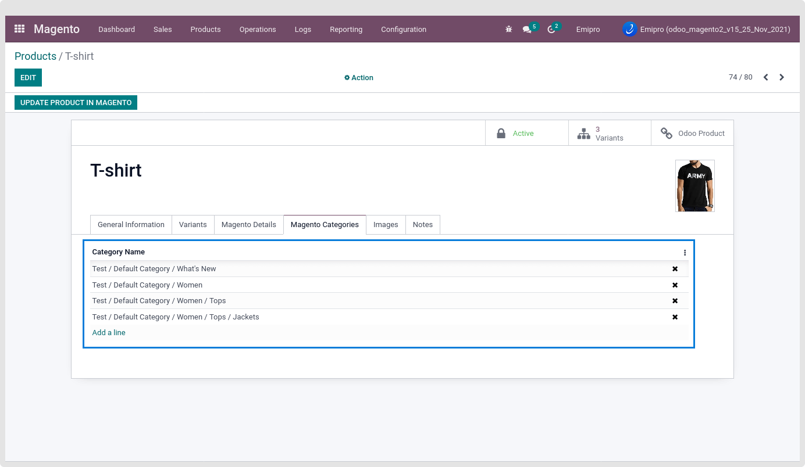

After product creation in the Magento Panel.

 

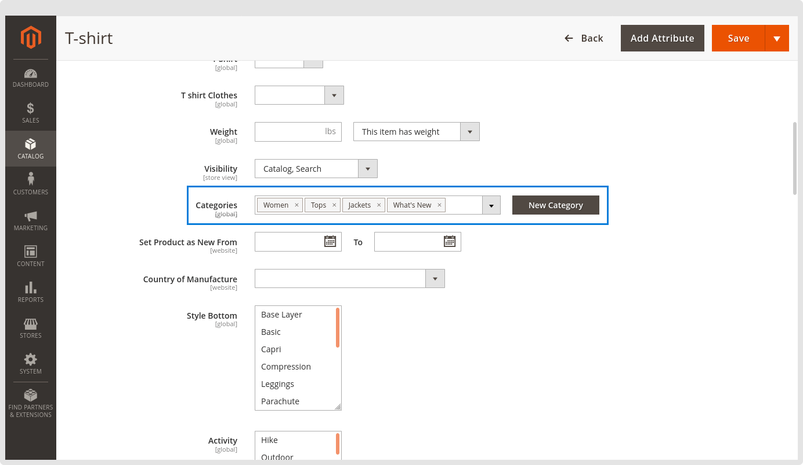

**Visibility of products into Magento**

After creating configurable products in Magento, only configurable products will be visible into catalog and search while its child products will not be visible into Magento Store.

Make sure while you create the new configurable product then all the variant products have set the SKU in the Magento layer.

In case the variant product’s option or option’s value is not exist in the Magento or else new for the Magento then while you try to Export as the New configurable product then first that Variant or Variant’s option will create in the Magento and then product will create with all those configured variant(Attribute) and variant’s value(Attribute Option Value).

* Magento Follows the pattern for the variant product name and we are also following the same. It’s Default Magento variant behavior. So due to this reason in case you are managing the different name for the Variant product name that will not be set in Magento but instead of the different name follow the default Magento’s naming behavior for variant product only.
* In our app, we only manage below export product data with the website wise : Price, Name, Description, Short Description. Other fields are managed globally.

2. ###### Update Configurable Product

Update configurable product allows to update the Main Configurable Product Image, Sale description and Short Description, Price, website, category, Tax Class. All those will update based on the wizard configuration.

Using the single click also updates the configurable product’s variant details. Price, Image, Description and short Description, Tax Class, Category will be updated for the variant product.

All those details will update store view wise. So all those details you can verify by changing the store from the Magento product store switcher.

In case during the update Configurable Product time, Process will not successfully complete then it will be placed in a log.

Below wizard will show while clicking or selecting the action for the “Update Product in Magento."

 

 

 

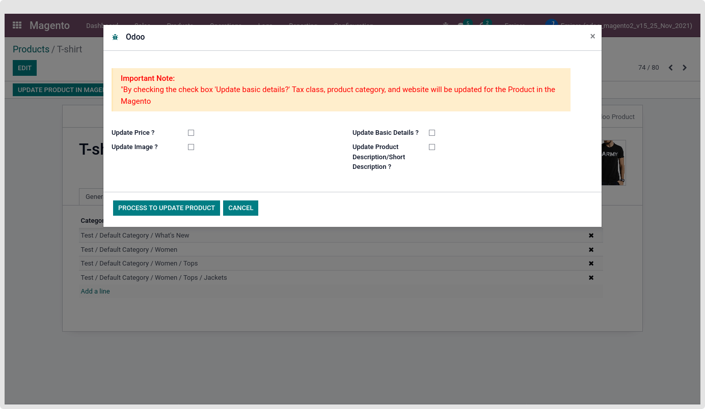

If you want to use the Export Product Feature then the latest version of Emipro Apichange plugin V1.0.8 must be updated in your Magento server 

