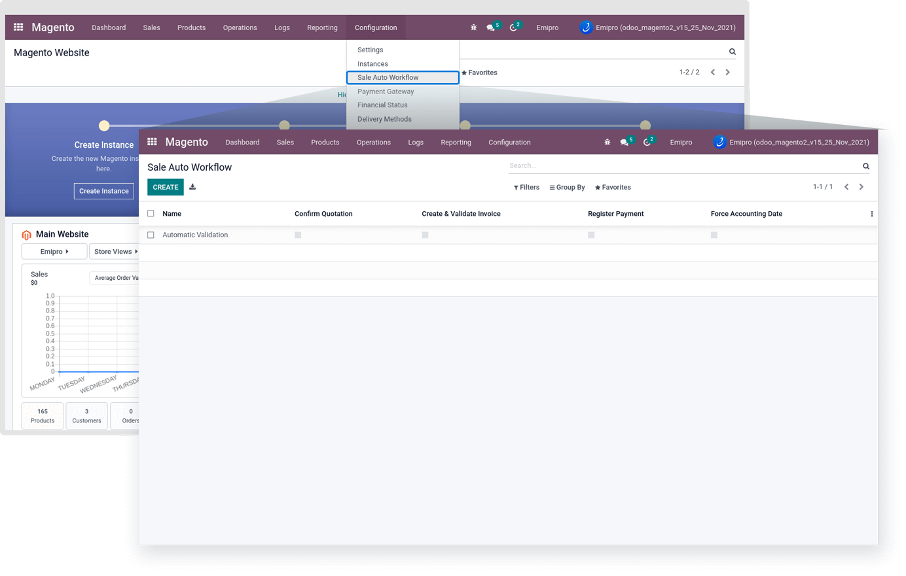
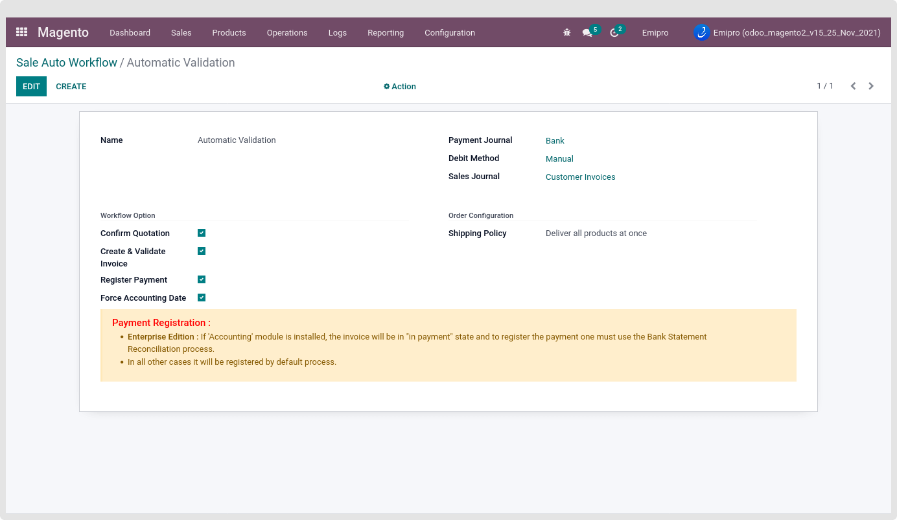

### Sales Auto Workflow

Before Importing the orders from Magento to Odoo, Need some pre-configuration for the Sales Auto Workflow. You can configure the Sales Auto Workflow by navigating to Magento -> Configuration -> Sales Auto Workflow.

 

Sales Auto Workflow Settings are important when you want to handle different kinds of orders in different ways. Suppose you have a customer who has chosen Cash On Delivery as a payment method for their order. In such a case you might prefer to manually validate the invoice and register payment. Whereas if a customer has chosen PayPal as a payment method, you may want to automatically validate their invoice and register the payment. For such different conditions, you can assign separate workflow settings.

You can create multiple Sales Auto Workflows and you set those workflows to the Payment Gateway under the Financial Status option.

By default, there is a Pending order Auto Workflow record created while installing the app.

You can further update the workflow as per your requirements.

 

There are few configuration settings, And based on that configuration, Magento orders will import into the Odoo.

* **Confirm Quotation:** If it's checked, the Order will be Validated. Auto-Confirms Quotation and creates the Delivery Order once it is imported from Magento.
* **Create & Validate Invoice:** If it's checked, the Invoice for the Order will be Created and Posted. Automatically Create & Validate Invoice after the Delivery Order is processed. However, in certain cases where the customer has preferred Cash On Delivery for payment, you might not want to automate the invoice processing. But, if there is payment through an e-wallet (PayPal, Stripe, etc.), this workflow can be preferable.
* **Register Payment:** If it's checked, Payment will be registered for the Invoice. Once the Invoice is processed completely, it will automatically Register the Payment in Odoo. However, the system will allow you to choose the Journal in which you want to settle the payment.
* **Force Accounting Date:** If it is checked then, the account journal entry will be generated based on Other order date and if unchecked then, the account journal entry will be generated based on the Invoice Date.

 While in your Workflow configuration, Checked Confirm Quotation, Create & Validate the Invoice, And Register Payment. Then your ordered product invoicing policy should be "Ordered Quantities".

If your ordered product invoicing policy is “Delivered Quantities”, then invoice will be created automatically after delivery order is completed.

In addition to this, you will need to select a Sales Journal, Debit Method & Payment Journal that are relevant to you. To configure Journals in Odoo, go to **Invoicing / Configuration / Journals**. Also, select the appropriate Shipping Policy that applies to your business process. 

