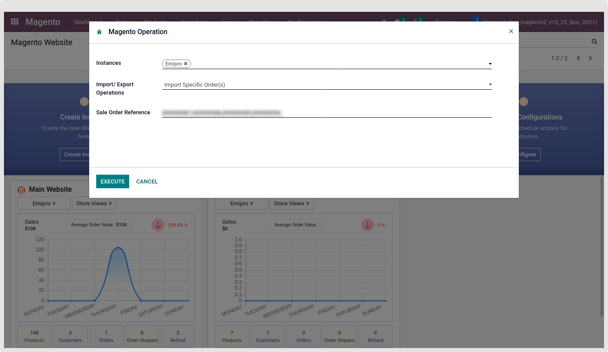
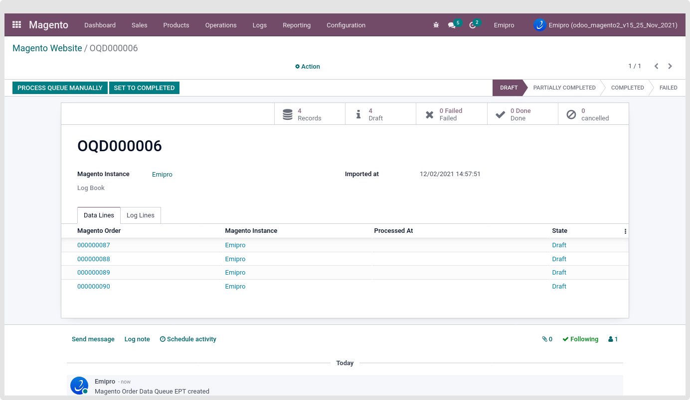

### Import Specific Sale Order

This feature allows importing specific orders by Magento Order Reference ID. Also, allow importing single or more than one Orders with comma-separated as shown in the below screen-short.

 

Only create those Order queue lines in which the Order reference ID exists in the Magento. Others will be skipped and not make the order queue line for those Magento reference IDs.

In specific order import, It will not check import order status configuration, It will get all types of order(s) from magento to odoo.

 

As per the explanation of the “Process Queues Manually” and “Set To Completed” in the Product Queue. It’s also the same functionality working for the Order Queue as well.

If you Force Done the queue, the data in it will not be processed in Odoo further anymore.

