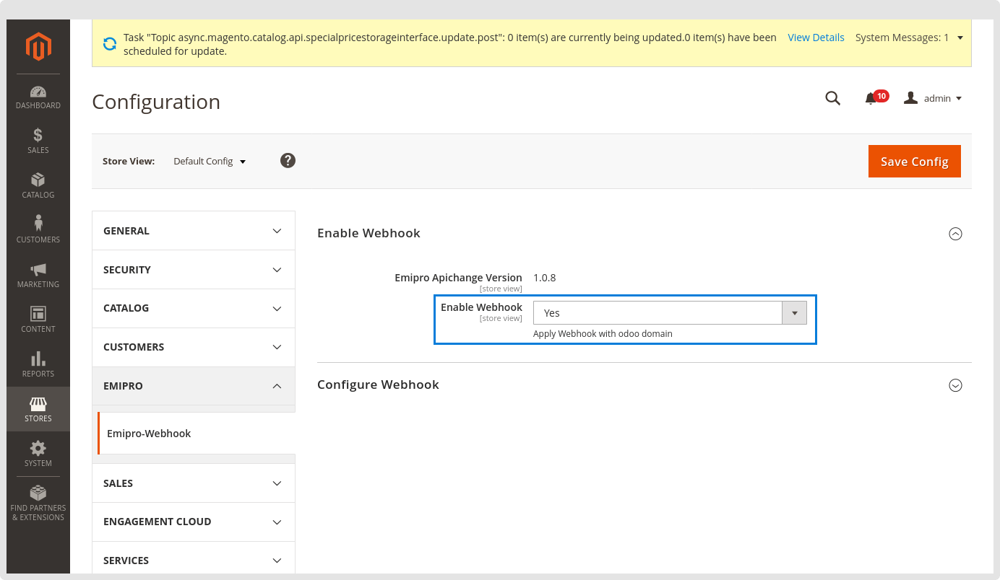
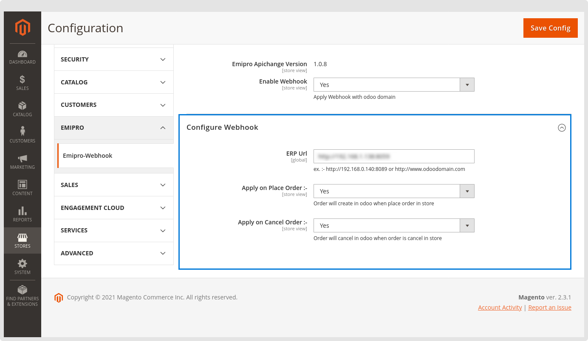

### Import Sale Order via Webhook (AUTOMATIC)

Using the webhook feature, the system will automatically create the order entry in Odoo. Let's say when creating a new order in Magento, Webhook will simultaneously create the order in Odoo as well. Same when the Order will be canceled from the Magento side then Order will cancel automatically at the Odoo side.

By default, the Webhook functionality is disabled, If you want to use this feature in your environment. Please configure it at the Magento site first.

Navigate to your Magento admin panel > Stores > Configuration > Emipro > Emipro-Webhook

* Enable Webhook

Make “Enable Webhook” as yes to enable this functionality.

 

* Configure Webhook

Add your odoo URL and as per your requirement enable the “Apply on Place Order” and “Apply on Cancel Order”

 

After applying the above configuration, while the new order will be created at the Magento side, the Automatically order will import in odoo and create the order queue.

Create orders webhook will automatically create an orders queue, and Cancel order webhook will directly cancel the order in odoo if the sale order is found. 

