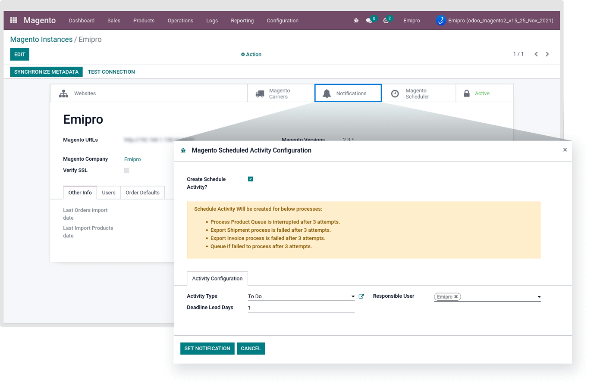
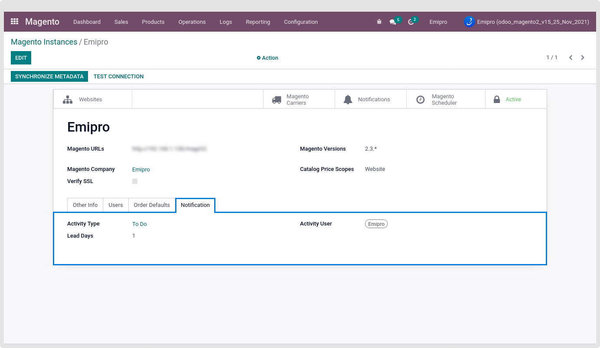
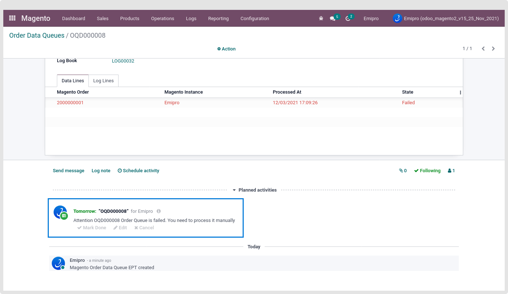
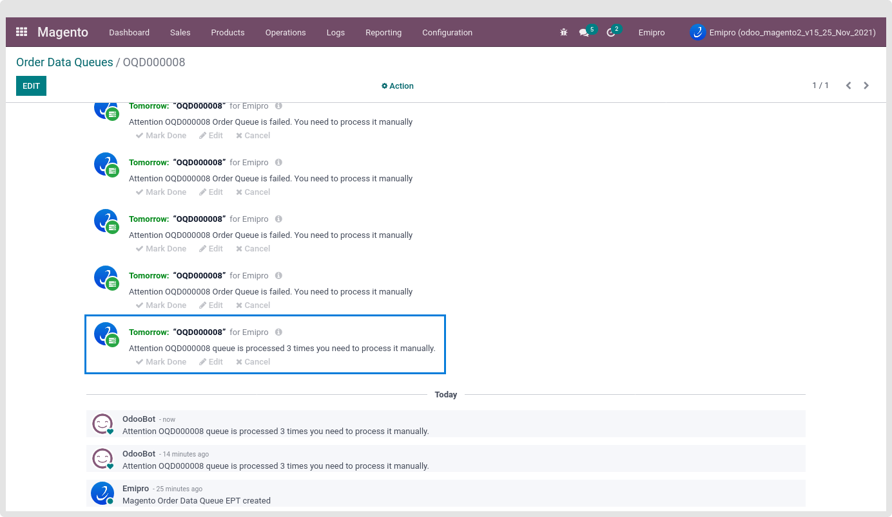
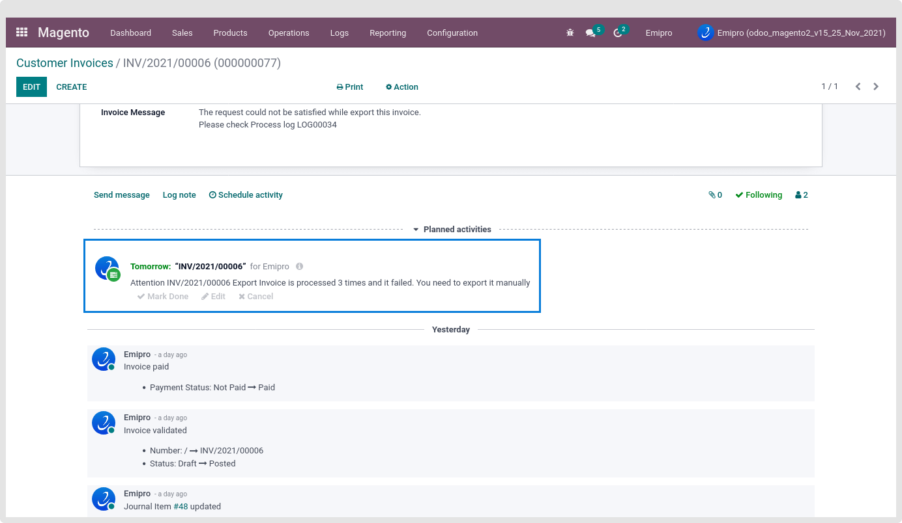
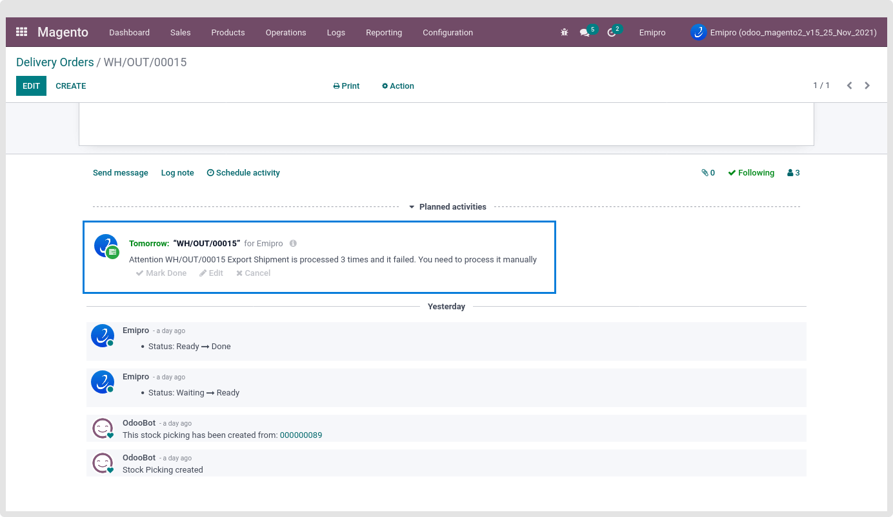

### Schedule Activities

Introduce a new feature that will create schedule activity if any queue processes 3 times and has some errors or the whole queue is in a failed state or shipment or invoice is exported 3 times but has some errors.

We can set schedule activities by navigating to Magento > Configuration > Instances > Open Instance > click on Notifications smart Button.

 

We can create scheduled activities by using below information. Let’s discuss in detail.

1. **Create Schedule Activity? :** If this option is checked, then only we can create schedule activity for failed or max attempts exceeding queues and shipment and invoice.
2. **Activity Type :** Type of schedule activity i.e. To do, Email, etc.
3. **Responsible User :** Responsible user to complete scheduled activity.
4. **Deadline Lead Days:** No of days in which activity will be completed.

After clicking on Set Notification button, New tab “Notifications” will be visible in the instance page and now onwards schedule activity will be generated after failed queue or max attempts of queues, invoice or shipment.

 

Schedule activities will be created into below points.

### **Failed Queue**

If any order, product or customer queue fails then schedule activity will be created for this operation.

 

**Queue is processed 3 times :** 

If Queue has any issue and it is not processed automatically after 3 attempts then scheduled activity will be created.

 

**Invoice is Exported 3 times:**

When invoice is not exported after 3 attempts then scheduled activity will be created.

 

**Shipment is Exported 3 times:**

When shipment is not exported after 3 attempts then scheduled activity will be created.

 

