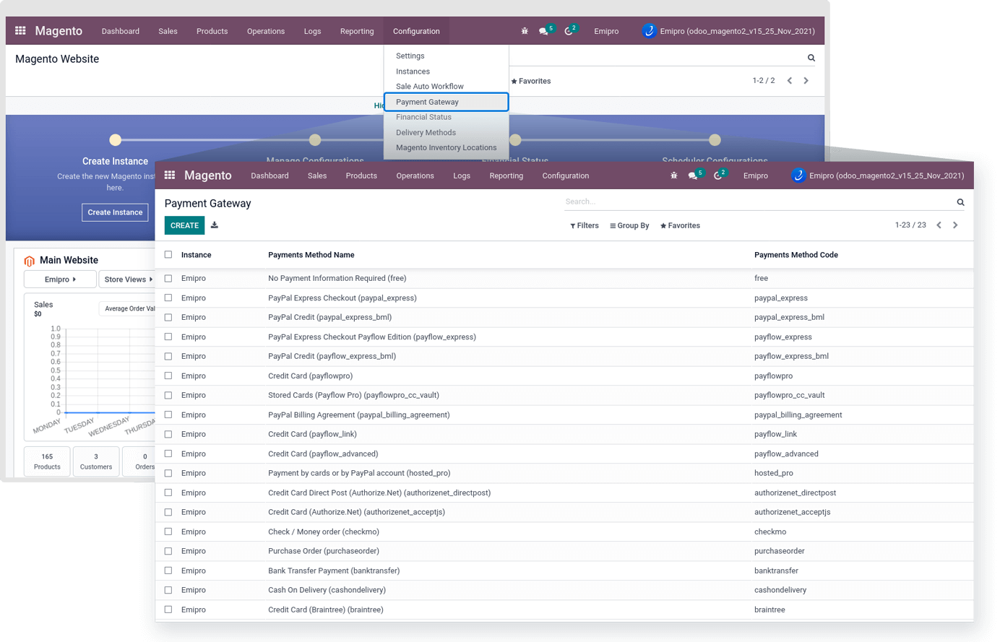

### Payment Gateways

Payment Gateways are the types of payments you offer to your customer at the time of checkout. E-Wallets, Credit/Debit Cards, Bank Wire, are standard payment gateways for eCommerce businesses.

When the connection has been made with the Magento Store, the payment gateway set in the Magento Store will automatically be imported and set under Magento -> Configuration -> Payment Gateway.

 

When the Instance is created, it will automatically fetch all the payment methods from Magento to Odoo. However, you can manually configure the Payment Methods if you want to add a custom payment method. To add a payment method, you will need to navigate to Magento -> Configuration -> Payment Methods.

To add new Payment Methods, click on the Create button. Add Payment method name, Magento Payment Method code (which is defined in magento), and select the Instance for which you want to use that Payment Method.

 

If you are using a 3rd party Payment Method in your Magento store, that will not be automatically created. So that’s the reason to make the manual Payment record in odoo. You can find a 3rd party Payment Method code from the respected Payment Method Documentation. And use that code in the newly created record.

**Import Rules :** In import rule connector provides 3 rules for import orders of specific payment methods.

1> Always : This will process all orders of this payment method.

2> Never : This will never process orders of this payment method

3> Paid : This will process all those orders which have paid payment status

**Import Past Orders Of X Days :** This option will process only those orders placed between the current date and previous x days.

**Create Invoice on Magento :** This configuration will be used when export invoice from odoo to magento.

1> Validate : Export only those invoices that are in validate state but not paid.

2> In payment/Paid: Export only those invoices that are in payment/paid state. 

