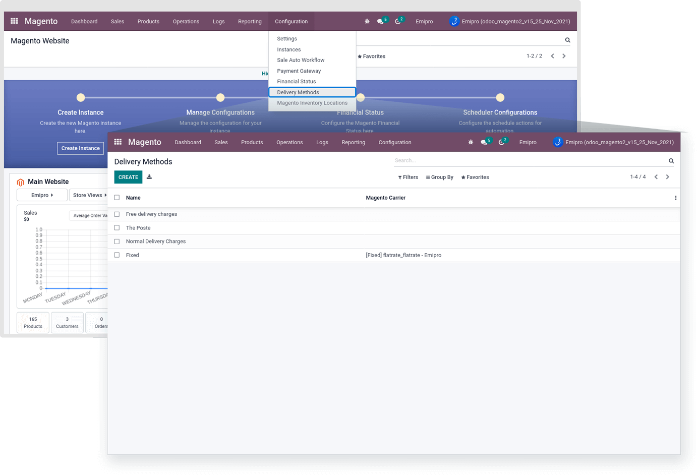
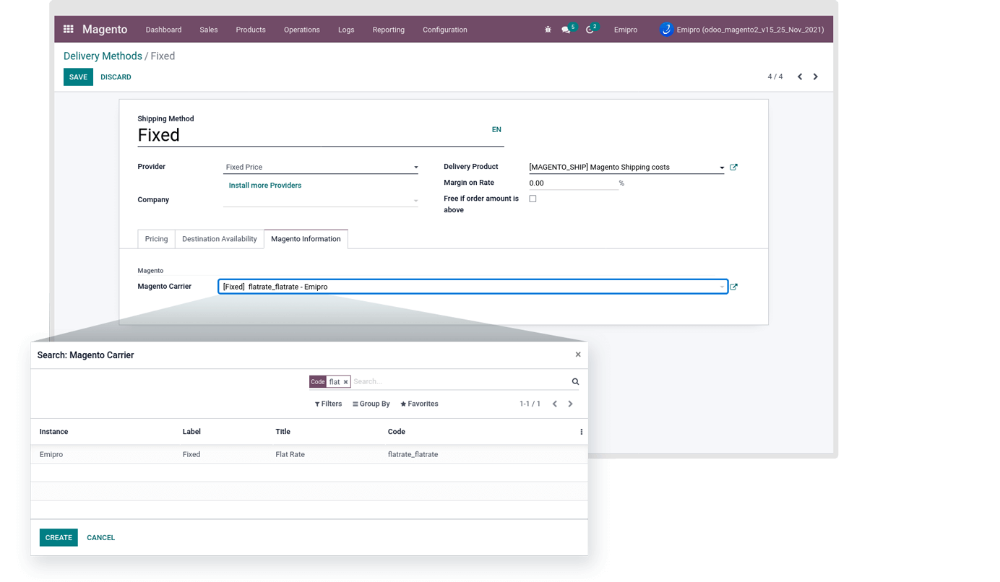
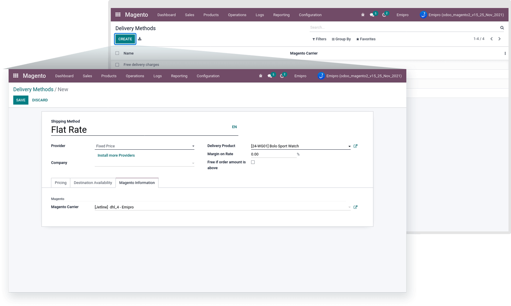
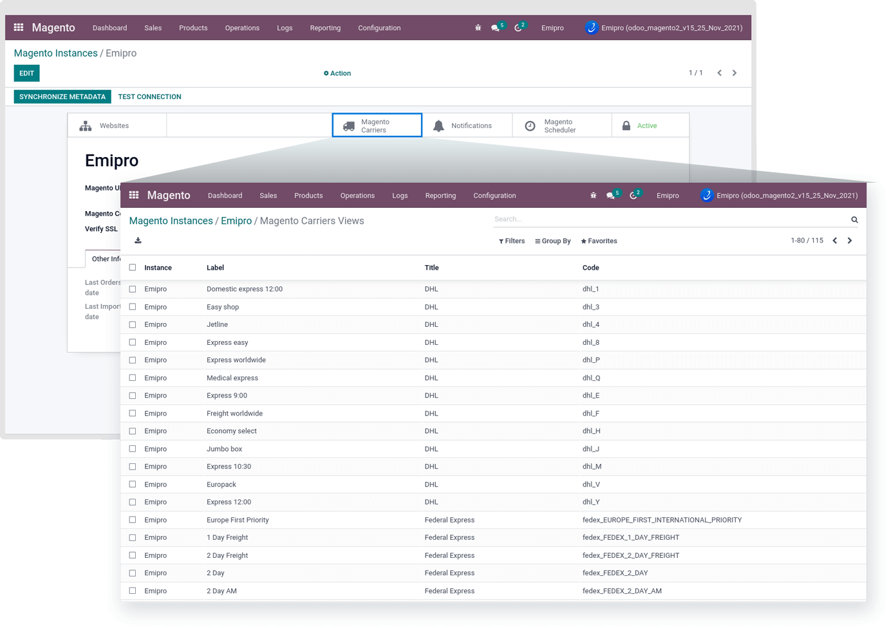

### Delivery Methods

When the connection has been made with the Magento Store, the Magento Store's Delivery Methods will automatically be imported and set under Magento -> Configuration -> Delivery Methods.

 

All the default Delivery Methods will be imported in odoo. You need to add the Magento Delivery Code in the respected Delivery Method. That is Navigate to the Magento Information tab.

 

You Can't set this same Magento carrier with multiple Delivery Methods for the same Magento Instance.

Find the Magento Delivery Method Carrier Code by clicking on the “Search More” option and set it as per your Instance.

 If you are using a 3rd party Delivery Method in your Magento store, that will be automatically created. So that’s the reason to make the manual Delivery Method record in odoo. In the case of an import sale order, the system will create a new delivery method if magento delivery method is not present and it is not found in odoo and then set it in the order.

To add new Delivery Methods, click on the Create button. Add Delivery method name, Company, Delivery Product, Magento Carrier, and Other relevant default data as per your requirement.

 

All your Magento Delivery methods will be listed inside the instance as well. There is one “Magento Carrier” smart button in Instance view.

Respected instance’s Delivery Method and its carrier code, carrier title will be shown as per the below screenshot.

 

