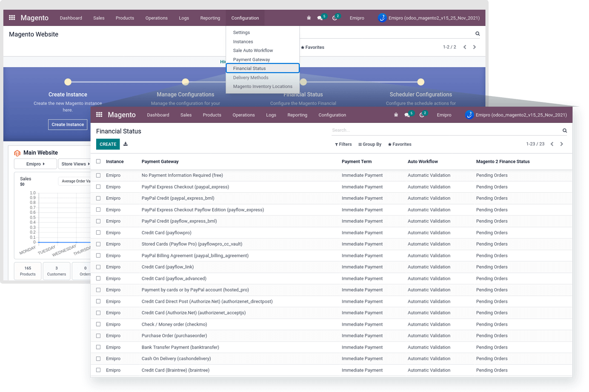
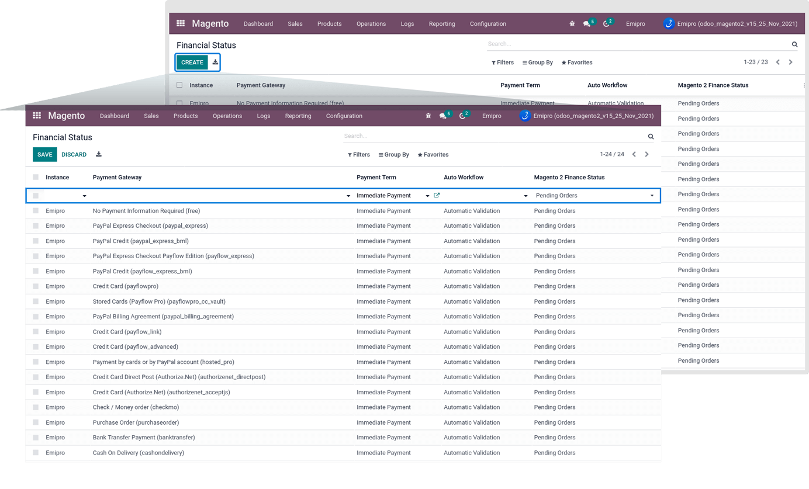

### Financial Status

Once you have successfully configured Auto invoice Workflow and Payment methods, then you will be able to configure financial status.

When an instance is created, pending order financial status will be automatically created for all payment methods with Default Workflow ("Automatic Validation").

Here, you can set your own created workflow based on the order status for any payment methods. You can set financial status under Magento -> Configuration -> Financial Status.

 

The Financial status represents the Magento order status. The connector supports Magento default order status "Pending," "Processing," and "Completed."

Magento 2 order status:

**Pending:** A pending order is one that has not been processed yet. The status of this order does not indicate whether it has been invoiced or shipped.

**Processing:** Orders that are processed have either been invoiced or shipped, but not both.

**Completed:** 

This status indicates that the order has been placed, paid, and shipped to the customer. Both an invoice and shipment is created for the order.

There are four stages in the Magento 2 financial status in the Configuration -> Financial Status

1. Pending orders
2. Processing orders with Invoice
3. Processing orders with Shipping
4. Completed orders

So Magento 2 order status Processing means that orders have either been invoiced or shipped, but not both. So in the connector, we manage it with different selections: 

* Processing orders with Invoice
* Processing orders with Shipping

So whenever Magento Processing orders with Shipping/ Completed Orders imports in odoo, it will directly create stock moves for the ordered items in the order. 

You can create new financial status by clicking on the Create button. Set the Instance, Payment Gateway, Payment Term, Auto Workflow, and Magento 2 Financial Status.

 

By default, all the active Payment method’s financial status records were created for Pending Order status. If you wish to import some specific payment method’s order in odoo, Then archive or delete other Payment method’s financial status records. Or else go to those Payment method’s records which you don’t allow to import order, and make the “Import Rules” as “Never”.

If any misconfigured of the steps mentioned earlier, it will have occurred log for the import order operation. 

