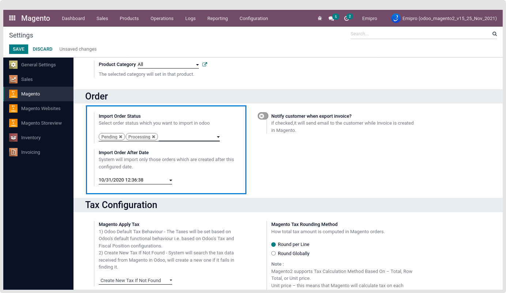
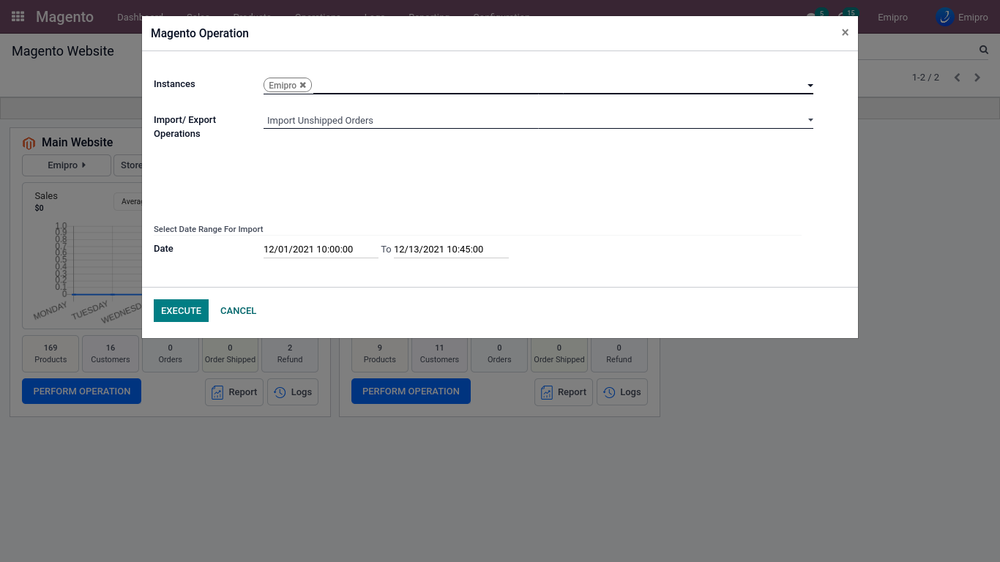
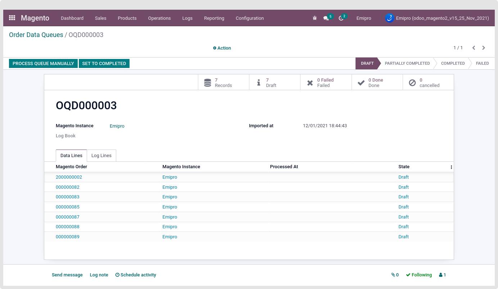
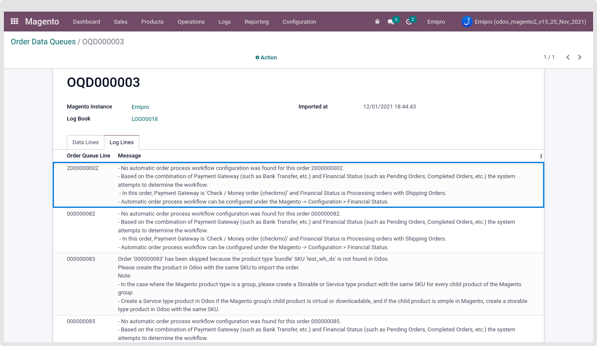
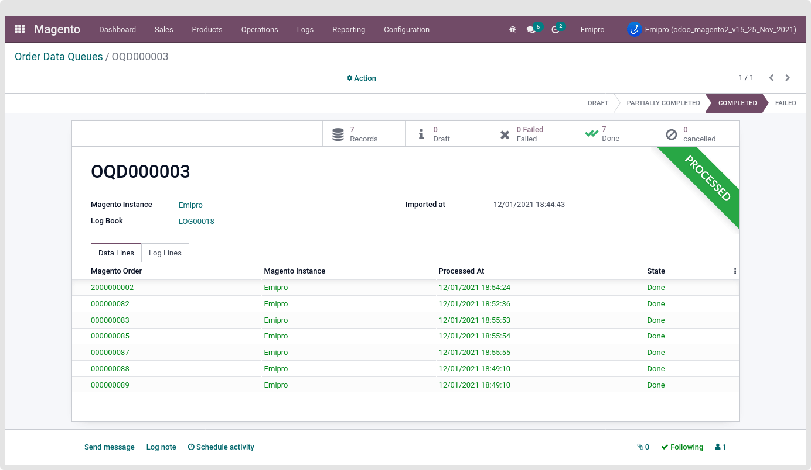
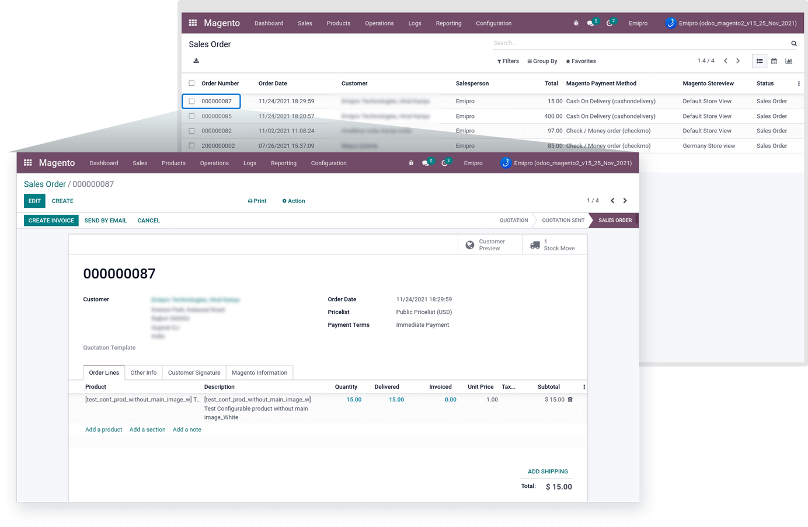

### Import Unshipped Sale Order from Magento

After doing the above as the Pre-Configuration, Now you can import the Order successfully. And if you want to import an unshipped sale order then first of all configure the required setting in order configuration and select order status as per mentioned below image.

 

Now go to the Magento > Operation menu and select the Instance in which you want to import the unshipped sale order. Select the Import/ Export Operations as “Import unshipped Sale Order”. Select the Date Range For Import the Order from Magento to Odoo.

 

The system will process those orders which are last updated between the Date Range set and the date & time set in configuration -> Settings -> Magento instance -> order section -> 'Import Order After Date' by you.

After performing import order operation, the connector will fetch all the orders from the Magento between the defined date range and create order queues (Batch of 50 orders) which will process orders one by one and make orders in odoo.

 

By default, when order imports, the order queues will be in the Draft state. Each queue will have 50 queue line items (orders)

There are two ways to run the queues, Either by process, the queue manually by clicking on the button "Process Queue Manually," or you can find the Schedule Action "Magento: Process Order Queues" (Setting-> Technical -> Automation -> Schedule Action).

Schedule Action "Magento: Process Order Queues" is by default active when installing the Magento 2 odoo connectors. You can update the execution time of the scheduled action as per your requirements.

Once the Draft queue is processed, the queue status can be changed to Complete or Partially completed or failed.

There are 4 main types of queue states.

* Draft: Queue is still not processed and all the relevant queue lines are in Draft state.
* Partially Completed: Queue is in process or Some of the relevant queue lines are in Draft state, some are in Completed state and some goes to Fail state
* Completed: Relevant all the queue lines are processed successfully and it’s in the done state.
* Failed: All the relevant queue lines are in the Failed state

After the order queue is processed, the Order will be created in the Odoo. If the Order is already created in the Odoo, it will not make a duplicated order and skip that Order.

If that Order is not created, Connector checks all the pre-configuration for the sale order is correct, and then it will generate the Order in the Odoo. If any misconfiguration or setting mismatch during the Queue Process, then the order will not import and place the logline. Also, make that order queue line a Fail state.

 

So, Please configure the Financial Status as per the log description. And then do the “Process Queue Manually” operation.

 

After successfully processing this order queue line, that order will be created in odoo as shown below.

 

It is recommended to follow the same tax configuration that you would manage in Magento to make the order's total amount identical.

Manage shipping cost of magento orders in odoo.

At the time of installation of our connector in Odoo, it creates one service type product called "Magento Shipping cost". Based on the shipping charge found in the orders, our connector will automatically add our Magento Shipping cost product to our order line with the shipping charge of magento

Manage discount of magento orders in odoo

At the time of installation of our connector in Odoo, it creates one service type product called "Magento Discount Coupon". Based on the Discount found in the orders, our connector will automatically add our Magento Discount product to our order line with the discount amount of magento.

