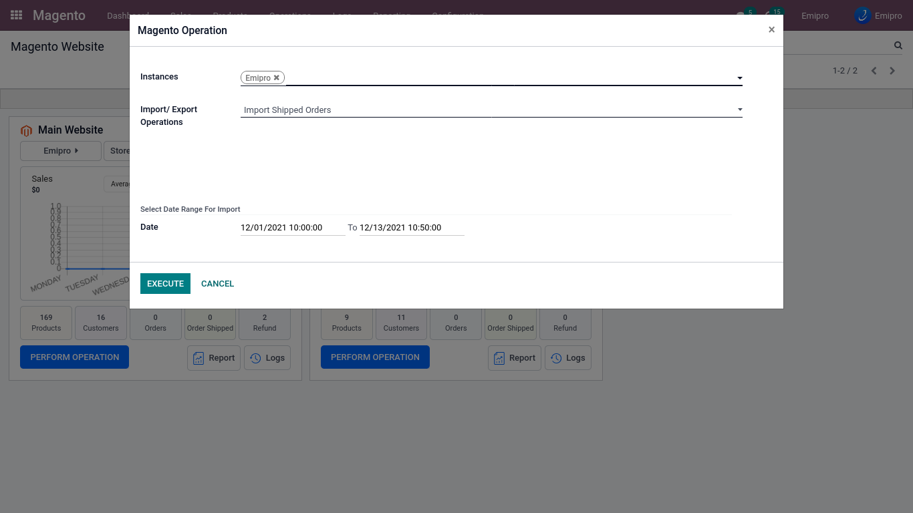
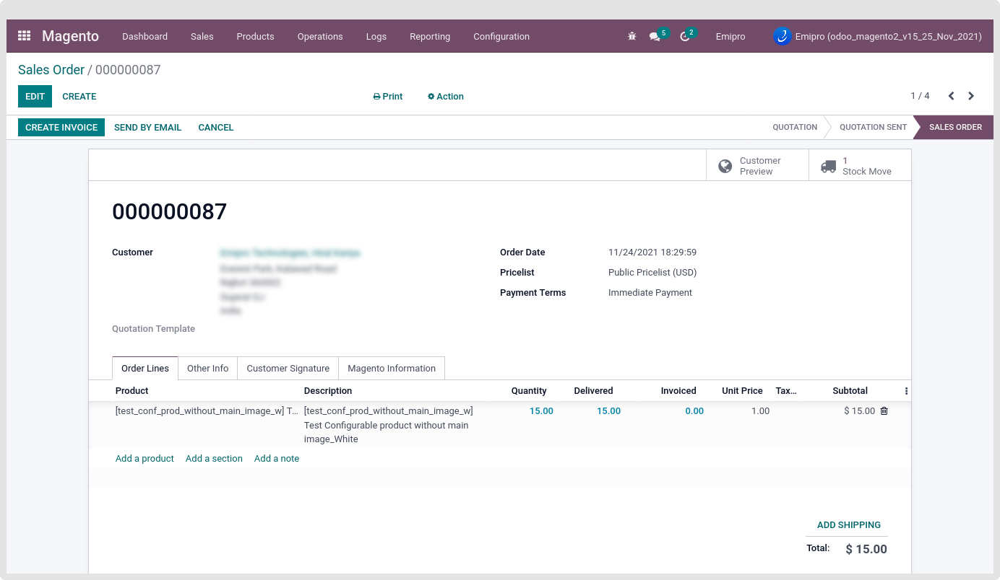

### Import shipped Sale Order from Magento

Go to Magento > Operation > select instance and select import shipped sale order and then click on execute button.

 

After clicking on the execute button, all completed orders between a given date range from Magento will be imported into Odoo and created as an order queue.

**Process Sale Order in Below sequence:**

**1> Process Order Queue**

- Order will be processed Manually from the wizard.

- Order will process using process order via scheduler.

**2> Check Financial status** :

- Order will get financial status based on order status configuration.

(Configuration > Financial Status)

**3> Check Import After Date :**

**-**Order will process based on Import After date configuration. Order will skip if import after date is less then order date (Configuration > Settings > Order > Import Order Status)

**4> Import Past Orders of X Days :**

Order will process if order days are less then given days. This configuration is available on payment methods. (Configuration > Payment Methods > (Select Payment method) > Import Past Orders of X Days).

If you want a specific payment method order will not import in odoo then Need to set 0. So, That payment method order will never be processed in odoo.

**5> Order Warehouse :**

When Order will process in odoo at that time product stock will deduct from given warehouse settings.

(Configuration > Magento Website > Select instance > Select Website > Set Warehouse.

Here Need to set a warehouse in all websites for instance. Connector will identify order websites and based on that deduct product stock of given warehouse in website wise.

**6> Order status is complete or Order is shipped but not invoiced** :

If order status is completed or order is shipped but not invoiced then Connector will create a direct stock move Of that order.

At the time of import complete orders, If Lot & Serial number is enabled in product. Then Make sure Product must have Lot & Serial number assigned.

 

