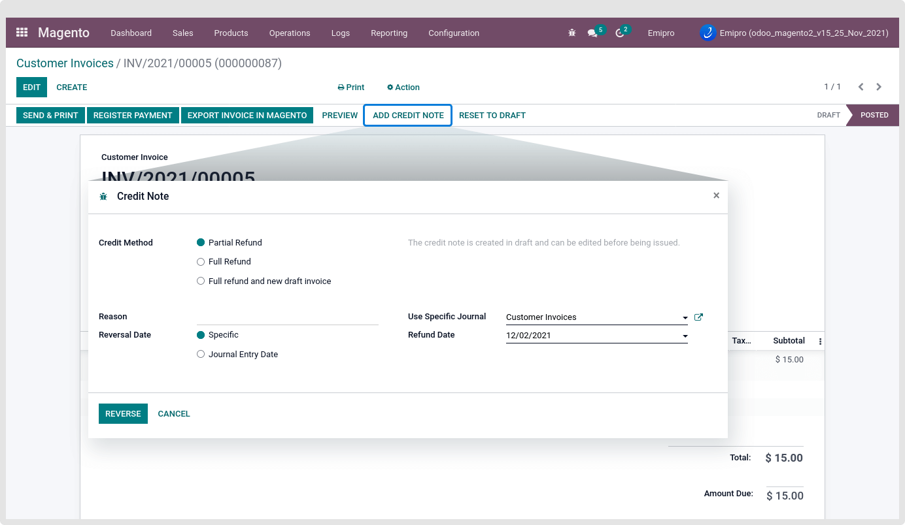
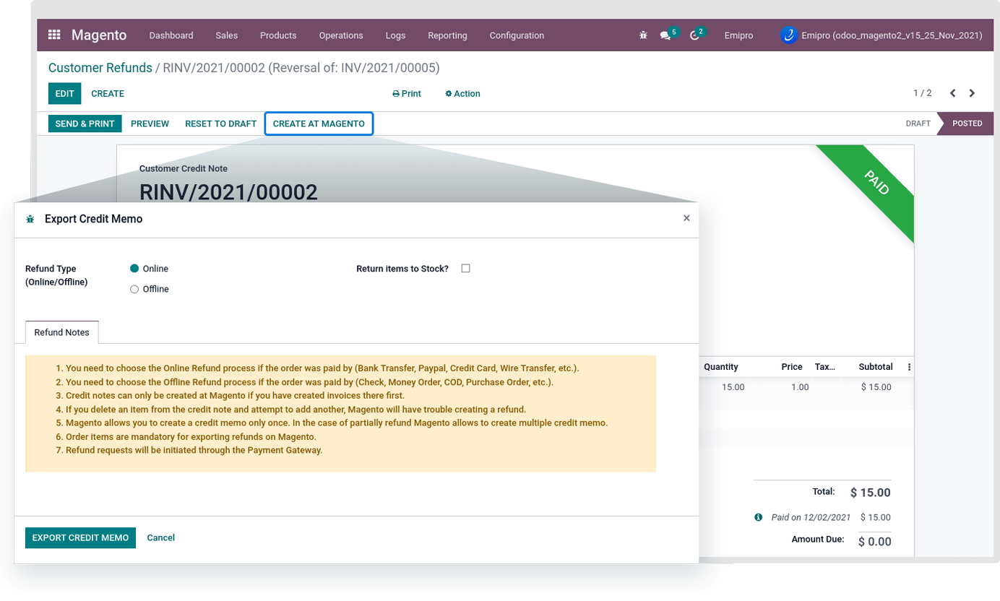
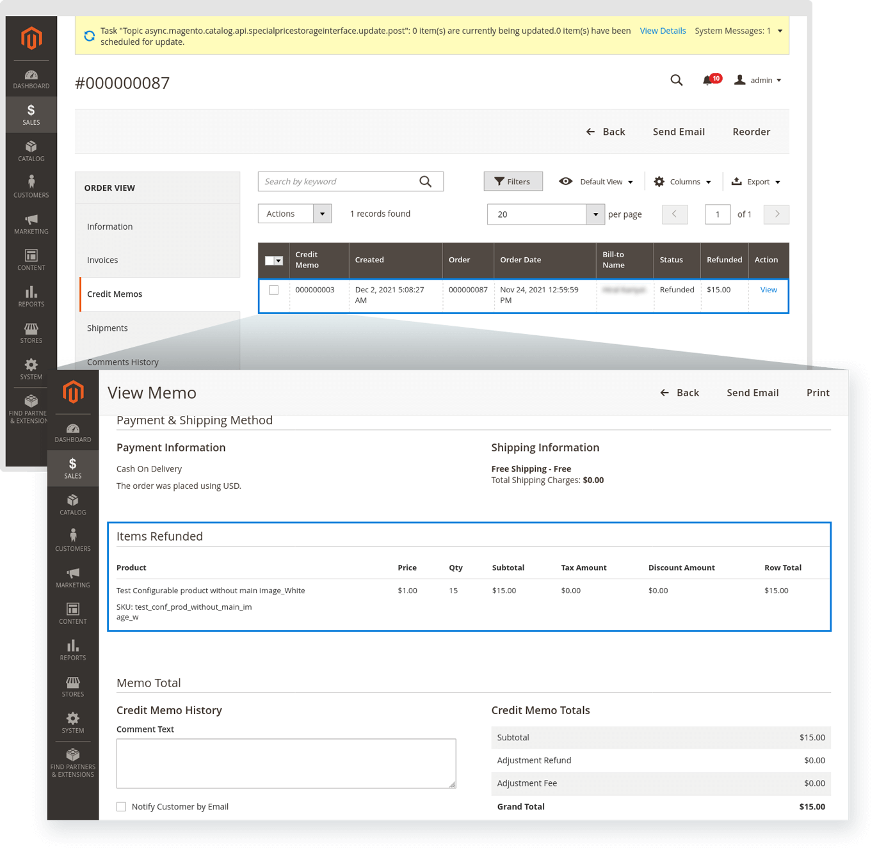

### Refund orders

Pre-requirement steps to perform the credit memo and refund

1. **You need to choose the Online Refund process if the order was paid by (Bank Transfer, Paypal, Credit Card, Wire Transfer, etc.).**
2. **You need to choose the Offline Refund process if the order was paid by (Check, Money Order, COD, Purchase Order, etc.).**
3. **Credit notes can only be created at Magento if you have created invoices there first.**
4. **If you delete an item from the credit note and attempt to add another, Magento will have trouble creating a refund.**
5. **Magento allows you to create a credit memo only once. In the case of partial refund Magento allows to create multiple credit memos.**
6. **Order items are mandatory for exporting refunds on Magento.**
7. **Refund requests will be initiated through the Payment Gateway.**

Go to Magento > Sales > Invoices. Open any invoice and click on add credit note.

You can see there are three types of credit notes

1. **Partial Refund**: The credit note is created in draft and can be edited before being issued.
2. **Full Refund**: The credit note is auto-validated and reconciled with the invoice.
3. **Full refund and new draft invoice**: The credit note is auto-validated and reconciled with the invoice. The original invoice is duplicated as a new draft.

Select credit note option based on your requirements and then click on reverse button.

 

After that click on the **Create At Magento** button. Select the Refund type option online / offline and then click on **Export Credit Memo** button.

 

After successfully exporting the refund into Magento, “create At Magento” button will be invisible. Please check refunds into Magento by navigating to Magento Admin panel > Sales > Orders > click on that order > credit Memos or Magento Admin panel > Sales > Orders > credit Memos.

 

