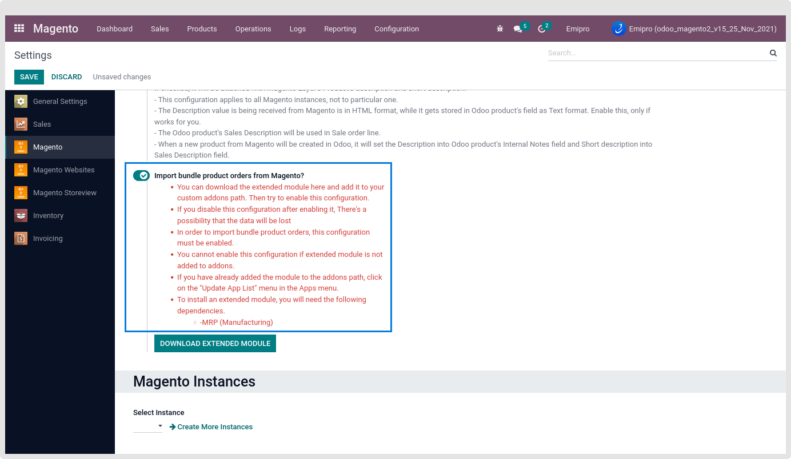
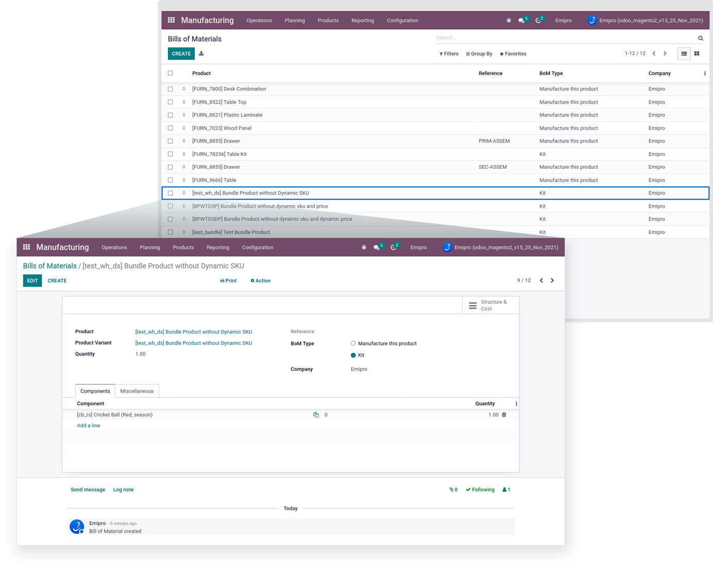

### Import Bundle product order from Magento

Now, our connector allows us to import bundle product’s orders from Magento. For that, we need to enable 1 configuration and install MRP (Manufacturing) and our extended module.

First of All enable global configuration, go to **Magento > Configuration > settings > click on Import Bundle Product orders from Magento?**

To download our extended bundle product module, go to **Magento > configuration > Settings > click on Download Extended Module**. After downloading the extended module, unzip the folder and place the module on a relevant path. Then install that extended module into your Odoo. After successfully install extended module we can import bundle product’s orders from Magento.

 

Pre-required configuration to import bundle product’s order

* All the components must be available in Odoo.
* Auto-create product configuration will not contain this flow for creating new bundle products if all the components are available at Odoo. (i.e. If configuration is disabled and BOM is not found, but all the components are available then also a new BOM product as well as odoo product will be created.)
* If the BOM is already created for that product, then there might also be a chance to create a new BOM with the same component with different components quantity.

Now, you can import bundle product’s orders, you can check orders from Magento > Sales > Quotations/ Orders.

 

You can check the created bundle product components by navigating to Manufacturing > Products > Bills of Materials.

 

