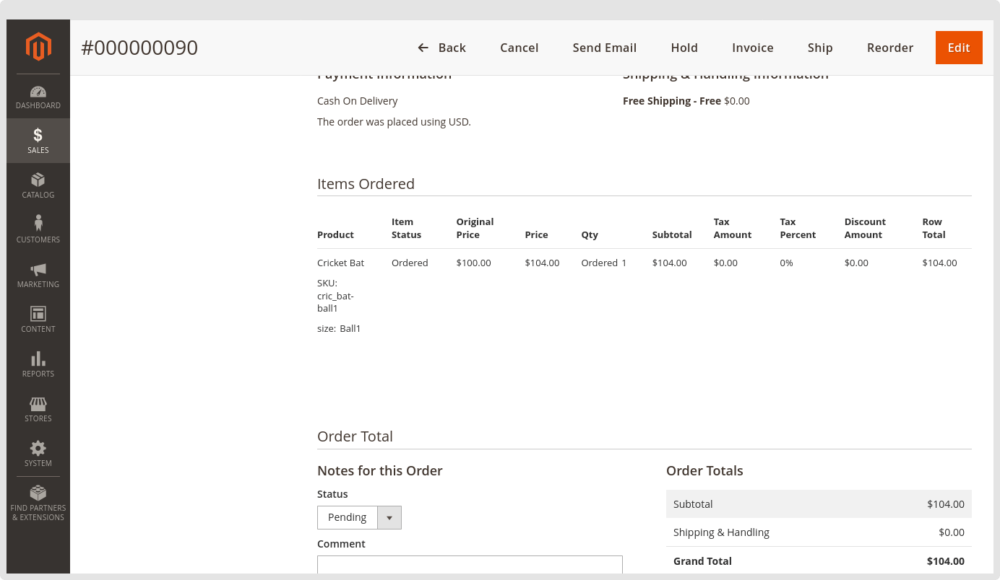
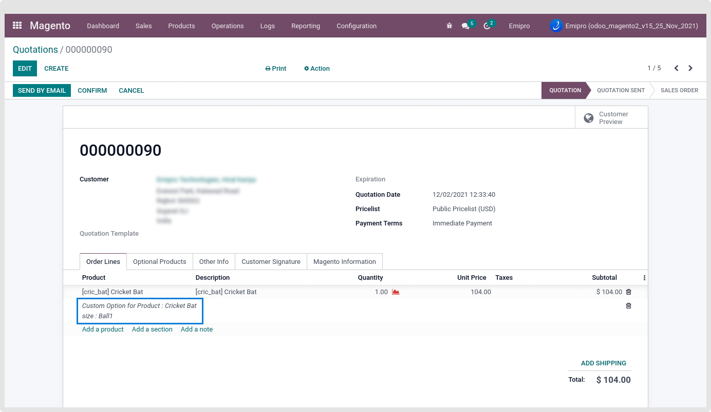
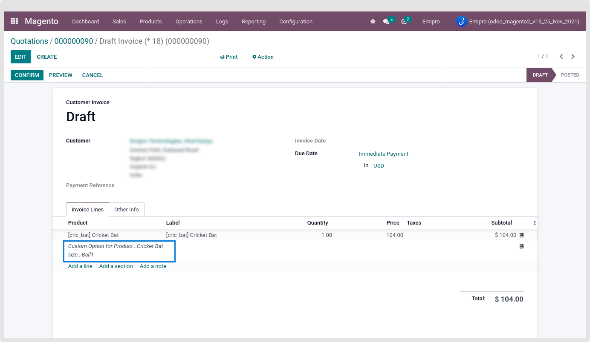
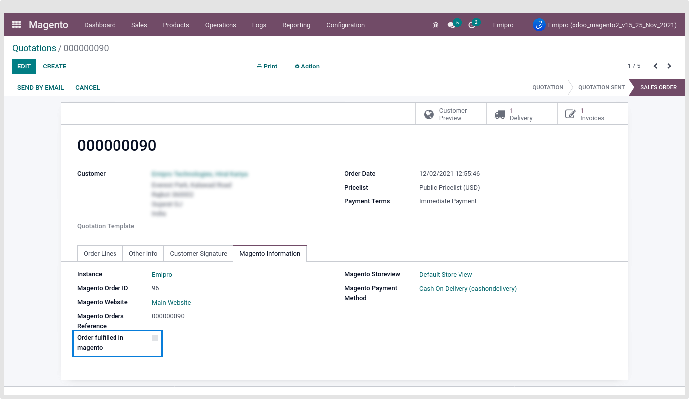
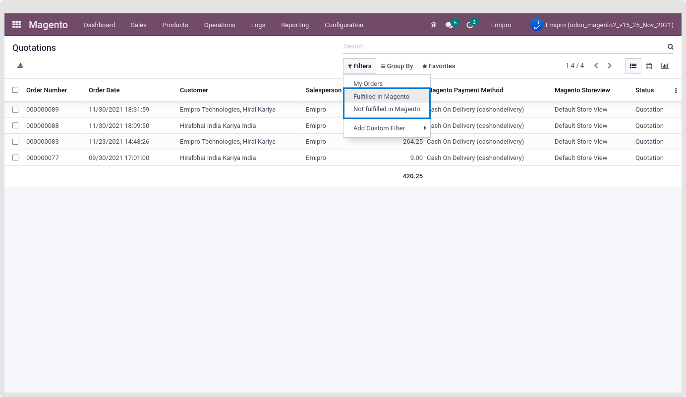

### Magento Custom Option Value in Sale Order Line

As Magento allows adding the custom option and its value in the ordered product, We can easily find that custom option and its significance for the Magento from the Magento order shown in the below screen-short.

 

After importing the order using the connector, users quickly identify the ordered product with its custom option and value, as shown in the below screenshot of the odoo order.

 

Easily pass and access this custom option value in the Invoice as well.

 

All the Magento Order-related information is stored in Sale order under the “Magento Information”. As shown in the below screen-short.

In this Tab, Magento Order-related information like Magento Order ID, Order’s Magento Instance, Magento Website, Magento Orders Reference, Magento Store View name, Ordered Payment Method. In case the Magento Order has the Payment Transaction ID, then that Magento Payment Transaction ID will be set in this tab.

If that Order is fulfilled in magento side then the “Order fulfilled in magento” field mark as True under the Magento Information Tab. And Still that order is not fulfilled in the Magento “Order fulfilled in magento” field marked as False.

 

Using our connector, users easily identify how many orders are still not fulfilled or fulfilled in Magento. To check that we are providing the filter for the same.

 

