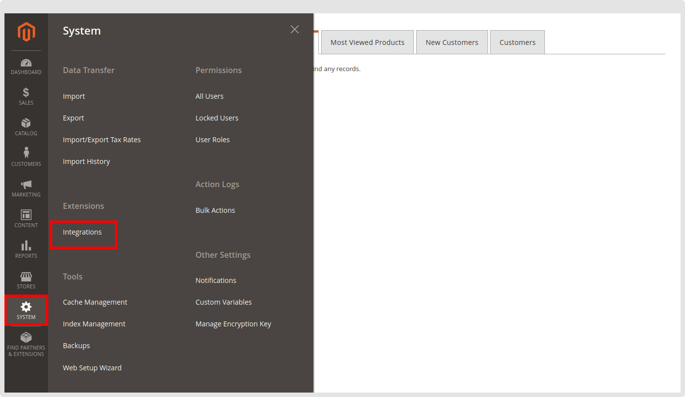
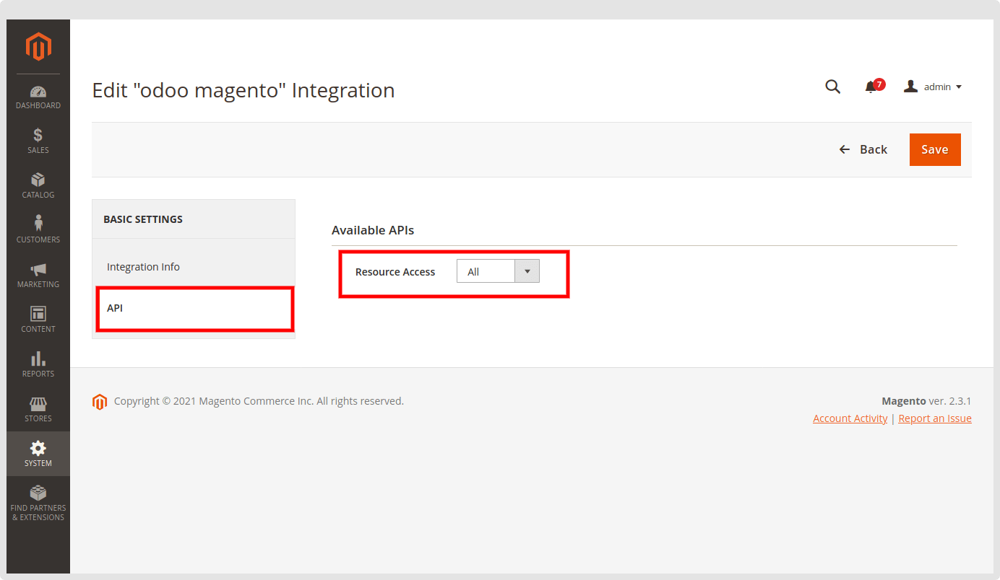
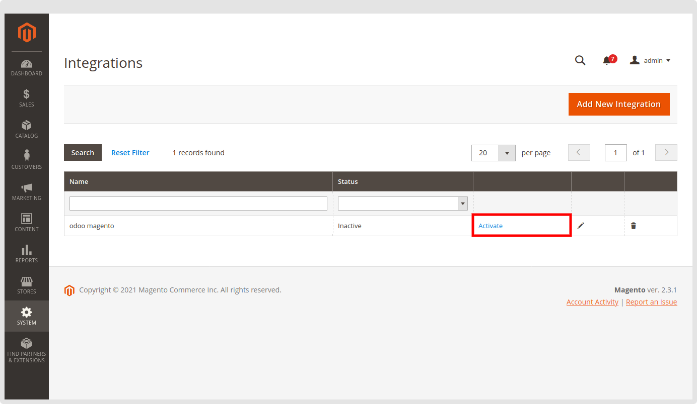
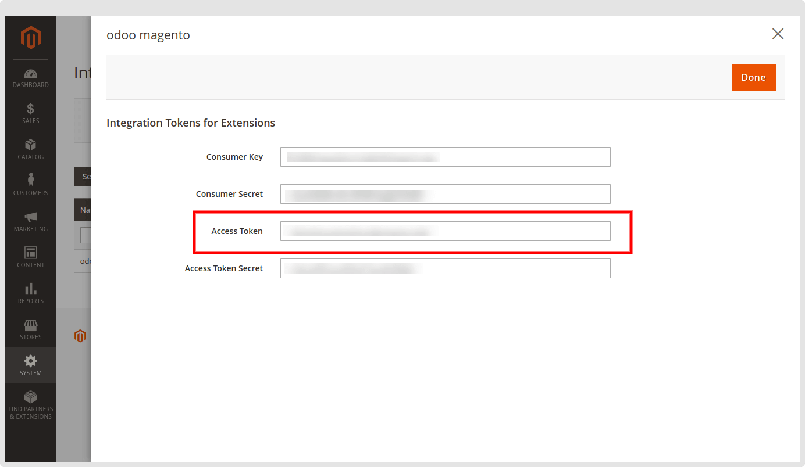

### Generate Access Token On Magento

Access Token tells us that you have the authorization to act on behalf of the user while integrating with other software. It is your identity that provides an easy way to work with Magento in Odoo and is a widespread standard program across well-known organizations and services. So, let’s generate it step-by-step from the Magento interface.

1. Log in to the Magento 2 Admin Panel.
2. Go to the System / Integration menu.

 

3. Click on the button Add New Integration.
4. Enter General Information like a name for integration, email, and current user’s password.
5. Go to API tab > and Select ALL In Resource Access and Click on Save button to save Integration.

 

6. To active Integration click on the **Activate** link.

 

7. Click on the **Allow** button in the opened Popup link.

 

8. Save Access token and click on **Done** to use the Integration link**.**

 

