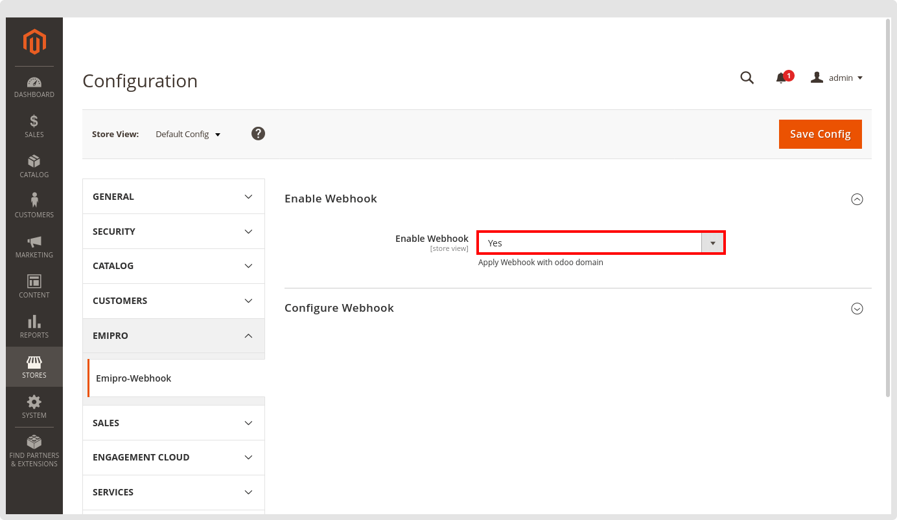
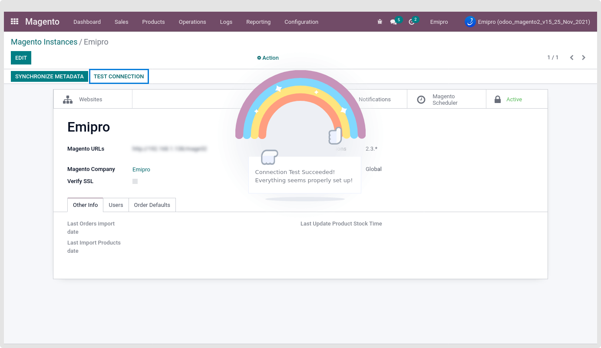
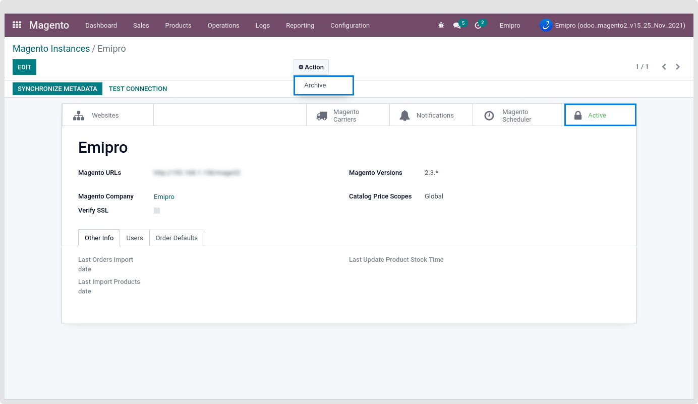
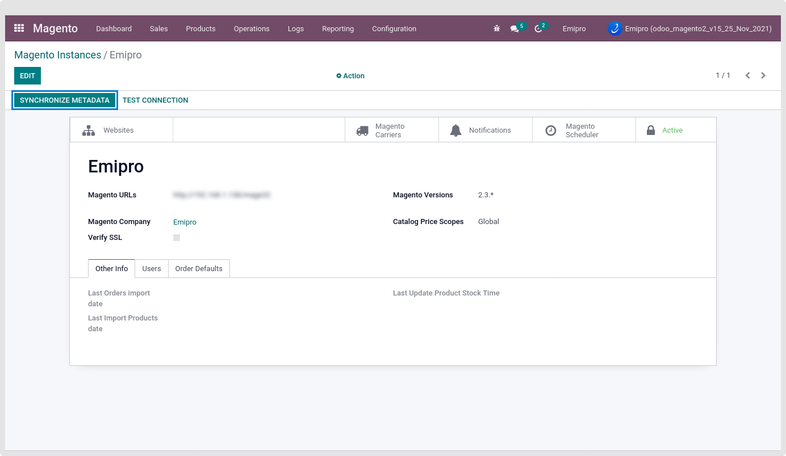

### Upload Magento 2 Plugin in the server

#### **Pre-Installation Step**

1. Backup your Magento web directory and database**.**

#### **Upload Extension**

1. Unzip emipro\_magento\_api\_change.zip file
2. Inside the emipro\_magento\_api\_change folder, you will find the app folder
3. Copy that app folder and paste it in Magento root folder

#### **Install Extension**

After uploading the Plugin, Please fire the below command on magento cli root directory

1. php bin/magento setup:upgrade
2. php bin/magento setup:static-content:deploy -f
3. php bin/magento setup:di:compile
4. php bin/magento cache:clean

After performing all these commands. Let’s check API change plugin is installed successfully.  

  

For that, go to Magento Backend > Stores > Configurations > click on Emipro Tab.

 

### **Test Connection**

After creating the Magento Instance in your odoo store and successfully installing the Magento 2 Plugin in the Magento 2 store, Please check the connection between your odoo and Magento store.

 

If Test Connection is successful then you are ready to use our connector. But in some cases, if the connection fails, Then please check & verify the Access Token of your Magento store. And again add your latest Access Token in the odoo instances.

To add/edit a new Access token, Please click on the “Active” smart button or go to Action and Archive the current instance. Edit the Instance and insert the new Access Token. After that save the instance and again Test the connection.

 

### **Synchronize Metadata**

After creating the instance and testing the instance, Please click on “Synchronize Metadata”. It will sync your Magento useful configuration in odoo. It will sync your Magento store data below.

* Price scope
* All your Magento store currency
* All your website & store view
* All the active payment methods
* All the Delivery methods
* All the Magento inventory location [applicable on only Magento version 2.3 or 2.3+]

 

It’s recommended that if any of your Magento store configuration or setup will change after setting the instance in odoo, Please re Synchronize metadata once again. 

