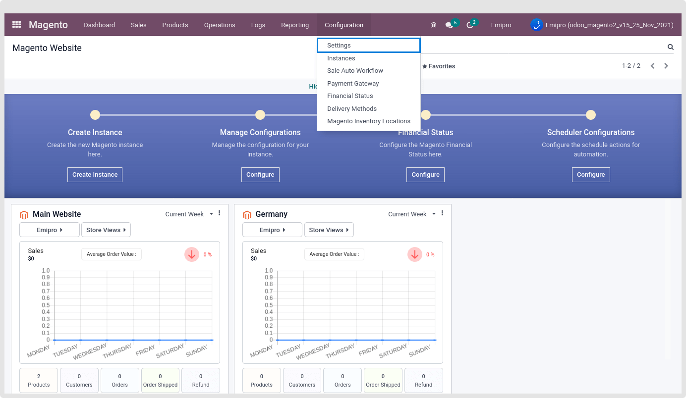
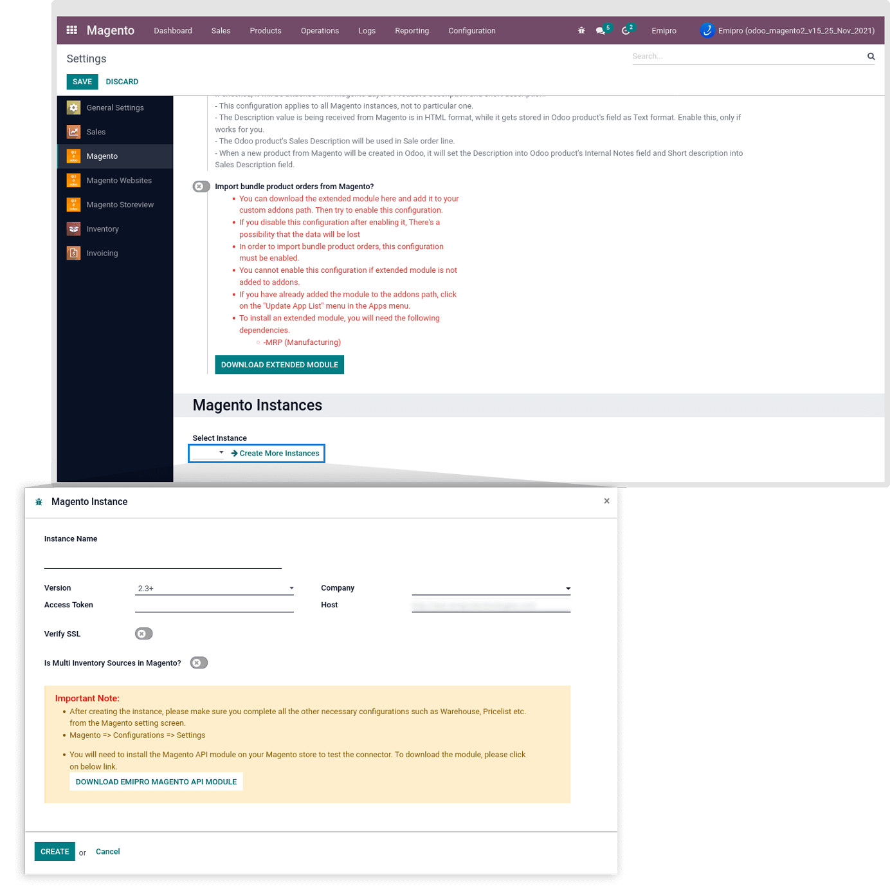

### Create Instance from Configuration

Another way to create an instance:

Navigate to Magento / Configuration / Settings and click on the Create More Instance.

 

 

A new window will open in which you will need to enter the required information including the Instance Name, Is Multi Inventory Sources in Magento, Magento 2 Version, Host, Company, and Access Token that we secured from the Magento backend and check the verify SSL as true if your magento site is using SSL certificate.. So, let’s create and configure the Magento Instance in Odoo.

