### Create and configure Magento Instance

After installing the Odoo Magento2 Connector in your Odoo, you can see the Magento menu in your Odoo if the Current user has rights as manager or User for Magento Connector.

In Odoo, you need to create an instance for each of your Magento accounts. There will be a separate instance for each Magento account, accommodating the multiple accounts to be manageable from a single window.

There are two different ways to configure and create the Magento Instance.

1. ### **Create Instance from Smart Onboarding Panel**

a. **Create Instance**

Navigate to Magento and click on the Create Instance.

 

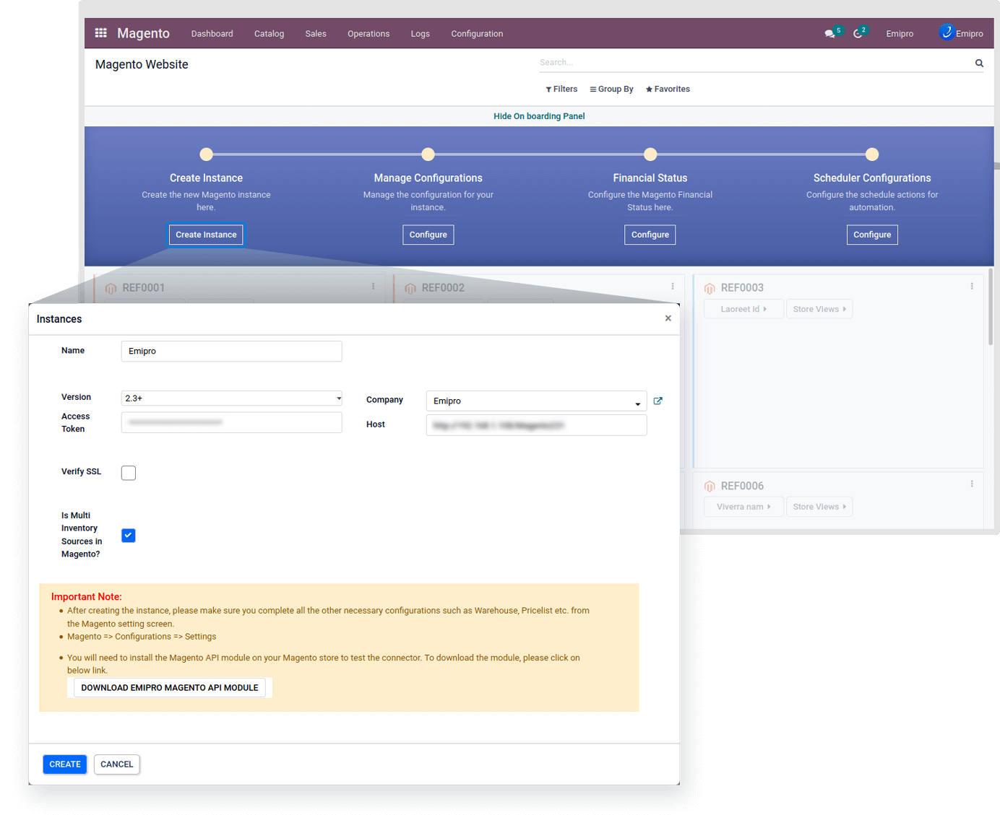

Enter the required information including the Instance Name, Magento 2 Version, Host, Is Multi Inventory Sources in Magento, Company, and Access Token that we secured from the Magento backend and check the verify SSL as true if your Magento site is using an SSL certificate.

#### b. **Manage Configurations**

With a single click, Configure and save the appropriate setting as per your requirement.

i. **Product**

 

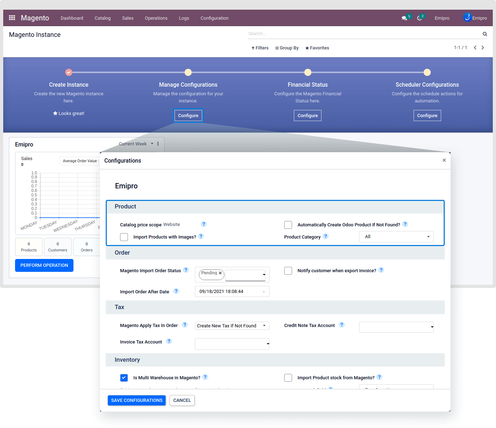

1. **Catalog price scope**

a. **Global:** The same product price is used throughout the store hierarchy.

b. **Website:** The same product can be available at different prices from stores that are associated with different websites.

This configuration automatically sets after creating the instance. And this was set based on your Magento catalog configuration. As shown in the below screenshot of the Magento configuration.

 

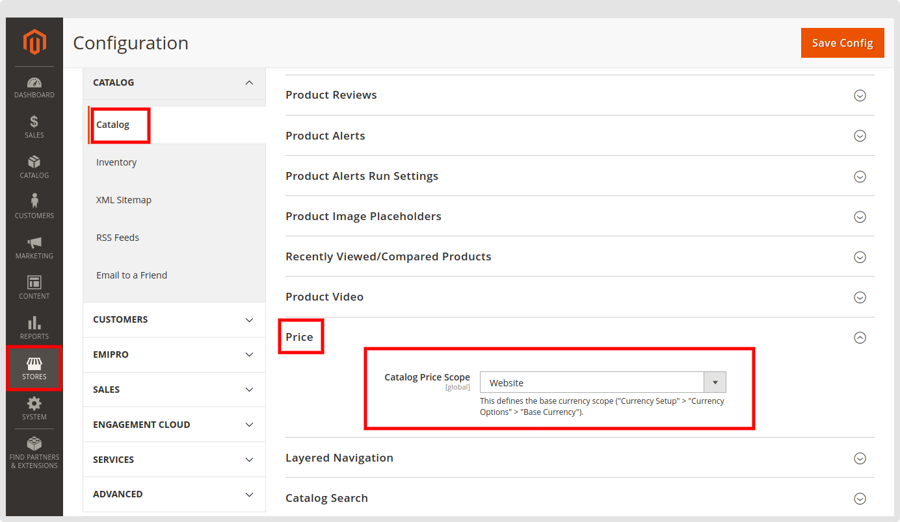

2. **Automatically Create Odoo Product If Not Found? :**

By checking this box, it will create new products in your catalog if the product is not found based on the SKU / Internal Reference / Default Product Code.

If you are selling on multiple sales channels and having different SKU / Internal Reference / Default Product Code on each sales channel, it may lead to the creation of duplicate products in your product catalog in your database.

This is only recommended when there is no product data in your Odoo. If you have an existing product catalog, we recommend not enabling this option at the initial stage.

3. **Import Products with Images? :** 

Import product images along with products from Magento to Odoo while you carry out import product operation.

4. **Product Category:**

While importing a product or creating the product of the Magento instance, the selected category will be set in the odoo product.

By default it will be set “All” in the Product Category, If you want to set another category then set it as per your requirement.

5. **Pricelist:** 

Product price will be taken/set from this price list if Catalog Price Scope is global. While the catalog Price Scope is Global at that time set the global level Price List from here. Otherwise, that will be set from Magento > Configuration > Magento Website > Select Website > Select Price-list

ii. **Order**

 

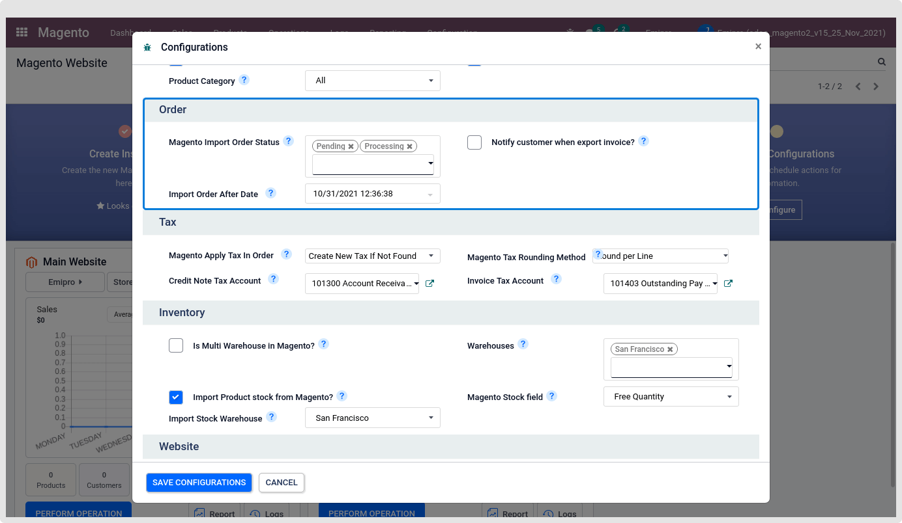

1. **Magento Import Order Status****:**

Select the types of Orders that you want to import to Odoo from Magento. It can be Pending or Processing.

2. **Notify the customer when exporting an invoice? :**

If checked, It will add comments to the invoice while the Invoice will be created for the Magento order.

3. **Process Order After Date:**

Connector only processes those orders which have been created after a given date. Here the default value will be set 30 days before the current date.

iii. **Tax**

 

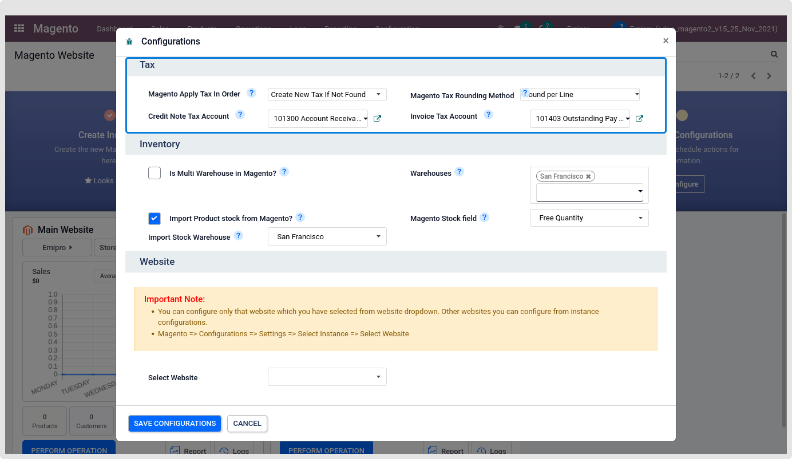

1. **Magento apply tax in order**

a. **Odoo default tax behaviour:**

if you select this configuration then the tax will be set based on the odoo’s default functional behaviour.

b. **Create new tax if not found:**

if you select this configuration then the system will search the tax data which is received from Magento in odoo if the tax is not found in odoo then create new tax in odoo and add that tax will set in order line.

2. **Magento Tax Rounding Method**

a. **Round per Line:**

Taxes will be rounded per order line. When you choose this configuration, you will need to configure the **Row total** in Magento2's tax calculation method.

b. **Round Globally:**

Tax will be rounded on the order total. When you choose this configuration, you will need to configure the **Total** in Magento2's tax calculation method. Configuration of tax calculation method in Magento is as per below image

 

Magento2 supports Tax Calculation Method Based On – Total, Row Total, or Unit price.

Unit price – this means that Magento will calculate tax on each quantity of each product in the cart, then round those up and add them together.

In Odoo, rounding is only supported per line and rounding globally, it doesn't support rounding based on unit price.

Here, set the tax calculation method based on the Magento2 Tax calculation method (Magento 2 admin panel > Stores > Settings >Configuration > Sales > Tax > Calculation Settings > Tax Calculation Method Based on)

3. **Credit note tax account:**

Set the credit tax account based on this account the connector will set this account in the newly created tax when import orders from Magento to Odoo. This will only be visible if you select the “create new tax if not found” configuration.

4. **Invoice tax account:**

Set the invoice tax account based on this account the connector will set this account in the newly created tax when importing orders from Magento to Odoo. This will only be visible if you select the “create new tax if not found” configuration.

iv. **Inventory**

 

 

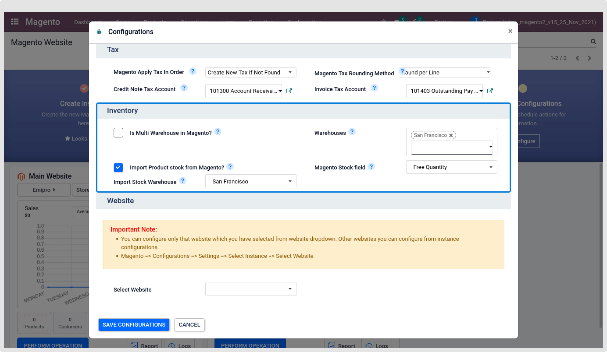

1. **Is Multi Warehouse in Magento?**

In your Magento store if you are using Multi Sources Inventory for product stock then keep it as True. This will only be visible if your Magento store version is 2.3 or 2.3+.

2. **Import Product stock from Magento?**

If you want to import product stock from Magento to Odoo then keep this checkbox as True.

3. **Import Stock Warehouse**

This will be used to import Stock from Magento to Odoo. It will only be visible if you do not use the MSI in your Magento store.

4. **Warehouses**

This will be used to Export Stock from Odoo to Magento. Only visible this setting under while you are not using MSI.

5. ​​​​​​​**Magento Stock field**

a. **On Hand Quantity**

b. **Forecast Quantity**

Based on this configuration Product stock quantity will be exported from odoo to Magento.

v. ​​​​​​​**Website**

**​**

**​​​​​​​**

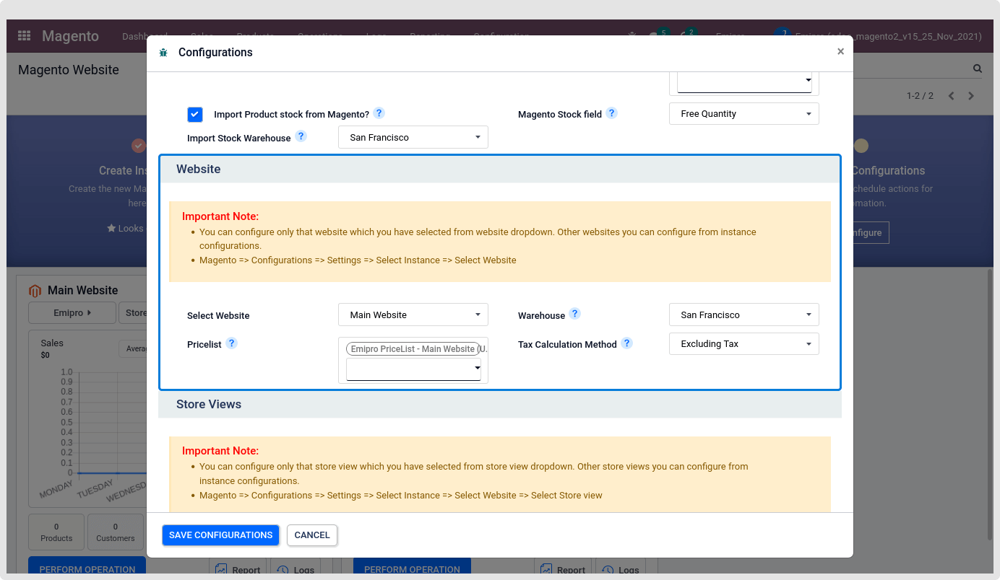

1. ​​​​​​​**Warehouse:** All the orders that you import will be processed and fulfilled through the warehouse that you select here.

2.​​​​​​​ **Pricelist:** Product price will be taken/set from this price list if Catalog Price Scope is a website.

3. ​​​​​​​**Tax Calculation Method:** This configuration determines whether the tax will be created as "Excluding Tax" or "Including Tax".

Set this value based on your Magento store's tax configuration. You can find the configuration here in your Magento store admin panel. “**Stores > Configuration > Sales > Tax > Calculation Settings > Catalog Prices**”

 

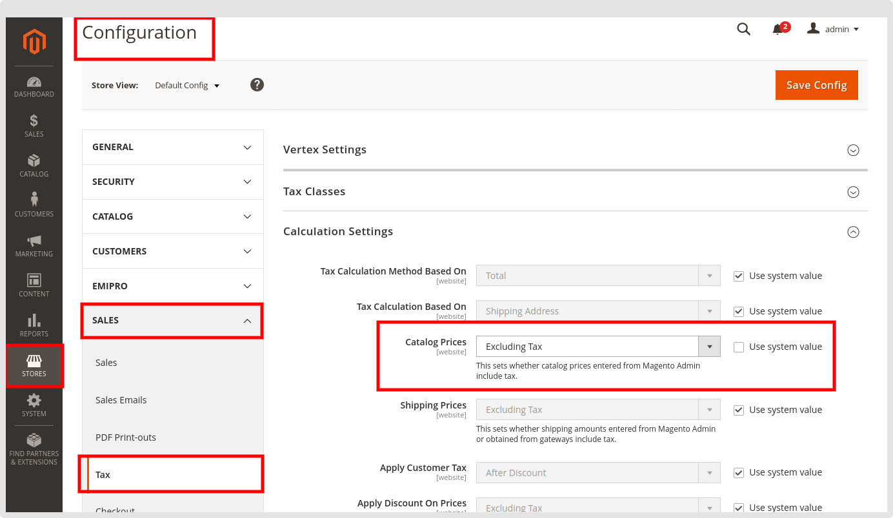

Based on the Magento “Catalog Prices” tax calculation setting we will manage the tax in the odoo.

Based on that configuration apply the same setting in the odoo Magento instance.

If the Magento configuration is set as the excluded tax we will take "price" and in the case of included tax will take "price\_incl\_tax" from the order reference to create the order in odoo.

You can configure only that website that you have selected from the website dropdown. Other websites you can configure from instance configurations.

Magento > Configurations > Settings > Select Instance > Select Website.

vi. **Storeview**

**​​​​​​​** 

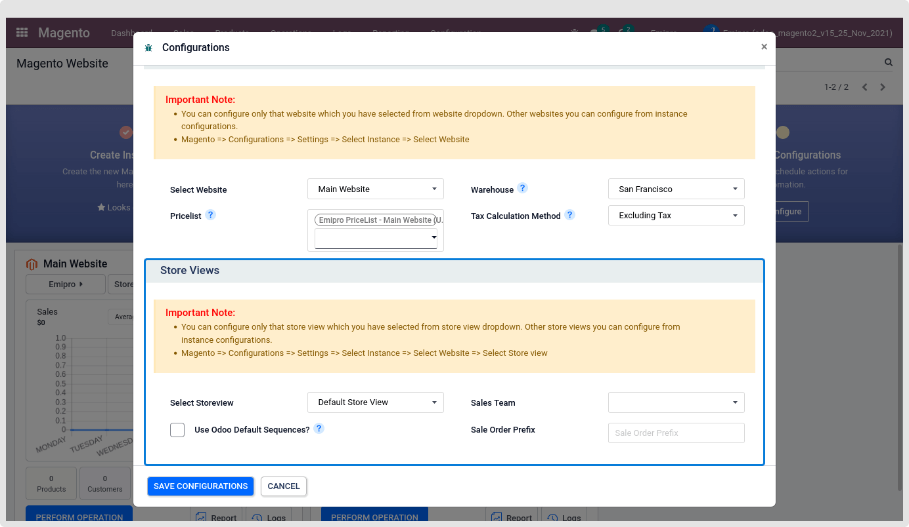

1. **Sales Team**:

Select the Sales Team in your Odoo which will manage this store view.

2. **Use Odoo Default Sequences? :**

If it is checked, the imported orders from Magento will be seen the same as Odoo’s default Sales Order. To visibly differentiate it, we recommended not to use this option.

3. **Sale Order Prefix:**

You can set any prefix (word or letters) to identify the Sales Order fetched from Magento.

You can configure only that store view which you have selected from the store view dropdown. Other store views you can configure from instance configurations.

Magento > Configurations > Settings > Select Instance > Select Website > Select Store view.

c. **Financial Status**

**​​​​​​​**

 

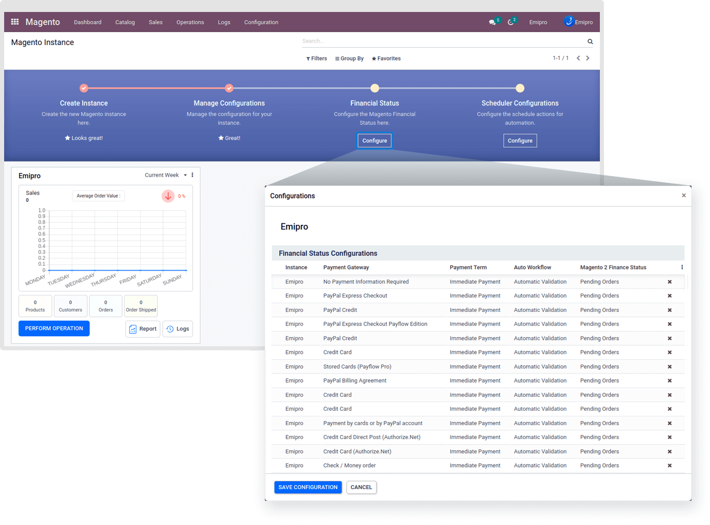

After creating the Instance, by default Financial status record will be created based on some combination of the Payment Gateway and Financial Status. From this window, you can Edit or Delete the existing record. If you want to add some new combinations of the Record, Then that will be created from Magento > Configuration > Financial Status.

d. **Scheduler Configurations**

**​​​​​​​**

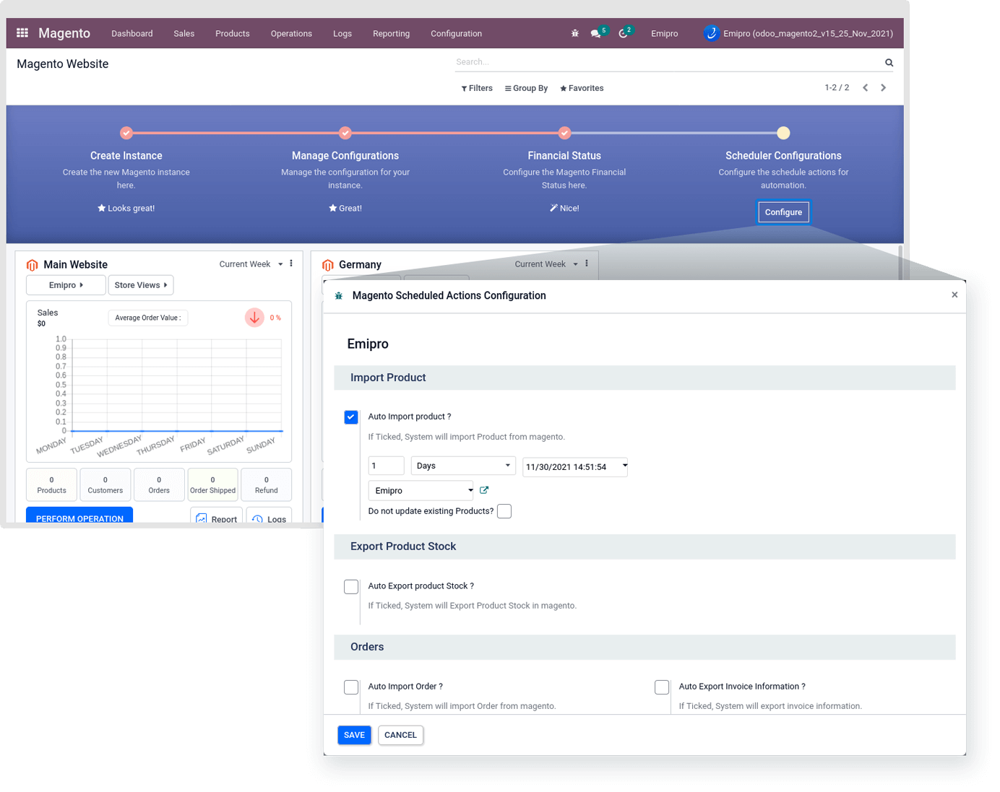

Enable and Configuration the Scheduled Actions based on your requirement. Set the appropriate User and Time for the Next Scheduled Action.

