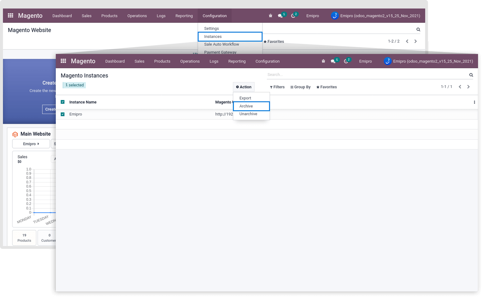
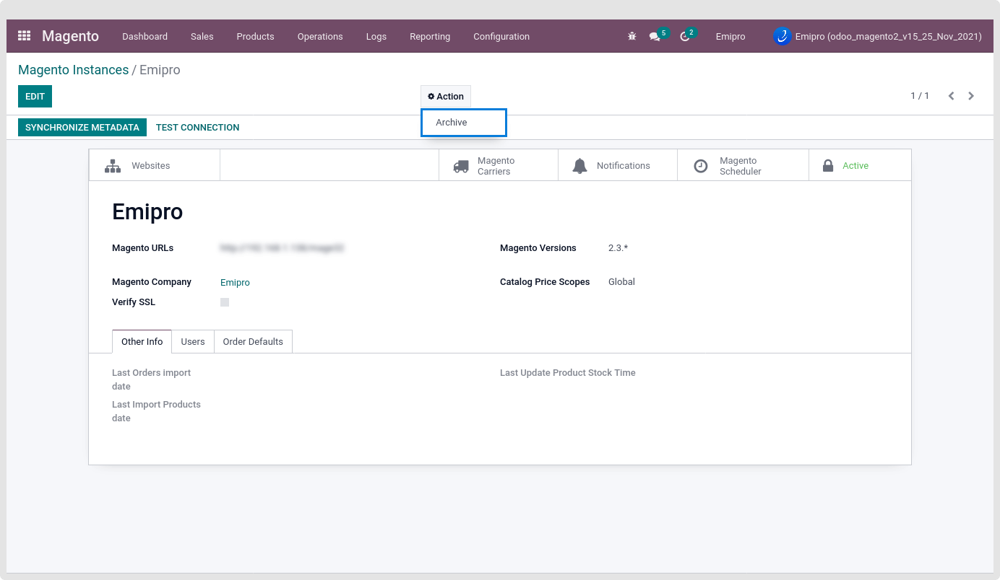
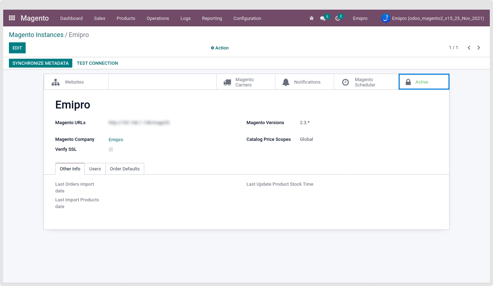
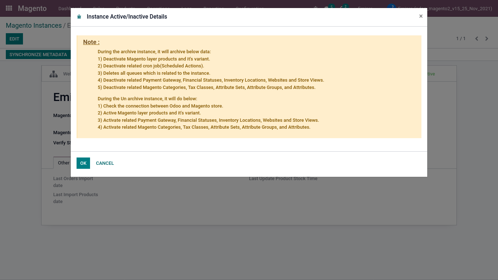

### Instance Archive

There are 3 different ways to archive the Created Instance.

1. Archive the Instance from the tree view of the Magento Instance. Go To Magento > Configuration > Instances.

 

Select the Instance and click on the Action. Click on the Archive.

2. Archive the Instance from the Form view of the Magento Instance. Select the Instance and open its form view. Click on the Action and Archive the Instance from there.

 

3. Archive the Instance from the Smart Button. Select the Instance, Click on the Active smart button. And from there you can also archive the Instance.

 

After clicking on the Archive, The confirmation wizard will open.

 

It means While Archive the Instance related record will also be archived. A related record like below.

* Magento layer products and their variants
* Scheduled Actions related to the current Instance only
* Deletes all queues which are related to the instance
* Payment Gateway
* Financial Statuses
* Inventory Locations If In Magento use MSI
* Websites and Store Views

While Unarchiving the Instance Check the Connection between Magento and Odoo, Active Magento layer products and it's variants. Also, Activate related Payment Gateway, Financial Statuses, Inventory Locations, Websites, and Store Views.

